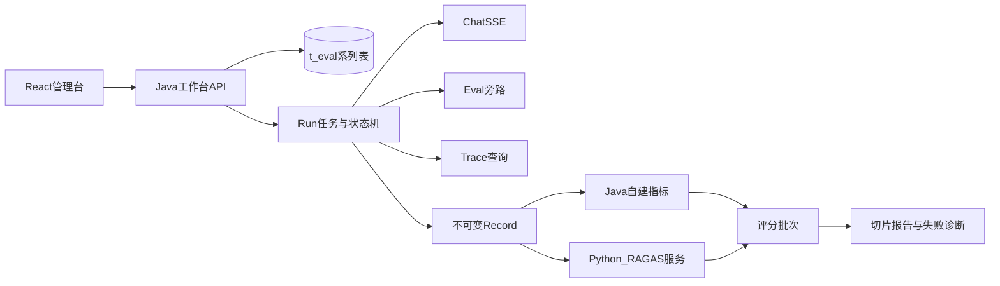

# RAG 评测工作台逐阶段开发方案

> 对应需求：[requirements.md](./requirements.md)  
> 参考资料：`resources/knowledge-samples/ragent-test/RAG 评测——从指标到实践/`、外部项目 `D:\code\ragenteval`  
> 状态：Draft · 2026-07-31（阶段 0–5 已落地；阶段 6 本轮仅同版本 Run 对比）  
> 决策摘要：MVP 沿用 `/rag/v3/chat` + `/rag/eval` 双路径采集并显式披露漂移风险；RAGAS 将 `ragenteval` 改造成独立 HTTP 评分服务。  
> 阶段 0 产物：[docs/evaluation/](../README.md) · [退出报告](../reports/phase-0-exit-report.md)  
> 阶段 1 建表：[resources/database/evaluation/](../../../resources/database/evaluation/README.md)  
> 阶段 2 评估集：[phase-2-exit-report.md](../reports/phase-2-exit-report.md)  
> 阶段 3 Run 录制：[phase-3-exit-report.md](../reports/phase-3-exit-report.md)  
> 阶段 4 自建评分：[phase-4-exit-report.md](../reports/phase-4-exit-report.md)  
> 阶段 5 RAGAS：[phase-5-exit-report.md](../reports/phase-5-exit-report.md)

## 目标架构与边界

- Java 主应用负责评估集、版本、Run 状态机、双路径录制、自建指标、报告聚合、权限和持久化；主入口放在 `bootstrap/.../rag/evaluation/`，与现有旁路包 `rag/eval` 分离。
- Python 侧复用 `ragenteval` 的 `EvalRecord`、RAGAS 和容错逻辑，改造成独立 HTTP 服务；Java 不嵌入 Python，也不通过同步子进程执行分钟级任务。
- MVP 暂时通过 `/rag/v3/chat` 录制真实回答，通过 `/rag/eval` 获取旁路证据；Record、评分批次和报告解耦，满足「录制一次，评分 N 次，报告 M 次」。
- 首期仅开放 ADMIN；RAGAS 失败不得回滚录制或自建评分；严格 A/B 结论只允许相同数据集版本。

## 阶段总览

| 阶段 | 对应里程碑 | 周期 | 交付重点 |
|------|------------|------|----------|
| 0 | 前置确认 | 3–5 天 | 契约、ADR、SSE/Trace spike、RAGAS 服务契约 |
| 1 | 骨架 | 1 周 | 7 张表、模块骨架、配置开关、权限审计 |
| 2 | M1 | 1.5–2 周 | 评估集 CRUD、导入校验、版本发布、前端数据集页 |
| 3 | M2-A | 2–3 周 | Run 状态机、双路径录制、Trace、取消/恢复 |
| 4 | M2-B / MVP | 1.5–2 周 | 自建指标、报告、导出、MVP 验收 |
| 5 | M3 | 2–3 周 | ragenteval 服务化、RAGAS、容错与成本 |
| 6 | M4 / V1 | 1.5–2 周 | A/B 对比、阈值门禁（人工覆盖已取消） |
| 7 | V2 | 按价值拆分 | CI/Webhook、趋势、Trace 单轨、数据治理 |

MVP 累计约 **6–8** 个日历周；V1 累计约 **10–13** 个日历周（假设 2 后端、1 前端、1 测试并行）。

---

## 阶段 0：规格冻结与技术验证（3–5 个工作日）

- 以需求文档、评测实践资料和 `ragenteval/eval/common/schemas.py` 固化三份跨语言 JSON Schema：`EvalSample`、`EvalRecord`、`MetricResult`；统一 camelCase API、snake_case Python 的映射与 `schemaVersion` / `algorithmVersion`。
- 形成 ADR 并冻结默认口径：数据集与版本状态的职责、Run 终态互斥规则、`PARTIAL_SUCCESS` 判定、Run 标签结构、阈值快照结构、Judge 配置引用、重试/取消/重启恢复语义、Thinking 默认不落库或脱敏后落库。
- 明确文档业务码 MVP 暂沿用 `doc_name` 去后缀规则；导入时检查唯一性和可解析性，并在 Run 中保存映射/知识库快照。后续再评估独立稳定业务码字段。
- 完成两项 spike：验证 Java SSE 客户端对 `meta/thinking/response/done/error` 的解析与 TTFT 口径；验证以 `taskId` 查询 Trace 并取得 `traceId` 的时序和重试窗口。
- 设计 Python 服务契约：`POST /v1/evaluations/score`、任务查询/取消、健康检查、批量大小、幂等键、超时、NaN、成本与 token 回传；Judge 密钥仅来自部署环境 Secret。
- **退出条件**：契约样例可由 Java/Python 双向反序列化；20 条样本 dry-run 可获得 answer、旁路证据、TTFT 和 traceId；未决项不再阻塞建表和接口。
- **阶段 0 落地（已完成，零业务代码改动）**：
  - Schema / 映射 / ADR / RAGAS 契约：见 [`docs/evaluation/`](../README.md)
  - 离线互转校验：`python scripts/evaluation/eval_phase0_validate_schemas.py`（已通过）
  - 在线 spike：`python scripts/evaluation/eval_phase0_spike.py`（需 ragent 运行；口径已写入退出报告）
  - 硬约束：不修改 Chat Pipeline、`EvalController`、`MetaPayload`；`traceId` 继续经 `taskId` 轮询 Trace

## 阶段 1：持久化与工作台骨架（1 周）

- 在 `resources/database/upgrades/v1.1.0/` 新增增量迁移，并同步 `resources/database/schema_pg.sql`：先建 `t_eval_dataset`、`t_eval_dataset_version`、`t_eval_case`，再建 `t_eval_run`、`t_eval_record`、`t_eval_score_batch`、`t_eval_score`；为状态、外键、`dataset_id+version`、`version_id+query_id`、`run_id+case_id`、分页筛选字段建约束和索引。
- 建立 `controller/service/runner/metric/judge/report/dao/task` 包结构、DO/Mapper/DTO/VO、统一错误码和分页响应；工作台 API 统一前缀 `/admin/evaluations`。
- 扩展 `EvalProperties` 与 `application.yaml`：增加 `workbench-enabled`、活动 Run 上限、录制并发、超时、重试和 RAGAS 服务配置；生产默认关闭旁路与工作台。
- 新增专用评测线程池，不复用聊天生成线程池；控制 `max-active-runs=1` 和低默认并发，避免批测挤占在线聊天资源。
- 扩展审计业务类型；所有 Controller 后端执行 `admin` 角色校验，不能只依赖前端路由守卫。
- **退出条件**：迁移可在空库和升级库执行；7 张表约束测试通过；关闭 feature flag 时无工作台入口和后台任务。
- **阶段 1 落地**：
  - 权威建表：[`resources/database/evaluation/schema_eval_workbench.sql`](../../../resources/database/evaluation/schema_eval_workbench.sql)
  - 升级入口：`resources/database/upgrades/v1.1.0/260730_eval_workbench.sql`（与权威脚本同步）
  - 全量 schema 已追加评测表段落：`resources/database/schema_pg.sql`
  - Java 包骨架：`bootstrap/.../rag/evaluation/`（entity/mapper/config/constant + 后续分层 package-info）
  - 配置：`ragent.eval.workbench-enabled` 默认 false；`evalRecordExecutor` 仅在开关开启时注册
  - 审计类型：`EVAL_DATASET` / `EVAL_DATASET_VERSION` / `EVAL_RUN`
  - 已取消：`t_eval_manual_override`（见 `260803_drop_eval_manual_override.sql`）

## 阶段 2：评估集资产化 M1（1.5–2 周）

- 实现数据集 CRUD、草稿版本创建/复制/归档、Case 分页编辑；Run 只能引用 `PUBLISHED` 版本，发布后 Case 不可变，修改必须生成新草稿版本。
- 实现 JSONL/JSON 流式导入、预检和错误明细下载；校验必填字段、queryId 唯一、difficulty 枚举、requiresRag 与 expectedDocIds/groundTruth 的组合、意图叶子存在性、业务文档码唯一性和可解析性。
- 导入兼容 `ragenteval` 的 `eval_set_v1.jsonl`（20 条）与 150 条全量集；保留 `expectedDocIdsNice`、`trapType`、`expectedAnswerType`、`evalMetrics`，但未启用字段不影响 MVP 评分。
- 前端新增 `frontend/src/pages/admin/evaluations/` 和 `evaluationService.ts`：数据集列表、版本详情、Case 表格、拖拽导入、逐行错误、发布确认；在 `AdminLayout.tsx` 和 `router.tsx` 注册菜单与路由。
- 测试重点：150 条导入、坏 JSON/重复 queryId/无效业务码、发布并发、已发布版本不可写、ADMIN 隔离。
- **退出条件**：管理员可完全通过 UI 创建、导入、修复、发布和导出评估集；满足需求 MVP 验收第 1–2 条。
- **阶段 2 落地**：
  - API：`/admin/evaluations/datasets*`、`dataset-versions*`、`cases*`（workbench-enabled + admin）
  - 导入兼容 snake_case / camelCase；不可解析文档码与意图为警告
  - 前端：评估集列表 / 详情 / 版本详情（导入、校验、发布、导出）
  - 单测：`EvalCaseImportSupportTest`

## 阶段 3：Run 状态机与双路径录制 M2-A（2–3 周）

- 实现 Run 创建、查询、取消、失败重试和重启恢复；状态按 `PENDING → RECORDING → DETERMINISTIC_SCORING → REPORTING → COMPLETED/PARTIAL_SUCCESS/FAILED` 推进，取消为独立终态。状态变更采用条件更新/乐观锁，任务领取采用数据库租约，避免重复执行。
- 创建 Run 时冻结数据集版本、应用版本/commit、模型、Embedding/Rerank、检索参数、Prompt、意图树、知识库/文档映射、算法版本、并发/超时/重试和阈值；不可取得的版本信息明确标为 unknown，不能伪造可复现性。
- Java Runner 调真实 Chat SSE，准确采集 response、thinking 策略结果、conversationId、taskId、首个 response token 的 TTFT 和总耗时；随后以 taskId 重试查询 Trace，再调用 `/rag/eval` 获取意图、doc/chunk/context、hasKb/hasMcp、skipReason 和旁路耗时。
- 将两路数据合并为不可变 `t_eval_record`；单样本失败只记录 `finalStatus/errorCode/errorMessage/stage` 并继续。取消采用协作式中断，不删除已有 Record；失败重试只重跑失败样本并保持幂等。
- 前端实现 Run 创建、运行列表、进度、阶段、成功/失败计数、取消和样本列表；页面固定展示「双路径证据可能与真实回答上下文不完全一致」的风险提示。
- 进度首期轮询，计数由任务增量维护而非每次全表聚合；为未来 SSE 推送保留事件接口。
- **退出条件**：20/150 条 Run 可异步执行；单样本超时产生 `PARTIAL_SUCCESS`；重启后无永久 RUNNING；取消后已录制数据保留；Trace 可跳转。
- **阶段 3 落地**：
  - API：`/admin/evaluations/runs*`、`/records*`（workbench-enabled + admin）
  - Runner：真实 Chat 管线 + 旁路证据同口径采集 + `taskId→traceId`；写入不可变 `t_eval_record`
  - 租约：`lease_owner` / `lease_expire_at` 心跳与 `EvalRunLeaseReclaimer` 恢复
  - 终态：`COMPLETED` / `PARTIAL_SUCCESS` / `FAILED` / `CANCELLED`；录制后进入自建评分（阶段 4）
  - 前端：Run 列表 / 详情进度轮询 / 取消与失败重试 / 双路径漂移披露 / Trace 跳转
  - 退出报告：[phase-3-exit-report.md](../reports/phase-3-exit-report.md)

## 阶段 4：自建评分、报告与 MVP 验收 M2-B（1.5–2 周）

- 定义 `Metric` SPI 和统一 `MetricResult`，将 `ragenteval/eval/rag/metrics/` 作为黄金参考，在 Java 实现并单测：Intent Top-1；Hit/Recall@1/3/5/10；MRR@10；误拒/过召回；TTFT P50/均值与总耗时均值。
- 明确过滤口径：检索指标只统计 `requiresRag=true` 且 gold 非空样本；文档级 ID 指标与 chunk/context 级语义指标分开；兜底/拒答优先读取结构化字段，避免绑定某句中文文案。
- 每次评分生成新的 `t_eval_score_batch`，保存算法与阈值快照，不覆盖旧分数；保存 overall、intentL1/L2、difficulty 和 per-sample 结果。
- 实现报告总览、切片、指标分子/分母、样本详情、失败原因多标签、Trace 链接和 JSONL/JSON/CSV 导出；低样本量性能报告只展示 P50/均值，不声称 P95/P99。
- 以 Python 现有 score/report 结果建立 golden fixtures，要求 Java 在自建指标上逐项一致；覆盖空 gold、重复召回、多个 gold、SYSTEM_ONLY、部分失败和零分母。
- **退出条件**：完成需求文档全部 MVP 验收项；自建指标可重复、可重评分；RAGAS 未部署时 MVP 仍完整可用。此节点作为首个可发布版本。
- **阶段 4 落地**：
  - Metric SPI：`bootstrap/.../rag/evaluation/metric/`（Intent / Retrieval / Behavior / Latency）
  - 评分服务：`EvalScoreService` 写入 `t_eval_score_batch` / `t_eval_score`；Worker 录制后自动评分
  - API：`POST .../rescore`、`GET .../metrics`、`GET .../score-batches`、`GET .../export`
  - 前端：Run 详情指标卡片、Intent L2 切片、失败样本、重评与导出
  - 单测：`DeterministicMetricsTest`
  - 退出报告：[phase-4-exit-report.md](../reports/phase-4-exit-report.md)

## 阶段 5：ragenteval 服务化与 RAGAS M3（2–3 周）

- 在 `D:\code\ragenteval` 补齐 `pyproject.toml`/锁文件、明确许可证/代码权属、配置分层、结构化日志、健康检查和自动化测试；从 `score.py` 与 `ragas_judge.py` 抽出纯服务层，CLI 与 HTTP 共用实现。
- HTTP 服务接收版本化 `EvalRecord[]` 或对象存储引用，返回 per-sample 与聚合 `MetricResult`；支持 faithfulness、answer relevancy/correctness、context precision/recall、1–3 次采样、限并发、超时、幂等、逐条重试和取消。
- Java `SemanticEvaluationProvider` 异步提交任务、轮询/回调结果并写独立 RAGAS score batch；服务不可用、NaN 或部分失败时标记指标失败并保留自建结果。
- 保存 Judge 模型/Embedding、参数、采样次数、prompt/算法版本、token、费用估算和失败原因；密钥不入 DB，发送外部 Judge 前执行字段白名单与必要脱敏。
- 前端展示 RAGAS 独立进度、有效样本数、NaN/失败数、成本和不确定性提示；明确 ID Recall@K 与 RAGAS Context Recall 不可直接替换。
- 测试包括跨语言契约、固定样例、服务超时/429/5xx、NaN、部分返回、重复回调、取消和 Judge 未配置降级。
- **退出条件**：RAGAS 失败不影响 Run 录制和自建报告；同一 Record 可创建多个 RAGAS 批次；采样三次时保留每轮结果与聚合值。
- **阶段 5 落地**：
  - 外部仓库分支：`D:\code\ragenteval` → `feat/ragas-http-service`（FastAPI + skip_ragas 契约测）
  - Java：`SemanticEvaluationProvider` / `RagasHttpSemanticEvaluationProvider`；`scoreRagas`；Worker 可选 `RAGAS_SCORING`
  - API：`POST .../ragas-rescore`、`GET .../metrics?scoreType=RAGAS`
  - 前端：创建 Run 勾选 RAGAS、详情 RAGAS 表与口径提示
  - 退出报告：[phase-5-exit-report.md](../reports/phase-5-exit-report.md)
  - 已知薄项：`records_uri`/`callback_url`（延期，非 MVP）、每轮采样原始分落库、真实 Judge E2E CI；token/cost 已透传到管理台（数值依赖 Judge 侧是否回传）
  - 管理台可取消进行中 RAGAS：`POST .../ragas-batches/{batchId}/cancel`

## 阶段 6：A/B 与质量门禁 M4（1.5–2 周）

> **本轮范围（2026-07-31）**：仅实现 **同数据集版本 Run 结果对比**；跨版本直接拒绝，不提供探索性对比。其余条目暂不实现。  
> **已取消**：人工覆盖（`t_eval_manual_override` / override API）；不再实现。

- **本轮实现** 同版本 Run A/B：配置快照差异、指标 delta、intent/difficulty 切片、新增失败/修复/持续失败、TTFT 差异；**仅允许相同 `dataset_version_id`**，版本不一致返回业务错误。
- ~~定义阈值策略版本与快照：overall、切片、关键样本、最大退化值；Run 增加独立 quality verdict（PASS/FAIL/WARN/NOT_EVALUATED），不要与执行状态混为一列。~~ **暂不实现**
- ~~首次阈值由 20 条冒烟集跑通后，以 150 条 baseline 校准；自建指标可用于日常门禁，RAGAS 默认只用于改版/发布深评，差异小于约 3% 时提示可能处于 Judge 方差范围。~~ **暂不实现**
- ~~提供只读 CI 查询接口和稳定机器可读结果，但自动阻断合入可作为下一阶段开启。~~ **暂不实现**
- **本轮退出条件**：任意两次同数据集版本 Run 可比较（配置 diff + 指标/切片 delta + 失败回归 + TTFT + 样本交集）；跨版本不可比。完整 V1（门禁、CI）延后。

## 阶段 7：持续评测与采集链路演进（V2，按价值拆分）

- CI/Webhook：提交或部署后触发自建指标 Run，异步返回 verdict；增加配额、幂等、回调签名和失败通知。
- 定时计划与趋势：按数据集版本、应用版本和环境展示趋势；禁止把不同数据集版本直接连成质量趋势。
- 双路径改进：优先在真实 Chat Trace 中持久化实际 intent、chunk/context 与检索分支，或让 SSE meta 返回可关联 traceId；经兼容期后 Runner 以单次真实请求证据为主，`/rag/eval` 仅作诊断旁路。迁移前后用同一评估集比较证据一致率。
- 数据治理：从脱敏 Trace 提议候选 bad case，经人工确认后进入新草稿版本；补充 must/nice 标注、自然语言 ground truth、隐藏回归集和关键风险样本。
- 容量治理：大 contexts 转对象存储、记录保留/归档策略、评测专用环境与资源池、成本预算和告警。
- 多轮/Agent 评测保持独立项目，不扩张当前单轮 Record 契约，直至需求和指标口径另行冻结。

---

## 并行开发与发布门槛

- 阶段 1 后可并行三条轨道：后端数据集/Run，前端页面骨架，Python 服务契约与测试基础；阶段 3 的录制契约稳定后再正式接入 RAGAS。
- 每阶段必须同时交付迁移、API 文档、审计、单元/集成测试、前端错误态和运维说明，不把测试集中留到 M4。
- 后端验证：`mvn test`、评测包定向测试、迁移空库/升级库测试；前端验证：`npm run lint && npm run build`，并在阶段 2 前补充 Vitest/React Testing Library；Python：pytest、类型/格式检查、20 条无 RAGAS smoke、固定 5 条 RAGAS contract smoke。
- 发布采用 feature flag：先专用评测环境和 20 条集，再 150 条 baseline；通过资源竞争、恢复、取消、权限和数据外发检查后，才允许在共享环境低并发启用。

## 关键风险控制

- **双路径漂移**：Record 保存两路时间与来源，UI 固定披露；阶段 7 以 Trace 单轨演进，MVP 不宣称证据完全等同于 Chat 实际上下文。
- **可复现性不足**：对无法真正版本化的知识库/索引只保存快照指纹与时间，不夸大为可重现；严格对比要求数据集版本和环境快照兼容。
- **资源竞争**：独立线程池、活动 Run 上限、低并发、专用环境优先、支持取消和退避。
- **Judge 方差/成本/隐私**：固定 Judge、可选三次采样、逐条容错、预算上限与脱敏；CI 默认不跑 RAGAS。
- **外部 Python 项目治理**：服务化前必须补依赖锁、测试、许可证/权属确认和部署可观测性，否则只作为参考实现，不直接进入生产链路。

## 阶段检查清单

- [x] 阶段 0：契约与 ADR 冻结；离线 Schema 互转通过；SSE/Trace spike 脚本就绪（在线 dry-run 待本地服务）
- [x] 阶段 1：7 张表与模块骨架就绪，feature flag 可控（`workbench-enabled=false` 无工作台任务 Bean）
- [x] 阶段 2：评估集可导入、发布、导出（M1）
- [x] 阶段 3：双路径录制与 Run 状态机可用（M2-A）
- [x] 阶段 4：自建指标与报告通过 MVP 验收（M2-B）
- [x] 阶段 5：RAGAS 服务化接入且失败可降级（M3）
- [ ] 阶段 6：同版本 Run A/B 对比（本轮）；门禁 / CI 暂不实现；人工覆盖已取消（M4 部分）
- [ ] 阶段 7：CI/趋势/单轨采集按价值推进（V2）
