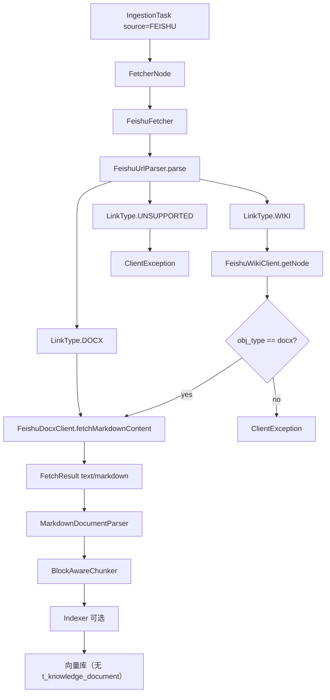
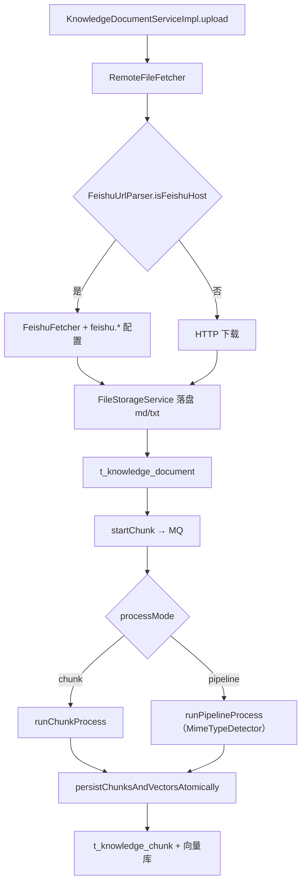
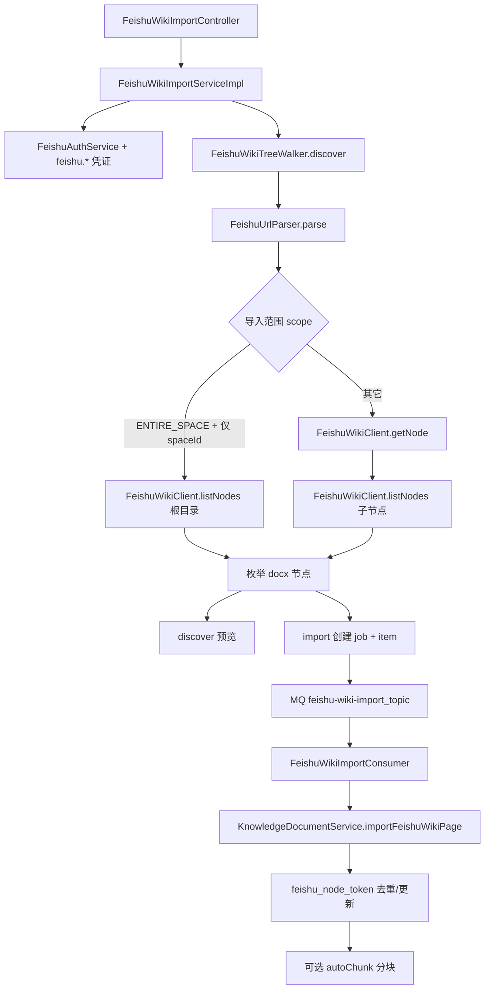

# 飞书知识库 Wiki 接入开发文档

## 1. 背景与问题

### 1.1 业务场景

用户希望将飞书云文档或知识库 Wiki 页面导入 RAG 系统。飞书存在两类常见链接：

| 产品 | 链接形态 | 示例 |
|------|---------|------|
| 云文档 docx | `/docx/{documentToken}` | `https://xxx.feishu.cn/docx/doccnXXXX` |
| 知识库 wiki（经典） | `/wiki/{nodeToken}` | `https://xxx.feishu.cn/wiki/wikcnXXXX` |
| 知识库 wiki（新版空间） | `/wiki/space/{spaceId}` | `https://xxx.feishu.cn/wiki/space/7xxxxxxxx` |
| 知识库 wiki（新版节点） | `/wiki/space/{spaceId}/nodes/{nodeToken}` | `https://xxx.feishu.cn/wiki/space/7xxx/nodes/EpMmw5...` |
| 知识库设置页 | `/wiki/settings/{spaceId}` | `https://xxx.feishu.cn/wiki/settings/7xxxxxxxx` |

> **注意：** node token 不一定以 `wikcn` 开头；`spaceId` 与 `nodeToken` 均为飞书侧 opaque 字符串，须从浏览器地址栏完整复制。

### 1.2 改造前的问题

改造前 [`FeishuFetcher`](../bootstrap/src/main/java/com/nageoffer/ai/ragent/ingestion/strategy/fetcher/FeishuFetcher.java) 仅对含 `/docx/`、`/docs/` 的链接调用飞书 Open API；知识库 Remote URL 及其它 HTTP 路径对 wiki 链接走 **直接下载网页**。早期 docx 正文使用 `raw_content` 接口，仅得到**无结构的纯文本**。

```
改造前：
  docx/docs URL → raw_content API → text/plain（结构丢失）
  wiki URL      → HTTP GET 网页   → text/html（无效正文）

当前（Markdown 导出）：
  docx/docs URL → docs/v1/content → text/markdown ✅
  wiki/docx 节点 → get_node + docs/v1/content → text/markdown ✅
  wiki URL（未走 API）→ HTTP GET 网页 → text/html ❌（已禁止兜底）
```

wiki 分享页在浏览器中是 SPA 网页，HTTP 响应为 `text/html`，并非文档正文，导致：

- 解析/入库可能失败（如 `file_type` 超长等）
- 即便入库，分块内容也是无效 HTML

### 1.3 目标与实现范围

**已实现（P0 — Ingestion）：**

- 支持粘贴**具体 wiki 页面**链接（含 `wikcn...` 等 node token）
- 经 Wiki Open API 解析节点，对 `obj_type = docx` 的节点复用 docx **Markdown 导出**拉取正文
- 默认产出 `text/markdown`（`.md`），经 `MarkdownDocumentParser` + block-aware 分块提升 RAG 效果
- Ingestion 任务使用 `source.type = FEISHU`，任务级 `credentials` 传凭证
- 移除 `FeishuFetcher` 对未知飞书链接的 HTTP 网页兜底

**已实现（P3 — 知识库 Remote URL）：**

- 知识库上传页 **Remote URL** 来源不变（`sourceType = url`），粘贴飞书链接时由 [`RemoteFileFetcher`](../bootstrap/src/main/java/com/nageoffer/ai/ragent/knowledge/handler/RemoteFileFetcher.java) 自动识别并走 Open API
- 飞书应用凭证通过 **`application.yaml` 的 `feishu.*` 配置**，不在 UI 填写
- 拉取结果落盘为 `text/markdown`（`.md`）文件（主路径），写入 `t_knowledge_document`，走完整文档生命周期（分块表、向量、定时刷新）
- 知识库 **Pipeline 处理模式**下使用 `MimeTypeDetector` 识别真实 MIME（`.md` → `text/markdown`），由 `MarkdownDocumentParser` 解析并触发 block-aware 分块

**未实现（后续扩展）：**

- Ingestion 任务 `source.type = URL` 自动识别飞书（须显式选 **Feishu** 来源或走知识库 Remote URL）
- wiki 下 sheet、旧版 doc 等非 docx 节点类型

**已实现（P2 — 知识库 Wiki 整库/子树批量导入）：**

- 知识库页 **飞书 Wiki 导入**：遍历空间子节点，逐页落库 `t_knowledge_document`
- `FeishuWikiClient.listNodes()` + `FeishuWikiTreeWalker` + MQ 异步 `FeishuWikiImportService`
- `feishu_node_token` 去重；可选「导入后自动分块」与定时刷新

---

## 2. 架构设计

### 2.1 Ingestion 任务链路

Ingestion 任务 `source.type = FEISHU` 时，由 [`FetcherNode`](../bootstrap/src/main/java/com/nageoffer/ai/ragent/ingestion/node/FetcherNode.java) 路由至 `FeishuFetcher`：



### 2.2 知识库 Remote URL 链路

知识库上传 `sourceType = url`，当 URL 为飞书域名时：



### 2.3 知识库 Wiki 批量导入链路（P2）

管理后台 **飞书 Wiki 导入** 或 `POST .../feishu-wiki/discover|import`：



| 导入范围 `scope` | 行为 | 主要 API |
|------------------|------|----------|
| `PAGE_ONLY` | 仅导入根链接对应页面 | `get_node` |
| `SUBTREE` | 根页面 + 其下所有子节点 | `get_node` + `list_nodes` |
| `ENTIRE_SPACE` | 整个知识空间所有页面 | `list_nodes`（根目录起） |

当 `rootUrl` 为 `/wiki/space/{spaceId}` 或 `/wiki/settings/{spaceId}` 且 `scope = ENTIRE_SPACE` 时，**跳过 `get_node`**，直接用 URL 中的 `spaceId` 从根目录遍历。

### 2.4 三条入口对比

| 维度 | Ingestion 任务 | 知识库 Remote URL | 知识库 Wiki 批量导入 |
|------|----------------|-------------------|---------------------|
| 入口 | Ingestion 页 / `POST /ingestion/tasks` | 知识库 → 上传 → Remote URL | 知识库 → 飞书 Wiki 导入 |
| 来源类型 | `source.type = FEISHU` | `sourceType = url` | `feishu-wiki/discover\|import` |
| 飞书凭证 | 任务 `source.credentials` | `feishu.*` 配置文件 | `feishu.*` 配置文件 |
| 导出格式 | Markdown（默认）/ 纯文本回退 | 同上 | 同上 |
| 文档记录 | ❌ 仅 `t_ingestion_task` | ✅ `t_knowledge_document` | ✅ 多文档 + job/item 表 |
| 向量 `doc_id` | 摄取任务 ID | 知识库文档 ID | 知识库文档 ID |
| 遍历子节点 | ❌ 单链接 | ❌ 单链接 | ✅ `list_nodes` |
| 定时同步 | ❌ | ✅ URL 定时刷新 | ✅ 按 `feishu_node_token` 去重更新 |
| 额外依赖 | Pipeline | — | RocketMQ + DB 升级脚本 |

### 2.5 模块职责

| 类 | 路径 | 职责 |
|----|------|------|
| `FeishuFetcher` | `ingestion/strategy/fetcher/` | 编排入口：鉴权、URL 分流、Markdown/纯文本策略、组装 `FetchResult` |
| `FeishuAuthService` | 同上 | 从凭证解析 `tenant_access_token` 并组装请求头 |
| `FeishuUrlParser` | 同上 | 识别 docx/wiki/unsupported；解析 `token` 与 `wikiSpaceId` |
| `FeishuDocxClient` | 同上 | 调用 `docs/v1/content` 导出 Markdown；失败时可回退 `raw_content` |
| `FeishuWikiClient` | 同上 | wiki `get_node` / `list_nodes`；131005/131006 转 `ClientException` |
| `WikiNodeInfo` | 同上 | 记录 `title`、`objType`、`objToken`、`spaceId` |
| `FeishuWikiTreeWalker` | `knowledge/feishu/` | 按 scope 遍历 Wiki 树，枚举可导入 docx 页 |
| `FeishuWikiImportServiceImpl` | `knowledge/service/impl/` | discover / import 编排、job 持久化、发 MQ |
| `FeishuWikiImportConsumer` | `knowledge/mq/` | 异步逐页调用 `importFeishuWikiPage` |
| `FeishuProperties` | `knowledge/config/` | 绑定 `feishu.*`（含 `content-format`、`fallback-to-plain-on-error`） |
| `FeishuCredentialsProvider` | `knowledge/config/` | 校验并组装配置文件中的凭证 |
| `FeishuWikiImportProperties` | `knowledge/config/` | `feishu.wiki-import.*`（页数上限、限流） |
| `RemoteFileFetcher` | `knowledge/handler/` | Remote URL 上传/定时刷新；飞书域名分流 |

---

## 3. 代码变更清单

### 3.1 核心文件（Ingestion / 共用）

```
bootstrap/src/main/java/com/nageoffer/ai/ragent/ingestion/strategy/fetcher/
├── FeishuFetcher.java
├── FeishuAuthService.java
├── FeishuUrlParser.java
├── FeishuDocxClient.java
├── FeishuWikiClient.java
├── WikiNodeInfo.java
├── WikiNodeItem.java
└── WikiListNodesResult.java

bootstrap/src/main/java/com/nageoffer/ai/ragent/knowledge/feishu/
├── FeishuWikiTreeWalker.java
├── FeishuWikiImportScope.java
├── FeishuApiRateLimiter.java
└── ...

bootstrap/src/test/java/.../ingestion/strategy/fetcher/
├── FeishuUrlParserTest.java
├── FeishuDocxClientTest.java
├── FeishuWikiClientListNodesTest.java
└── FeishuFetcherTest.java

bootstrap/src/test/java/.../knowledge/feishu/
└── FeishuWikiTreeWalkerTest.java
```

### 3.2 知识库接入（P3）

```
bootstrap/src/main/java/com/nageoffer/ai/ragent/knowledge/
├── config/FeishuProperties.java
├── config/FeishuCredentialsProvider.java
├── handler/RemoteFileFetcher.java          # 飞书 URL 分流
└── service/impl/KnowledgeDocumentServiceImpl.java  # Pipeline MIME 修复

bootstrap/src/test/java/.../knowledge/handler/
└── RemoteFileFetcherFeishuTest.java

bootstrap/src/main/resources/application.yaml  # feishu.* 节
frontend/src/pages/admin/knowledge/KnowledgeDocumentsPage.tsx  # URL 提示文案
```

### 3.4 知识库 Wiki 批量导入（P2）

```
bootstrap/src/main/java/com/nageoffer/ai/ragent/knowledge/
├── controller/FeishuWikiImportController.java
├── service/impl/FeishuWikiImportServiceImpl.java
├── feishu/FeishuWikiTreeWalker.java
├── mq/consumer/FeishuWikiImportConsumer.java
├── config/FeishuWikiImportProperties.java
└── dao/entity/FeishuWikiImportJobDO.java / FeishuWikiImportItemDO.java

resources/database/upgrade_v1.2_to_v1.3.sql   # job/item 表 + feishu_node_token 列
frontend/src/pages/admin/knowledge/components/FeishuWikiImportDialog.tsx
docs/examples/feishu-wiki-batch-import-example.md
```

### 3.5 前端（Ingestion）

| 文件 | 变更说明 |
|------|---------|
| [`IngestionPage.tsx`](../frontend/src/pages/admin/ingestion/IngestionPage.tsx) | Feishu 来源的链接与凭证提示 |

### 3.6 示例与文档

```
docs/examples/
├── feishu-wiki-ingestion-example.md
├── feishu-wiki-batch-import-example.md
└── feishu-pipeline-request.json
```

---

## 4. 核心实现说明

### 4.1 URL 解析（FeishuUrlParser）

解析优先级：

1. 路径含 `/docx/` 或 `/docs/` → `LinkType.DOCX`，`token` = 文档 token
2. 路径含 `/wiki/` 或以 `/wiki` 结尾 → `LinkType.WIKI`
3. 其余飞书链接 → `LinkType.UNSUPPORTED`

**Wiki 链接解析规则（`ParseResult` 含 `token` 与 `wikiSpaceId`）：**

| URL 形态 | `token`（node token） | `wikiSpaceId` |
|----------|----------------------|---------------|
| `/wiki/{nodeToken}` | 第一段节点 token | `null` |
| `/wiki/space/{spaceId}` | `null` | `spaceId` |
| `/wiki/space/{spaceId}/nodes/{nodeToken}` | `nodeToken` | `spaceId` |
| `/wiki/settings/{spaceId}` | `null` | `spaceId` |
| `/wiki/`（无后续段） | — | 抛 `ClientException` |

**保留路径段（不作为 node token）：** `space`、`settings`、`nodes`。旧版解析若将 `space` 误当作 token，调用 `get_node` 会返回飞书 **`131005 not found`**。

`tryExtractWikiSpaceId()` 从 `/wiki/space/{id}` 与 `/wiki/settings/{id}` 提取知识空间 ID，供 `ENTIRE_SPACE` 整库遍历使用。

辅助方法（知识库 Remote URL 分流使用）：

| 方法 | 说明 |
|------|------|
| `isFeishuHost(url)` | 域名是否为 `*.feishu.cn` / `*.larksuite.com` / `*.larkoffice.com` |
| `isSupportedDocumentUrl(url)` | 是否为可 API 拉取的 docx/docs/wiki 页（含仅含 spaceId 的空间链接，不抛异常） |
| `buildWikiUrl(host, nodeToken)` | 由域名与 node token 构造 `https://{host}/wiki/{nodeToken}` |

**RemoteFileFetcher 分流规则：**

| URL | 行为 |
|-----|------|
| 非飞书域名 | 原有 HTTP 逻辑 |
| 飞书 + docx/docs/wiki | `FeishuFetcher` + 配置凭证 |
| 飞书 + 其它路径 | `ClientException`，**禁止 HTTP 兜底** |
| 飞书 + `feishu.enabled=false` | `ClientException("飞书集成未启用")` |

### 4.2 鉴权

**Ingestion（`FeishuFetcher` + 任务 credentials）：**

1. `tenantAccessToken`
2. `accessToken`
3. `app_id` + `app_secret` → 请求 `tenant_access_token`

**知识库（`FeishuCredentialsProvider` + 配置文件）：**

```yaml
feishu:
  enabled: true
  app-id: ${FEISHU_APP_ID:}
  app-secret: ${FEISHU_APP_SECRET:}
  tenant-access-token: ${FEISHU_TENANT_TOKEN:}  # 可选，非空时优先
  content-format: markdown                      # markdown（默认）或 plain
  fallback-to-plain-on-error: true              # Markdown API 失败时回退 raw_content
```

| 配置项 | 默认值 | 说明 |
|--------|--------|------|
| `content-format` | `markdown` | `markdown` 走 `docs/v1/content`；`plain` 强制 `raw_content` |
| `fallback-to-plain-on-error` | `true` | 仅 `content-format=markdown` 时生效 |

请求头均为：`Authorization: Bearer {token}`。

### 4.3 Wiki API（FeishuWikiClient）

**获取节点（单页 / 子树根）：**

```
GET https://open.feishu.cn/open-apis/wiki/v2/spaces/get_node?token={token}
GET ...?token={token}&obj_type=docx   # 云文档 token 查询时可选
Authorization: Bearer {accessToken}
```

- query 参数经 `UriComponentsBuilder` 编码，避免特殊字符导致请求失败
- 从 `data.node` 读取 `title`、`obj_type`、`obj_token`、`space_id`
- `folder` 类型节点可无 `obj_token`（遍历场景）；docx 等叶子节点须有 `obj_token`

**获取子节点列表（子树 / 整库）：**

```
GET https://open.feishu.cn/open-apis/wiki/v2/spaces/{space_id}/nodes
    ?page_size=50
    [&parent_node_token={token}]
    [&page_token={cursor}]
Authorization: Bearer {accessToken}
```

- `parent_node_token` 省略或空表示从知识空间根目录分页
- `FeishuWikiTreeWalker` 结合 `FeishuApiRateLimiter` 按 `feishu.wiki-import.rate-limit-per-minute` 限流

**飞书错误码映射（HTTP 400 体或 JSON `code`）：**

| 飞书 code | 含义 | 系统侧提示要点 |
|-----------|------|----------------|
| `131005` | not found | 节点/空间不存在，或链接解析错误（如把 `space` 当 token） |
| `131006` | permission denied | 应用 API 权限或知识库成员资格不足（见 §6） |
| `131002` | 参数错误 | 链接不完整或 token 格式错误 |

`131006` 细分（飞书 `msg` 子串）：

- `wiki space permission denied` → 应用未加入该知识空间成员
- `node permission denied` → 对某节点无阅读权限

### 4.4 文档正文拉取（FeishuDocxClient）

[`FeishuFetcher`](../bootstrap/src/main/java/com/nageoffer/ai/ragent/ingestion/strategy/fetcher/FeishuFetcher.java) 根据 [`FeishuProperties`](../bootstrap/src/main/java/com/nageoffer/ai/ragent/knowledge/config/FeishuProperties.java) 决定导出格式：

| 配置 | 行为 |
|------|------|
| `content-format: markdown`（默认） | 调用 Markdown API；失败且 `fallback-to-plain-on-error=true` 时回退 `raw_content` |
| `content-format: plain` | 始终调用 `raw_content`，产出 `text/plain` + `.txt` |
| `fallback-to-plain-on-error: false` | Markdown API 失败直接抛错，不回退 |

**主路径（Markdown）：**

```
GET https://open.feishu.cn/open-apis/docs/v1/content
    ?doc_token={documentToken}
    &doc_type=docx
    &content_type=markdown
Authorization: Bearer {accessToken}
```

- 解析 JSON `code`，非 0 抛 `ClientException`（消息含飞书 `msg`）
- 成功取 `data.content`（Markdown 字符串）
- 落盘 MIME：`text/markdown`，文件名 `.md`
- 开放平台权限：**查看云文档内容** `docs:document.content:read`
- 接口频控：**5 次/秒**（低于 `raw_content` 的特殊频控）

**回退路径（`raw_content`）：**

```
GET https://open.feishu.cn/open-apis/docx/v1/documents/{documentToken}/raw_content
```

- 取 `data.content` 纯文本；MIME：`text/plain`，文件名 `.txt`
- 开放平台权限：**查看新版文档** `docx:document:readonly`
- 触发场景：`content-format=plain`，或 Markdown 导出失败且允许回退

回退时服务端日志示例：`飞书 Markdown 导出失败，回退纯文本, token=..., reason=...`

### 4.5 返回值与落盘

主路径：

```java
new FetchResult(contentBytes, "text/markdown", fileName)  // fileName 以 .md 结尾
```

回退 / plain 模式：

```java
new FetchResult(contentBytes, "text/plain", fileName)     // fileName 以 .txt 结尾
```

[`FileTypeDetector`](../bootstrap/src/main/java/com/nageoffer/ai/ragent/rag/util/FileTypeDetector.java) 将 `.md` / `text/markdown` 识别为 `fileType=markdown`，知识库文档**预览接口**（`KnowledgeDocumentService.preview`）仅对 markdown 类型开放，飞书导入成功后可直接预览。

### 4.6 Markdown 解析与 RAG 分块

Markdown 正文经 [`MarkdownDocumentParser`](../bootstrap/src/main/java/com/nageoffer/ai/ragent/core/parser/MarkdownDocumentParser.java) 解析为结构化 Block：

| Markdown 元素 | Block 类型 | 分块收益 |
|---------------|-----------|----------|
| `# 标题` | `HeadingBlock` | 维护 `outlinePath`，按章节注入上下文 |
| GFM 表格 | `TableBlock` | `TableChunker` 用 key-value 做 embedding |
| 围栏代码块 | `CodeBlock` | 原子保护，避免与正文切碎 |
| 列表 | `ListBlock` | 列表语义独立分块 |

[`StructuredChunkingService`](../bootstrap/src/main/java/com/nageoffer/ai/ragent/core/chunk/StructuredChunkingService.java) 在 blocks 非空时**自动走 block-aware 分块**，即使 Pipeline Chunker 配置为 `fixed_size`，`chunkSize` 也会映射为 block-aware 的 `maxChars` 预算。

纯文本回退路径仍走 `TikaDocumentParser`，仅按空行分段，无上述结构收益。

### 4.7 复杂块与 Markdown 导出边界

Markdown 导出**通常不会导致整篇文档 API 失败**，但部分飞书复杂块会降级或丢失内容：

| 块类型 | raw_content（旧） | Markdown 导出 | RAG 影响 |
|--------|------------------|---------------|----------|
| 标题 / 列表 / 段落 / 引用 | 压平为连续文字 | 标准 MD 语法 | 显著改善 |
| 文档内表格 | 单元格粘连 | GFM 表格 | 显著改善 |
| 代码块 | 与正文混合 | 围栏代码块 | 改善 |
| 分栏 | 列顺序可能错乱 | 顺序文本/嵌套列表 | 中等改善 |
| 图片 | 常丢失 | `` 链接 | 有链接可展示；不走 VLM；URL 可能需鉴权 |
| 画板 / 嵌入 Sheet / Bitable | 基本丢失 | 占位或链接，无表数据 | 仍不可用 |
| 思维笔记 / UML | 丢失 | 官方不支持 | 仍丢失 |
| 同步块 | 可能重复或残缺 | 内容可能不完整 | 需实测 |

典型知识库说明文档（标题+段落+列表+表格+代码）适合 Markdown 导出；强依赖画板、嵌入表格的页面建议**导出文件手动上传**，或等待后续 Sheet/Bitable 扩展。

### 4.8 知识库 Pipeline 模式的 MIME 处理

知识库 Pipeline 在上传阶段已将正文落盘，`FetcherNode` 会跳过拉取。`runPipelineProcess` 必须使用 **`MimeTypeDetector.detect(bytes, docName)`** 传入 Parser，不能直接使用 `documentDO.getFileType()`（库中存的是扩展名如 `markdown`/`txt`，与 MIME 探测结果可能不一致）。

```java
// KnowledgeDocumentServiceImpl.runPipelineProcess
String mimeType = MimeTypeDetector.detect(fileBytes, docName);
IngestionContext context = IngestionContext.builder()
        .rawBytes(fileBytes)
        .mimeType(mimeType)
        .source(DocumentSource.builder().fileName(docName).build())
        .skipIndexerWrite(true)
        .build();
```

知识库 Pipeline 推荐节点：`PARSER(MARKDOWN) → CHUNKER`（无需 FETCHER / INDEXER，向量由 `persistChunksAndVectorsAtomically` 写入）。

### 4.9 定时刷新（飞书 URL 文档）

`ScheduleRefreshProcessor` 调用 `RemoteFileFetcher.fetchIfChanged`。飞书链接无 ETag，通过 **内容 SHA-256** 与 `last_content_hash` 比较判断是否变更。

> **升级注意：** 从纯文本切换为 Markdown 后，同一文档的 hash 必然变化，**首次定时刷新会触发重新拉取与分块**，即使飞书侧正文未改动。

---

## 5. 错误处理

| 场景 | 异常类型 | 消息要点 |
|------|---------|---------|
| location 为空 | `ServiceException` | 飞书文档地址不能为空 |
| wiki 仅 `/wiki/` 无后续段 | `ClientException` | 请提供具体 wiki 页面链接或带知识空间 ID 的链接 |
| 整库/子树但无 node token 且非空间 URL | `ClientException` | 请粘贴知识库内具体页面链接，或用于整库导入的空间/设置页链接 |
| wiki 节点非 docx | `ClientException` | 暂仅支持 docx 类型的 wiki 节点 |
| 不支持的飞书 URL | `ClientException` | 不支持的飞书链接格式 |
| 飞书集成未启用 | `ClientException` | 飞书集成未启用，请设置 feishu.enabled=true |
| 飞书凭证未配置 | `ClientException` | 请设置 feishu.app-id/app-secret 或 tenant-access-token |
| 飞书 `131005` | `ClientException` | 节点不存在或无法访问；检查链接是否为具体页面 |
| 飞书 `131006`（list_nodes） | `ClientException` | 开通 `wiki:node:retrieve` 并将应用加为知识空间成员 |
| 飞书 `131006`（get_node） | `ClientException` | 开通 wiki 只读权限并确保应用可访问目标节点 |
| 其它 Wiki / 令牌 API 失败 | `ServiceException` | 飞书 Wiki API / 令牌请求失败 |
| 批量导入无可导入页 | `ClientException` | 未发现可导入的 docx 页面 |
| 飞书 Markdown 导出失败（无回退） | `ClientException` | 飞书 Markdown 导出失败: ...；检查 `docs:document.content:read` 权限 |
| 飞书 Markdown 导出失败（已回退） | —（warn 日志） | 落盘为 `text/plain`，Parser 需允许 TEXT 或 ALL |
| Pipeline 类型不匹配 | `ClientException` | 文件类型不符合要求（检查 Parser rules 是否为 MARKDOWN） |
| 分块文本为空 | `ClientException` | 可分块文本为空（多为拉取到 HTML 而非正文） |

---

## 6. 飞书开放平台配置

### 6.1 应用权限

在 [飞书开放平台](https://open.feishu.cn/) 创建企业自建应用，按使用场景开通：

| 能力 | 开放平台权限（scope） | 使用场景 |
|------|----------------------|----------|
| 云文档正文（Markdown） | 查看云文档内容 `docs:document.content:read` | 所有 wiki/docx 导入（主路径） |
| 云文档正文（纯文本回退） | 云文档只读 / docx `raw_content` | Markdown 失败回退或 `content-format=plain` |
| 单节点元数据 | 知识库节点读取 / `get_node` | 单页 Remote URL、`PAGE_ONLY` |
| 子节点列表 | **查看知识空间节点列表** `wiki:node:retrieve` | `SUBTREE` / `ENTIRE_SPACE` |
| 知识库只读（二选一） | **查看知识库** `wiki:wiki:readonly` | 同上，或与上项组合 |
| 知识库管理 | `wiki:wiki` | 同上（权限更大，一般只读即可） |

**权限与导入范围对照：**

| `scope` | 最少应用权限 | 资源权限（tenant_access_token） |
|---------|-------------|--------------------------------|
| `PAGE_ONLY` | docx Markdown 导出 + `get_node` | 目标 wiki 页 / 底层 docx 对应用可见 |
| `SUBTREE` | 上项 + **`wiki:node:retrieve`** | 应用为**知识空间成员**，且对子树节点有阅读权 |
| `ENTIRE_SPACE` | 上项 + **`wiki:node:retrieve`** | 应用为**知识空间成员** |

发布应用并安装到目标租户；**权限变更后须重新发布版本**，由企业管理员审批生效。

使用 `tenant_access_token` 时，除开通 API 权限外，还须在飞书客户端打开目标知识库 → **设置 → 成员**，将企业自建**应用/机器人**添加为**知识空间成员**。否则 `list_nodes` 典型返回 **`131006`**（`wiki space permission denied`），而单页 `get_node` 有时仍可通过。

### 6.2 凭证方式

| 场景 | 配置方式 |
|------|---------|
| Ingestion 任务 | 任务 `source.credentials` JSON |
| 知识库 Remote URL | `application.yaml` 的 `feishu.*`（推荐环境变量注入 secret） |

Ingestion 凭证示例：

```json
{
  "app_id": "cli_xxxxxxxx",
  "app_secret": "xxxxxxxxxxxxxxxx"
}
```

或 `{"tenantAccessToken": "t-xxxxxxxx"}`。

### 6.3 批量导入配置（`feishu.wiki-import`）

```yaml
feishu:
  enabled: true
  app-id: ${FEISHU_APP_ID:}
  app-secret: ${FEISHU_APP_SECRET:}
  content-format: markdown
  fallback-to-plain-on-error: true
  wiki-import:
    max-pages-per-job: 500      # 单次任务最多预览/导入页数
    rate-limit-per-minute: 90   # 飞书 Open API 调用限速（低于官方 100/min）
```

依赖 **RocketMQ**（topic：`feishu-wiki-import_topic`）异步逐页落库；数据库须先执行 `upgrade_v1.2_to_v1.3.sql`。

### 6.4 常见问题排查

| 现象 | 可能原因 | 处理 |
|------|---------|------|
| `131005 not found`（`get_node`） | URL 解析错误：把 `space` 当 token；或节点已删除 | 使用 §4.1 支持的链接格式；确认页面在浏览器可打开 |
| `131006`（`list_nodes`） | 未开 `wiki:node:retrieve`；应用非知识空间成员 | §6.1 开通列表权限；知识库设置中添加应用为成员 |
| `get_node` 成功、`list_nodes` 失败 | 仅配置了单节点权限，未配置遍历权限 | 属预期：改用 `PAGE_ONLY` 或补齐 §6.1 整库权限 |
| `未发现可导入的 docx 页面` | 空间下无 docx 节点，或均为 sheet 等类型 | 预览 `skipped` 列表查看跳过原因 |
| Markdown 导出权限不足 | 未开 `docs:document.content:read` | §6.1 开通权限并重新发布应用；或临时设 `content-format=plain` |
| 导入成功但分块无结构 | 回退到了纯文本（检查 warn 日志） | 补齐 Markdown 权限；或 Pipeline 同时允许 TEXT |
| 画板/嵌入表格内容缺失 | 复杂块 Markdown 不支持完整导出 | 导出文件手动上传；见 §4.7 |
| discover 成功、import 卡住 | RocketMQ 未启动或 consumer 未消费 | 检查 MQ 与 `FeishuWikiImportConsumer` 日志 |

飞书返回体中的 `log_id` 可在 [开放平台排查工具](https://open.feishu.cn/search?from=openapi) 查询详情。

---

## 7. 使用说明

### 7.1 创建 Pipeline

飞书拉取结果为 Markdown（主路径），Parser 需允许 **MARKDOWN**：

```
FETCHER → PARSER(MARKDOWN) → CHUNKER → INDEXER    # Ingestion 任务
PARSER(MARKDOWN) → CHUNKER                        # 知识库 Pipeline 模式（Fetcher/Indexer 可省略）
```

Parser settings 示例：

```json
{
  "rules": [{ "mimeType": "MARKDOWN" }]
}
```

参考 [`docs/examples/feishu-pipeline-request.json`](examples/feishu-pipeline-request.json)。

### 7.2 知识库 Remote URL 导入（推荐完整文档管理）

**1. 配置 `application.yaml`：**

```yaml
feishu:
  enabled: true
  app-id: ${FEISHU_APP_ID:}
  app-secret: ${FEISHU_APP_SECRET:}
  content-format: markdown
  fallback-to-plain-on-error: true
```

**2. 管理后台：** 知识库 → 上传文档 → 来源 **Remote URL** → 粘贴飞书链接。

**3. 处理模式：**

- **chunk**：直接分块；Markdown 自动经 `MarkdownDocumentParser` 走 block-aware 结构分块
- **pipeline**：选允许 **MARKDOWN** 的 Pipeline（回退纯文本时需允许 TEXT 或 ALL）；内容已在上传阶段落盘，Fetcher 节点会自动跳过

**4. 可选：** 开启 URL 定时刷新，飞书文档变更后按 cron 重新拉取并分块。

### 7.3 创建 Ingestion 任务（仅向量、无文档记录）

```bash
curl -X POST "http://localhost:9090/api/ragent/ingestion/tasks" \
  -H "Content-Type: application/json" \
  -H "Authorization: <token>" \
  -d '{
    "pipelineId": "<pipelineId>",
    "source": {
      "type": "FEISHU",
      "location": "https://xxx.feishu.cn/wiki/wikcnXXXXXXXX",
      "credentials": {
        "app_id": "cli_xxx",
        "app_secret": "xxx"
      }
    },
    "vectorSpaceId": {
      "logicalName": "<知识库 collectionName>"
    }
  }'
```

管理后台：Ingestion 页 → 来源 **Feishu** → 粘贴链接 → 填写凭证 JSON。

> **注意：** Ingestion 任务来源须选 **Feishu**，不要选 URL 粘贴飞书链接（URL 来源会 HTTP 下载网页，Parser 得到空文本）。

简明步骤见 [`docs/examples/feishu-wiki-ingestion-example.md`](examples/feishu-wiki-ingestion-example.md)。

### 7.4 支持的链接

| 类型 | 示例 | 单页 Remote URL | 批量导入 |
|------|------|-----------------|----------|
| 云文档 docx | `https://xxx.feishu.cn/docx/doccnXXXX` | ✅ | — |
| 旧版 docs | `https://xxx.feishu.cn/docs/doccnXXXX` | ✅ | — |
| wiki 经典页面 | `https://xxx.feishu.cn/wiki/wikcnXXXX` | ✅（docx 节点） | ✅ |
| wiki 空间节点 | `https://xxx.feishu.cn/wiki/space/{spaceId}/nodes/{token}` | ✅ | ✅ |
| wiki 空间首页 | `https://xxx.feishu.cn/wiki/space/{spaceId}` | ❌ | ✅（仅 `ENTIRE_SPACE`） |
| wiki 设置页 | `https://xxx.feishu.cn/wiki/settings/{spaceId}` | ❌ | ✅（仅 `ENTIRE_SPACE`） |
| wiki 裸路径 | `https://xxx.feishu.cn/wiki/` | ❌ | ❌ |
| wiki 表格节点 | `obj_type = sheet` 等 | ❌ | 跳过并记入 `skipped` |

### 7.5 知识库 Wiki 批量导入

**前置：** §6 权限与凭证、`upgrade_v1.2_to_v1.3.sql`、RocketMQ 可用。

**管理后台：** 知识库 → 文档管理 → **飞书 Wiki 导入**

导入结果为 **Markdown**（`.md`）；画板、嵌入电子表格等复杂块可能降级或记入 `skipped`。

1. 粘贴 Wiki 链接（见 §7.4）
2. 选择范围：`PAGE_ONLY` / `SUBTREE` / `ENTIRE_SPACE`（默认 `SUBTREE`）
3. **预览页面**（`discover`）查看可导入 docx 列表与跳过项
4. 可选「导入后自动分块」
5. 确认导入，轮询 job 进度

**推荐链接与范围组合：**

| 目标 | `rootUrl` | `scope` |
|------|-----------|---------|
| 单页 | `/wiki/{nodeToken}` 或 `.../nodes/{token}` | `PAGE_ONLY` |
| 某目录下全部 | 该目录节点链接 | `SUBTREE` |
| 整个知识库 | `/wiki/space/{spaceId}` 或 `/wiki/settings/{spaceId}` | `ENTIRE_SPACE` |

**API：**

- `POST /api/ragent/knowledge-base/{kbId}/feishu-wiki/discover`
- `POST /api/ragent/knowledge-base/{kbId}/feishu-wiki/import`
- `GET /api/ragent/knowledge-base/feishu-wiki/import/{jobId}`

同一知识库下相同 `feishu_node_token` 再次导入会**更新**已有文档，不重复创建。

简明 curl 示例见 [`docs/examples/feishu-wiki-batch-import-example.md`](examples/feishu-wiki-batch-import-example.md)。

### 7.6 从纯文本版升级（Markdown 改造后）

若此前已使用 `raw_content` 纯文本版接入，升级后请注意：

| 项 | 操作 |
|----|------|
| 飞书应用权限 | 新增 `docs:document.content:read` |
| `application.yaml` | 确认 `content-format: markdown`（默认）；按需保留 `fallback-to-plain-on-error: true` |
| Ingestion Pipeline | 将 Parser rules 从 `TEXT` 改为 **`MARKDOWN`**（或 `ALL`） |
| 已导入文档 | 不会自动转换；定时刷新或手动 re-import 后变为 `.md`，**需重新分块** |
| 内容 hash | 格式切换后 hash 必然变化，首次刷新会触发更新 |

参考 Pipeline 示例：[`docs/examples/feishu-pipeline-request.json`](examples/feishu-pipeline-request.json)。

---

## 8. 测试

### 8.1 单元测试

| 测试类 | 覆盖点 |
|--------|--------|
| `FeishuUrlParserTest` | docx/docs/wiki 解析、新版 space URL、`isFeishuHost`、`isSupportedDocumentUrl` |
| `FeishuDocxClientTest` | Markdown API 响应解析、错误码、`raw_content` 回退路径 |
| `FeishuFetcherTest` | Markdown 主路径、wiki→docx、plain 模式、Markdown 失败回退、非 docx wiki 节点 |
| `FeishuWikiClientListNodesTest` | `list_nodes` 响应解析 |
| `FeishuWikiTreeWalkerTest` | `PAGE_ONLY` / `SUBTREE` / `ENTIRE_SPACE`（含跳过 get_node） |
| `RemoteFileFetcherFeishuTest` | 知识库飞书落盘（markdown MIME）、unsupported 报错、hash 变更检测 |

**运行：**

```bash
mvn install -DskipTests
mvn test -pl bootstrap "-Dtest=FeishuDocxClientTest,FeishuUrlParserTest,FeishuFetcherTest,FeishuWikiClientListNodesTest,FeishuWikiTreeWalkerTest,RemoteFileFetcherFeishuTest"
```

### 8.2 集成验证

**知识库批量导入路径：**

1. 配置 §6 权限（含 `wiki:node:retrieve`）并将应用加为知识空间成员
2. 执行 `upgrade_v1.2_to_v1.3.sql`
3. `discover` 预览列表非空
4. `import` 后 job 状态 `success`，`t_knowledge_document.feishu_node_token` 有值

**知识库 Remote URL 路径：**

1. 配置 `feishu.enabled=true`、凭证及 `docs:document.content:read` 权限
2. 知识库上传 Remote URL（wiki 单页链接）
3. 触发分块，确认 `fileType=markdown`、文档状态 `success`、分块数 > 0
4. 抽查 chunk 是否含 `outlinePath`（有标题的文档）
5. RAG 检索可命中；可在文档详情预览 Markdown 原文

**Ingestion 路径：**

1. 创建 feishu Pipeline（PARSER 允许 **MARKDOWN**；若启用回退，可同时允许 TEXT）
2. 来源选 **Feishu**，创建任务
3. 确认任务 `COMPLETED`，向量写入目标 `collectionName`

---

## 9. 后续扩展建议

| 优先级 | 内容 | 改动点 |
|--------|------|--------|
| P2 | ~~整库 / 子树批量导入~~（知识库路径已实现） | `FeishuWikiImportController` + `FeishuWikiTreeWalker` |
| P4 | sheet / 旧版 doc 节点 | 按 `obj_type` 扩展拉取策略 |
| P5 | Ingestion URL 来源识别飞书 | `HttpUrlFetcher` 分流（与 RemoteFileFetcher 对齐） |
| P6 | 知识库级 / 多租户飞书凭证 | `feishu.profiles.{name}` 或 KB 级配置 |
| P7 | 飞书 Markdown 内图片下载转存 | 将 `` 转为本地资产供 RAG 展示 |

---

## 10. 变更记录

| 日期 | 说明 |
|------|------|
| 2026-06-29 | 初版：Wiki 单页 Ingestion、模块拆分、移除 FeishuFetcher HTTP 兜底 |
| 2026-06-29 | P3：知识库 Remote URL 自动识别飞书、`feishu.*` 配置、Pipeline MIME 修复、定时刷新 hash 比对 |
| 2026-06-30 | P2：知识库 Wiki 整库/子树批量导入、MQ 异步逐页落库、`feishu_node_token` 去重 |
| 2026-06-30 | 修复新版 Wiki URL 解析（`/wiki/space/...`）；`ENTIRE_SPACE` 可跳过 `get_node`；完善 131005/131006 错误提示与权限文档 |
| 2026-07-02 | **Markdown 导出改造**：`FeishuDocxClient.fetchMarkdownContent`（`docs/v1/content`）；默认 `text/markdown` + `.md`；`content-format` / `fallback-to-plain-on-error` 配置；Pipeline 推荐 `PARSER(MARKDOWN)`；block-aware 分块；复杂块边界说明 |

---

## 11. 相关链接

- 单页使用示例：[`docs/examples/feishu-wiki-ingestion-example.md`](examples/feishu-wiki-ingestion-example.md)
- 批量导入示例：[`docs/examples/feishu-wiki-batch-import-example.md`](examples/feishu-wiki-batch-import-example.md)
- Pipeline 配置：[`docs/examples/feishu-pipeline-request.json`](examples/feishu-pipeline-request.json)
- 核心 Fetcher 目录：`bootstrap/src/main/java/com/nageoffer/ai/ragent/ingestion/strategy/fetcher/`
- 知识库接入目录：`bootstrap/src/main/java/com/nageoffer/ai/ragent/knowledge/config/`、`knowledge/handler/`
