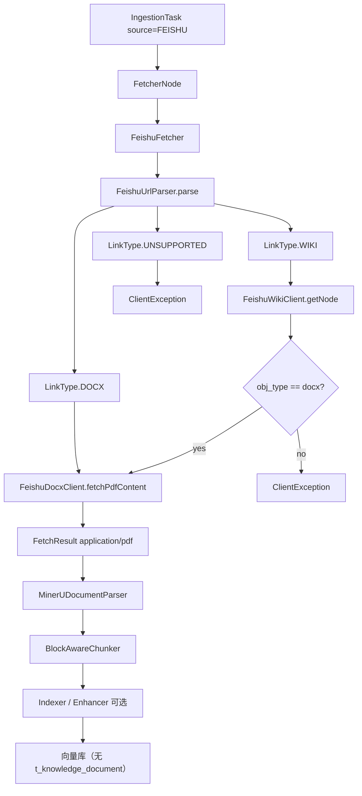
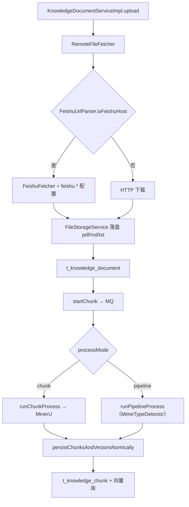
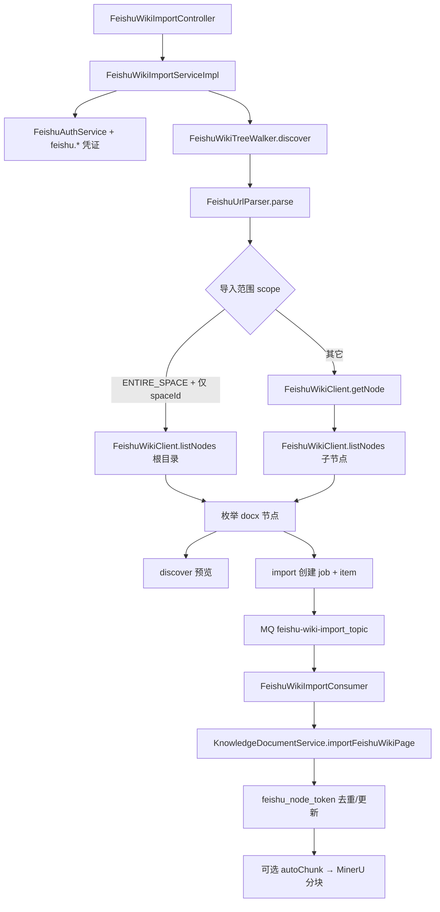

# 飞书知识库 Wiki 接入开发文档

## 1. 背景与问题

### 1.1 业务场景

用户希望将飞书云文档或知识库 Wiki 页面导入 RAG 系统。飞书存在两类常见链接：

| 产品 | 链接形态 | 示例 |
|------|---------|------|
| 云文档 docx | `/docx/{documentToken}` | `https://xxx.feishu.cn/docx/doccnXXXX` |
| 知识库 wiki（经典） | `/wiki/{nodeToken}` | `https://xxx.feishu.cn/wiki/wikcnXXXX` |
| 知识库 wiki（新版空间） | `/wiki/space/{spaceId}` | `https://xxx.feishu.cn/wiki/space/7xxxxxxxx` |
| 知识库 wiki（新版节点） | `/wiki/space/{spaceId}/nodes/{nodeToken}` | `https://xxx.feishu.cn/wiki/space/7xxx/nodes/EpMmw5...` |
| 知识库设置页 | `/wiki/settings/{spaceId}` | `https://xxx.feishu.cn/wiki/settings/7xxxxxxxx` |

> **注意：** node token 不一定以 `wikcn` 开头；`spaceId` 与 `nodeToken` 均为飞书侧 opaque 字符串，须从浏览器地址栏完整复制。

### 1.2 改造前的问题

改造前 [`FeishuFetcher`](../bootstrap/src/main/java/com/nageoffer/ai/ragent/ingestion/strategy/fetcher/FeishuFetcher.java) 仅对含 `/docx/`、`/docs/` 的链接调用飞书 Open API；知识库 Remote URL 及其它 HTTP 路径对 wiki 链接走 **直接下载网页**。早期 docx 正文使用 `raw_content` 接口，仅得到**无结构的纯文本**。

```
改造前：
  docx/docs URL → raw_content API → text/plain（结构丢失）
  wiki URL      → HTTP GET 网页   → text/html（无效正文）

历史（Markdown 导出，仍可通过 content-format=markdown 启用）：
  docx/docs URL → docs/v1/content → text/markdown
  wiki/docx 节点 → get_node + docs/v1/content → text/markdown

当前（PDF 导出，默认）：
  docx/docs URL → drive/v1/export_tasks → application/pdf ✅
  wiki/docx 节点 → get_node + export_tasks → application/pdf ✅
  分块 → MimeTypeDetector → MinerUDocumentParser（表格/图片/代码块）✅
  fallback-on-error=true → pdf 失败可降级 md → plain ✅
  wiki URL（未走 API）→ HTTP GET 网页 → text/html ❌（已禁止兜底）
```

wiki 分享页在浏览器中是 SPA 网页，HTTP 响应为 `text/html`，并非文档正文，导致：

- 解析/入库可能失败（如 `file_type` 超长等）
- 即便入库，分块内容也是无效 HTML

### 1.3 目标与实现范围

**已实现（P0 — Ingestion）：**

- 支持粘贴**具体 wiki 页面**链接（含 `wikcn...` 等 node token）
- 经 Wiki Open API 解析节点，对 `obj_type = docx` 的节点复用 docx 正文拉取
- **默认**异步导出 **PDF**（`application/pdf`、`.pdf`），经 **MinerU** 解析 + block-aware 分块，保留表格与图片
- 统一降级链 **`pdf → markdown → plain`**，由 `feishu.fallback-on-error` 控制（默认开启）
- 兼容 `content-format: markdown` / `plain`（见 §4.4）
- Ingestion 任务使用 `source.type = FEISHU`，任务级 `credentials` 传凭证
- 移除 `FeishuFetcher` 对未知飞书链接的 HTTP 网页兜底

**已实现（P3 — 知识库 Remote URL）：**

- 知识库上传页 **Remote URL** 来源不变（`sourceType = url`），粘贴飞书链接时由 [`RemoteFileFetcher`](../bootstrap/src/main/java/com/nageoffer/ai/ragent/knowledge/handler/RemoteFileFetcher.java) 自动识别并走 Open API
- 飞书应用凭证通过 **`application.yaml` 的 `feishu.*` 配置**，不在 UI 填写
- 拉取结果落盘为 **`application/pdf`（`.pdf`）**（默认），写入 `t_knowledge_document`，走完整文档生命周期（分块表、向量、定时刷新）
- 分块时 `MimeTypeDetector` 识别 MIME → `MinerUDocumentParser`；Pipeline 模式同理（Parser 需允许 `PDF`）

**未实现（后续扩展）：**

- Ingestion 任务 `source.type = URL` 自动识别飞书（须显式选 **Feishu** 来源或走知识库 Remote URL）
- wiki 下 sheet、旧版 doc 等非 docx 节点类型

**已实现（P2 — 知识库 Wiki 整库/子树批量导入）：**

- 知识库页 **飞书 Wiki 导入**：遍历空间子节点，逐页落盘 PDF 并落库 `t_knowledge_document`
- `FeishuWikiClient.listNodes()` + `FeishuWikiTreeWalker` + MQ 异步 `FeishuWikiImportService`
- `feishu_node_token` 去重；可选「导入后自动分块」与定时刷新

---

## 2. 架构设计

### 2.1 Ingestion 任务链路

Ingestion 任务 `source.type = FEISHU` 时，由 [`FetcherNode`](../bootstrap/src/main/java/com/nageoffer/ai/ragent/ingestion/node/FetcherNode.java) 路由至 `FeishuFetcher`：



> `content-format=markdown` 时，`docxClient` 换为 `fetchMarkdownContent`，解析器换为 `MarkdownDocumentParser`（见 §4.4）。

### 2.2 知识库 Remote URL 链路

知识库上传 `sourceType = url`，当 URL 为飞书域名时：



### 2.3 知识库 Wiki 批量导入链路（P2）

管理后台 **飞书 Wiki 导入** 或 `POST .../feishu-wiki/discover|import`：



| 导入范围 `scope` | 行为 | 主要 API |
|------------------|------|----------|
| `PAGE_ONLY` | 仅导入根链接对应页面 | `get_node` |
| `SUBTREE` | 根页面 + 其下所有子节点 | `get_node` + `list_nodes` |
| `ENTIRE_SPACE` | 整个知识空间所有页面 | `list_nodes`（根目录起） |

当 `rootUrl` 为 `/wiki/space/{spaceId}` 或 `/wiki/settings/{spaceId}` 且 `scope = ENTIRE_SPACE` 时，**跳过 `get_node`**，直接用 URL 中的 `spaceId` 从根目录遍历。

### 2.4 三条入口对比

| 维度 | Ingestion 任务 | 知识库 Remote URL | 知识库 Wiki 批量导入 |
|------|----------------|-------------------|---------------------|
| 入口 | Ingestion 页 / `POST /ingestion/tasks` | 知识库 → 上传 → Remote URL | 知识库 → 飞书 Wiki 导入 |
| 来源类型 | `source.type = FEISHU` | `sourceType = url` | `feishu-wiki/discover\|import` |
| 飞书凭证 | 任务 `source.credentials` | `feishu.*` 配置文件 | `feishu.*` 配置文件 |
| 导出格式（默认） | PDF → MinerU | PDF → MinerU | PDF → MinerU |
| 兼容格式 | `markdown` / `plain` | 同上 | 同上 |
| 文档记录 | ❌ 仅 `t_ingestion_task` | ✅ `t_knowledge_document` | ✅ 多文档 + job/item 表 |
| 向量 `doc_id` | 摄取任务 ID | 知识库文档 ID | 知识库文档 ID |
| 遍历子节点 | ❌ 单链接 | ❌ 单链接 | ✅ `list_nodes` |
| 定时同步 | ❌ | ✅ URL 定时刷新 | ✅ 按 `feishu_node_token` 去重更新 |
| 额外依赖 | Pipeline + **MinerU** | **MinerU** | RocketMQ + DB 升级脚本 + **MinerU** |

### 2.5 模块职责

| 类 | 路径 | 职责 |
|----|------|------|
| `FeishuFetcher` | `ingestion/strategy/fetcher/` | 编排入口：鉴权、URL 分流、**降级链**（`chainFrom`）、组装 `FetchResult` |
| `FeishuAuthService` | 同上 | 从凭证解析 `tenant_access_token` 并组装请求头 |
| `FeishuUrlParser` | 同上 | 识别 docx/wiki/unsupported；解析 `token` 与 `wikiSpaceId` |
| `FeishuDocxClient` | 同上 | PDF 异步导出（`export_tasks`）；兼容 Markdown / `raw_content` |
| `FeishuExportPollingExecutor` | 同上 | PDF 导出任务**共享调度轮询**（`ScheduledExecutorService`，替代业务线程 `Thread.sleep`） |
| `FeishuWikiClient` | 同上 | wiki `get_node` / `list_nodes`；131005/131006 转 `ClientException` |
| `WikiNodeInfo` | 同上 | 记录 `title`、`objType`、`objToken`、`spaceId` |
| `FeishuWikiTreeWalker` | `knowledge/feishu/` | 按 scope 遍历 Wiki 树，枚举可导入 docx 页 |
| `FeishuWikiImportServiceImpl` | `knowledge/service/impl/` | discover / import 编排、job 持久化、发 MQ |
| `FeishuWikiImportConsumer` | `knowledge/mq/` | 异步逐页调用 `importFeishuWikiPage` |
| `FeishuProperties` | `knowledge/config/` | 绑定 `feishu.*`（含 `content-format`、`fallback-on-error`） |
| `FeishuCredentialsProvider` | `knowledge/config/` | 校验并组装配置文件中的凭证 |
| `FeishuWikiImportProperties` | `knowledge/config/` | `feishu.wiki-import.*`（页数上限、限流） |
| `RemoteFileFetcher` | `knowledge/handler/` | Remote URL 上传/定时刷新；飞书域名分流；传入 `maxBytes` 限制 PDF 下载 |
| `MinerUDocumentParser` | `core/parser/mineru/` | PDF 结构化解析（默认分块路径） |

---

## 3. 代码变更清单

### 3.1 核心文件（Ingestion / 共用）

```
bootstrap/src/main/java/com/nageoffer/ai/ragent/ingestion/strategy/fetcher/
├── FeishuFetcher.java
├── FeishuAuthService.java
├── FeishuUrlParser.java
├── FeishuDocxClient.java          # fetchPdfContent / fetchMarkdownContent / fetchRawContent
├── FeishuExportPollingExecutor.java  # PDF export_tasks 共享调度轮询
├── FeishuWikiClient.java
├── WikiNodeInfo.java
├── WikiNodeItem.java
└── WikiListNodesResult.java

bootstrap/src/main/java/com/nageoffer/ai/ragent/knowledge/feishu/
├── FeishuWikiTreeWalker.java
├── FeishuWikiImportScope.java
├── FeishuApiRateLimiter.java
└── ...

bootstrap/src/test/java/.../ingestion/strategy/fetcher/
├── FeishuUrlParserTest.java
├── FeishuDocxClientTest.java      # 含 PDF export_tasks 流程与大小限制测试
├── FeishuWikiClientListNodesTest.java
└── FeishuFetcherTest.java         # 默认 PDF、降级链、fallback 开关、非法 content-format

bootstrap/src/test/java/.../knowledge/feishu/
└── FeishuWikiTreeWalkerTest.java
```

### 3.2 知识库接入（P3）

```
bootstrap/src/main/java/com/nageoffer/ai/ragent/knowledge/
├── config/FeishuProperties.java
├── config/FeishuCredentialsProvider.java
├── handler/RemoteFileFetcher.java              # 飞书路径传入 maxBytes
└── service/impl/KnowledgeDocumentServiceImpl.java  # MIME 路由 MinerU + documentId 注入

bootstrap/src/main/java/com/nageoffer/ai/ragent/ingestion/domain/context/
└── DocumentSource.java                         # 可选 maxBytes（PDF 下载大小限制）

bootstrap/src/test/java/.../knowledge/handler/
└── RemoteFileFetcherFeishuTest.java

bootstrap/src/main/resources/application.yaml  # feishu.* + mineru.*
frontend/src/pages/admin/knowledge/KnowledgeDocumentsPage.tsx  # PDF iframe 预览
frontend/src/pages/admin/knowledge/components/FeishuWikiImportDialog.tsx
```

### 3.4 知识库 Wiki 批量导入（P2）

```
bootstrap/src/main/java/com/nageoffer/ai/ragent/knowledge/
├── controller/FeishuWikiImportController.java
├── service/impl/FeishuWikiImportServiceImpl.java
├── feishu/FeishuWikiTreeWalker.java
├── mq/consumer/FeishuWikiImportConsumer.java
├── config/FeishuWikiImportProperties.java
└── dao/entity/FeishuWikiImportJobDO.java / FeishuWikiImportItemDO.java

resources/database/upgrade_v1.2_to_v1.3.sql
docs/examples/feishu-wiki-batch-import-example.md
```

### 3.5 前端（Ingestion）

| 文件 | 变更说明 |
|------|---------|
| [`IngestionPage.tsx`](../frontend/src/pages/admin/ingestion/IngestionPage.tsx) | Feishu 来源的链接与凭证提示 |

### 3.6 示例与文档

```
docs/examples/
├── feishu-wiki-ingestion-example.md
├── feishu-wiki-batch-import-example.md
├── pdf-ingestion-example.md           # 飞书 PDF 摄取完整示例
├── feishu-pipeline-request.json       # Markdown 兼容 Pipeline
└── pdf-pipeline-request.json          # PDF 默认 Pipeline（MinerU + Enhancer 可选）
```

---

## 4. 核心实现说明

### 4.1 URL 解析（FeishuUrlParser）

解析优先级：

1. 路径含 `/docx/` 或 `/docs/` → `LinkType.DOCX`，`token` = 文档 token
2. 路径含 `/wiki/` 或以 `/wiki` 结尾 → `LinkType.WIKI`
3. 其余飞书链接 → `LinkType.UNSUPPORTED`

**Wiki 链接解析规则（`ParseResult` 含 `token` 与 `wikiSpaceId`）：**

| URL 形态 | `token`（node token） | `wikiSpaceId` |
|----------|----------------------|---------------|
| `/wiki/{nodeToken}` | 第一段节点 token | `null` |
| `/wiki/space/{spaceId}` | `null` | `spaceId` |
| `/wiki/space/{spaceId}/nodes/{nodeToken}` | `nodeToken` | `spaceId` |
| `/wiki/settings/{spaceId}` | `null` | `spaceId` |
| `/wiki/`（无后续段） | — | 抛 `ClientException` |

**保留路径段（不作为 node token）：** `space`、`settings`、`nodes`。旧版解析若将 `space` 误当作 token，调用 `get_node` 会返回飞书 **`131005 not found`**。

`tryExtractWikiSpaceId()` 从 `/wiki/space/{id}` 与 `/wiki/settings/{id}` 提取知识空间 ID，供 `ENTIRE_SPACE` 整库遍历使用。

辅助方法（知识库 Remote URL 分流使用）：

| 方法 | 说明 |
|------|------|
| `isFeishuHost(url)` | 域名是否为 `*.feishu.cn` / `*.larksuite.com` / `*.larkoffice.com` |
| `isSupportedDocumentUrl(url)` | 是否为可 API 拉取的 docx/docs/wiki 页（含仅含 spaceId 的空间链接，不抛异常） |
| `buildWikiUrl(host, nodeToken)` | 由域名与 node token 构造 `https://{host}/wiki/{nodeToken}` |

**RemoteFileFetcher 分流规则：**

| URL | 行为 |
|-----|------|
| 非飞书域名 | 原有 HTTP 逻辑 |
| 飞书 + docx/docs/wiki | `FeishuFetcher` + 配置凭证 |
| 飞书 + 其它路径 | `ClientException`，**禁止 HTTP 兜底** |
| 飞书 + `feishu.enabled=false` | `ClientException("飞书集成未启用")` |

### 4.2 鉴权与配置

**Ingestion（`FeishuFetcher` + 任务 credentials）：**

1. `tenantAccessToken`
2. `accessToken`
3. `app_id` + `app_secret` → 请求 `tenant_access_token`

**知识库（`FeishuCredentialsProvider` + 配置文件）：**

```yaml
feishu:
  enabled: true
  app-id: ${FEISHU_APP_ID:}
  app-secret: ${FEISHU_APP_SECRET:}
  tenant-access-token: ${FEISHU_TENANT_TOKEN:}  # 可选，非空时优先
  content-format: pdf                           # pdf（默认）、markdown 或 plain
  fallback-on-error: true                       # 失败时按 pdf → markdown → plain 降级
  wiki-import:
    max-pages-per-job: 500
    rate-limit-per-minute: 90

mineru:
  api-key: ${MINERU_API_KEY:}                   # PDF 分块必填
```

| 配置项 | 默认值 | 说明 |
|--------|--------|------|
| `content-format` | `pdf` | `pdf` 走异步导出；`markdown` 走 `docs/v1/content`；`plain` 强制 `raw_content`；非法值启动后首次拉取时报错 |
| `fallback-on-error` | `true` | 失败时按 **pdf → markdown → plain** 链降级；`false` 时起始格式失败即抛错 |
| `mineru.api-key` | — | **PDF 路径分块必填**；未配置时 MinerU 解析失败 |

> **配置迁移：** 旧版 `fallback-to-plain-on-error` 已合并为 `fallback-on-error`，语义扩展为完整降级链。

请求头均为：`Authorization: Bearer {token}`。

### 4.3 Wiki API（FeishuWikiClient）

**获取节点（单页 / 子树根）：**

```
GET https://open.feishu.cn/open-apis/wiki/v2/spaces/get_node?token={token}
GET ...?token={token}&obj_type=docx   # 云文档 token 查询时可选
Authorization: Bearer {accessToken}
```

- query 参数经 `UriComponentsBuilder` 编码，避免特殊字符导致请求失败
- 从 `data.node` 读取 `title`、`obj_type`、`obj_token`、`space_id`
- `folder` 类型节点可无 `obj_token`（遍历场景）；docx 等叶子节点须有 `obj_token`

**获取子节点列表（子树 / 整库）：**

```
GET https://open.feishu.cn/open-apis/wiki/v2/spaces/{space_id}/nodes
    ?page_size=50
    [&parent_node_token={token}]
    [&page_token={cursor}]
Authorization: Bearer {accessToken}
```

- `parent_node_token` 省略或空表示从知识空间根目录分页
- `FeishuWikiTreeWalker` 结合 `FeishuApiRateLimiter` 按 `feishu.wiki-import.rate-limit-per-minute` 限流

**飞书错误码映射（HTTP 400 体或 JSON `code`）：**

| 飞书 code | 含义 | 系统侧提示要点 |
|-----------|------|----------------|
| `131005` | not found | 节点/空间不存在，或链接解析错误（如把 `space` 当 token） |
| `131006` | permission denied | 应用 API 权限或知识库成员资格不足（见 §6） |
| `131002` | 参数错误 | 链接不完整或 token 格式错误 |

`131006` 细分（飞书 `msg` 子串）：

- `wiki space permission denied` → 应用未加入该知识空间成员
- `node permission denied` → 对某节点无阅读权限

### 4.4 文档正文拉取（FeishuDocxClient）

[`FeishuFetcher`](../bootstrap/src/main/java/com/nageoffer/ai/ragent/ingestion/strategy/fetcher/FeishuFetcher.java) 根据 [`FeishuProperties`](../bootstrap/src/main/java/com/nageoffer/ai/ragent/knowledge/config/FeishuProperties.java) 决定起始格式与降级链：

| 配置 | 行为 | 落盘 MIME | 解析器 |
|------|------|-----------|--------|
| `content-format: pdf`（**默认**） | 优先异步导出 PDF；`fallback-on-error=true` 时可降级 md → plain | `application/pdf` / `text/markdown` / `text/plain` | `MinerUDocumentParser` / `MarkdownDocumentParser` / `TikaDocumentParser` |
| `content-format: markdown` | 优先 Markdown API；`fallback-on-error=true` 时可降级 plain | `text/markdown` / `text/plain` | `MarkdownDocumentParser` / `TikaDocumentParser` |
| `content-format: plain` | 始终 `raw_content` | `text/plain`、`.txt` | `TikaDocumentParser` |
| `fallback-on-error: false` | 仅尝试 `content-format` 指定格式；失败直接抛错 | — | — |

#### 降级链实现（FeishuFetcher）

`content-format` 决定**起始格式**；`fallback-on-error=true` 时仅向下一档降级（不向上回退）：

| `content-format` | 尝试顺序 |
|------------------|----------|
| `pdf`（默认） | pdf → markdown → plain |
| `markdown` | markdown → plain |
| `plain` | plain |

非法 `content-format`（如 `foo`）在首次拉取时抛 `IllegalArgumentException`，提示允许值 `pdf` / `markdown` / `plain`。

#### 主路径（PDF，默认）

三步异步导出（[`FeishuDocxClient.fetchPdfContent`](../bootstrap/src/main/java/com/nageoffer/ai/ragent/ingestion/strategy/fetcher/FeishuDocxClient.java)）：

**1. 创建导出任务**

```
POST https://open.feishu.cn/open-apis/drive/v1/export_tasks
Content-Type: application/json

{
  "file_extension": "pdf",
  "token": "{documentToken}",
  "type": "docx"
}
```

响应取 `data.ticket`。

**2. 轮询任务状态**

```
GET https://open.feishu.cn/open-apis/drive/v1/export_tasks/{ticket}?token={documentToken}
```

| `job_status` | 含义 |
|--------------|------|
| `0` | 成功，取 `result.file_token` |
| `1` | 初始化，继续轮询 |
| `2` | 处理中，继续轮询 |
| `≥3` | 失败（如 `107` 文档过大、`110` 无权限） |

默认轮询间隔 2s，超时 120s。

轮询由 [`FeishuExportPollingExecutor`](../bootstrap/src/main/java/com/nageoffer/ai/ragent/ingestion/strategy/fetcher/FeishuExportPollingExecutor.java) 执行：HTTP 状态查询在**共享调度线程池**（2 线程）中定时触发，业务线程在 `CompletableFuture.get()` 上等待结果，避免在 HTTP/MQ 工作线程中 `Thread.sleep`。实现模式与 [`MinerUPollingExecutor`](../bootstrap/src/main/java/com/nageoffer/ai/ragent/core/parser/mineru/MinerUPollingExecutor.java) 一致。

**3. 下载 PDF**

```
GET https://open.feishu.cn/open-apis/drive/v1/export_tasks/file/{file_token}/download
```

- 返回原始 PDF 字节，**不做 UTF-8 文本解码**
- 知识库 Remote URL 路径通过 `DocumentSource.maxBytes` 限制下载大小（默认对齐 `spring.servlet.multipart.max-file-size`，通常 50MB），使用 `HttpClientHelper.getWithLimit`
- Ingestion 直调 `source.type=FEISHU` 时未传 `maxBytes`，PDF 下载不做大小限制
- 开放平台权限：**导出云文档** `docs:document:export`（名称以平台为准）
- 单页耗时通常 **长于** Markdown API（创建 + 轮询 + 下载）

#### 兼容路径（Markdown）

```
GET https://open.feishu.cn/open-apis/docs/v1/content
    ?doc_token={documentToken}
    &doc_type=docx
    &content_type=markdown
```

- 权限：`docs:document.content:read`
- 频控约 **5 次/秒**

#### 回退路径（`raw_content`）

```
GET https://open.feishu.cn/open-apis/docx/v1/documents/{documentToken}/raw_content
```

- 权限：`docx:document:readonly`
- 触发：`content-format=plain`，或上级格式失败且 `fallback-on-error=true`

### 4.5 返回值与落盘

**PDF（默认）：**

```java
new FetchResult(pdfBytes, "application/pdf", fileName)  // fileName 以 .pdf 结尾
```

**Markdown：**

```java
new FetchResult(contentBytes, "text/markdown", fileName)  // fileName 以 .md 结尾
```

**plain / 回退：**

```java
new FetchResult(contentBytes, "text/plain", fileName)     // fileName 以 .txt 结尾
```

[`FileTypeDetector`](../bootstrap/src/main/java/com/nageoffer/ai/ragent/rag/util/FileTypeDetector.java) 将 `.pdf` 识别为 `fileType=pdf`。知识库文档预览：

- **PDF**：前端 iframe 预览源文件（`KnowledgeDocumentsPage`）
- **Markdown**：`KnowledgeDocumentService.preview` 返回 UTF-8 原文
- **其它类型**：按现有规则处理

### 4.6 PDF 解析与 RAG 分块（MinerU，默认）

PDF 经 [`MinerUDocumentParser`](../bootstrap/src/main/java/com/nageoffer/ai/ragent/core/parser/mineru/MinerUDocumentParser.java)：

1. 上传 PDF 至 MinerU SaaS
2. 轮询解析完成
3. 下载 zip，[`MinerUResultUnpacker`](../bootstrap/src/main/java/com/nageoffer/ai/ragent/core/parser/mineru/MinerUResultUnpacker.java) 解包为 Block 列表（含表格、图片、代码块）
4. 图片上传至 `asset-bucket`，markdown 内链替换为公开 URL

MIME 路由（chunk / pipeline 共用）：

```java
DocumentParser parser = parserSelector.selectByMimeType("application/pdf");
// → MinerUDocumentParser（@Order HIGHEST_PRECEDENCE）
```

[`StructuredChunkingService`](../bootstrap/src/main/java/com/nageoffer/ai/ragent/core/chunk/StructuredChunkingService.java) 在 blocks 非空时走 **block-aware** 分块。推荐 `structure_aware` 策略（见 `pdf-pipeline-request.json`）。

**前置条件：**

- `mineru.api-key` 已配置
- 运行环境可访问 `mineru.net` 及 MinerU OSS（`aliyuncs.com`）；本地代理 TUN 可能导致 Java SSL 握手失败

**已知限制：**

- MinerU 解析的代码块可能带有 PDF 行号前缀（如 `70 JsonObject respJson;`）
- Pipeline 中 **Enhancer** 输出的 `enhancedText` **不会**覆盖 block-aware 路径下的 `CodeBlock`（Chunker 直接使用 Parser 产出的 blocks）

### 4.7 Markdown 解析与分块（兼容模式）

`content-format: markdown` 时，正文经 [`MarkdownDocumentParser`](../bootstrap/src/main/java/com/nageoffer/ai/ragent/core/parser/MarkdownDocumentParser.java) 解析为 Block（标题、GFM 表格、围栏代码、列表等），同样走 block-aware 分块。

纯文本回退路径走 `TikaDocumentParser`，无结构收益。

### 4.8 PDF vs Markdown 导出对比

| 块类型 | Markdown 导出 | PDF + MinerU |
|--------|--------------|--------------|
| 标题 / 列表 / 段落 | GFM 语法 | 版面还原，outlinePath |
| 文档内表格 | GFM 表格 | `TableBlock` + 按行分块 |
| 代码块 | 围栏代码块 | 原子 `CodeBlock`（可能有行号噪声） |
| 图片 | ``，URL 可能需鉴权 | 抽图上传 asset-bucket，公开 URL |
| 画板 / 嵌入 Sheet | 占位或丢失 | 随 PDF 版面，质量依赖导出 |
| 导出速度 | 快（单次 API） | 慢（异步任务 + MinerU） |
| 权限 | `docs:document.content:read` | `docs:document:export` + MinerU |

典型技术文档（标题+段落+表格+代码+图片）推荐 **PDF 默认路径**；仅需纯文本或无法开通导出权限时，可退回 `markdown` / `plain`。

### 4.9 知识库 Pipeline 模式的 MIME 处理

知识库 Pipeline 在上传阶段已将正文落盘，`FetcherNode` 会跳过拉取。`runPipelineProcess` 必须使用 **`MimeTypeDetector.detect(bytes, docName)`** 传入 Parser，不能直接使用 `documentDO.getFileType()`。

```java
String mimeType = MimeTypeDetector.detect(fileBytes, docName);
IngestionContext context = IngestionContext.builder()
        .rawBytes(fileBytes)
        .mimeType(mimeType)
        .source(DocumentSource.builder().fileName(docName).build())
        .skipIndexerWrite(true)
        .build();
```

| `content-format` | 推荐 Pipeline Parser rules |
|------------------|---------------------------|
| `pdf`（默认） | `PDF`（自动路由 MinerU） |
| `markdown` | `MARKDOWN`（回退 plain 时加 `TEXT`） |

示例见 [`pdf-pipeline-request.json`](examples/pdf-pipeline-request.json)、[`feishu-pipeline-request.json`](examples/feishu-pipeline-request.json)。

### 4.10 定时刷新（飞书 URL 文档）

`ScheduleRefreshProcessor` 调用 `RemoteFileFetcher.fetchIfChanged`。飞书链接无 ETag，通过 **内容 SHA-256** 与 `last_content_hash` 比较判断是否变更。

> **升级注意：** 切换 `content-format`（如 markdown → pdf）后，同一文档的 hash **必然变化**，首次定时刷新会触发重新拉取与分块，即使飞书侧正文未改动。切换格式后须 **重新分块**。

---

## 5. 错误处理

| 场景 | 异常类型 | 消息要点 |
|------|---------|---------|
| location 为空 | `ServiceException` | 飞书文档地址不能为空 |
| wiki 仅 `/wiki/` 无后续段 | `ClientException` | 请提供具体 wiki 页面链接或带知识空间 ID 的链接 |
| 整库/子树但无 node token 且非空间 URL | `ClientException` | 请粘贴知识库内具体页面链接，或用于整库导入的空间/设置页链接 |
| wiki 节点非 docx | `ClientException` | 暂仅支持 docx 类型的 wiki 节点 |
| 不支持的飞书 URL | `ClientException` | 不支持的飞书链接格式 |
| 飞书集成未启用 | `ClientException` | 飞书集成未启用，请设置 feishu.enabled=true |
| 飞书凭证未配置 | `ClientException` | 请设置 feishu.app-id/app-secret 或 tenant-access-token |
| 飞书 `131005` | `ClientException` | 节点不存在或无法访问；检查链接是否为具体页面 |
| 飞书 `131006`（list_nodes） | `ClientException` | 开通 `wiki:node:retrieve` 并将应用加为知识空间成员 |
| 飞书 `131006`（get_node） | `ClientException` | 开通 wiki 只读权限并确保应用可访问目标节点 |
| 其它 Wiki / 令牌 API 失败 | `ServiceException` | 飞书 Wiki API / 令牌请求失败 |
| 批量导入无可导入页 | `ClientException` | 未发现可导入的 docx 页面 |
| 飞书 PDF 导出失败 | `ClientException` | 飞书 PDF 导出失败: ...；检查 `docs:document:export` 与文档阅读权限；`fallback-on-error=true` 时可降级 md/plain |
| 飞书 PDF 导出超时 | `ClientException` | 飞书 PDF 导出超时，ticket=... |
| 非法 `content-format` | `IllegalArgumentException` | 无效的 feishu.content-format: ...，允许值: pdf, markdown, plain |
| PDF 下载超过大小限制 | `ServiceException` | 文件大小超过限制（知识库 Remote URL 路径）；`fallback-on-error=true` 时可能继续尝试 markdown |
| 飞书 Markdown 导出失败（无回退） | `ClientException` | `fallback-on-error=false` 或已为链末端；检查 `docs:document.content:read` |
| 飞书格式降级（已回退） | —（warn 日志） | 如 `飞书 pdf 导出失败，降级下一格式`；落盘 MIME 可能变为 md/plain，Parser 须匹配 |
| MinerU 未配置 / 失败 | `ServiceException` / `ClientException` | 检查 `mineru.api-key`；OSS 网络与 SSL |
| Pipeline 类型不匹配 | `ClientException` | PDF 文档用了 MARKDOWN Pipeline，或反之 |
| 分块文本为空 | `ClientException` | 多为 URL 来源 HTTP 下载飞书网页，非 Feishu 来源 |

---

## 6. 飞书开放平台配置

### 6.1 应用权限

在 [飞书开放平台](https://open.feishu.cn/) 创建企业自建应用，按使用场景开通：

| 能力 | 开放平台权限（scope） | 使用场景 |
|------|----------------------|----------|
| 云文档 **PDF 导出**（**默认主路径**） | 导出云文档 `docs:document:export` | 所有 wiki/docx 导入（`content-format: pdf`） |
| 云文档正文（Markdown 兼容） | 查看云文档内容 `docs:document.content:read` | `content-format=markdown` |
| 云文档正文（纯文本回退） | 云文档只读 `docx:document:readonly` | Markdown 失败回退或 `content-format=plain` |
| 单节点元数据 | 知识库节点读取 / `get_node` | 单页 Remote URL、`PAGE_ONLY` |
| 子节点列表 | **查看知识空间节点列表** `wiki:node:retrieve` | `SUBTREE` / `ENTIRE_SPACE` |
| 知识库只读（二选一） | **查看知识库** `wiki:wiki:readonly` | 同上 |
| 知识库管理 | `wiki:wiki` | 权限更大，一般只读即可 |

**权限与导入范围对照（PDF 默认）：**

| `scope` | 最少应用权限 | 资源权限 |
|---------|-------------|----------|
| `PAGE_ONLY` | PDF 导出 + `get_node` | 目标 wiki 页 / 底层 docx 对应用可见 |
| `SUBTREE` | 上项 + **`wiki:node:retrieve`** | 应用为**知识空间成员** |
| `ENTIRE_SPACE` | 上项 + **`wiki:node:retrieve`** | 应用为**知识空间成员** |

发布应用并安装到目标租户；**权限变更后须重新发布版本**。

使用 `tenant_access_token` 时，还须将应用加为**知识空间成员**，否则 `list_nodes` 典型返回 **`131006`**。

### 6.2 凭证方式

| 场景 | 配置方式 |
|------|---------|
| Ingestion 任务 | 任务 `source.credentials` JSON |
| 知识库 Remote URL / Wiki 批量导入 | `application.yaml` 的 `feishu.*` |

Ingestion 凭证示例：

```json
{
  "app_id": "cli_xxxxxxxx",
  "app_secret": "xxxxxxxxxxxxxxxx"
}
```

或 `{"tenantAccessToken": "t-xxxxxxxx"}`。

### 6.3 批量导入与 MinerU 配置

```yaml
feishu:
  enabled: true
  app-id: ${FEISHU_APP_ID:}
  app-secret: ${FEISHU_APP_SECRET:}
  content-format: pdf
  fallback-on-error: true
  wiki-import:
    max-pages-per-job: 500
    rate-limit-per-minute: 90   # PDF 导出更慢，大批量导入耗时会明显增加

mineru:
  api-url: https://mineru.net/api/v4
  api-key: ${MINERU_API_KEY:}
  poll-interval-seconds: 5
  timeout-seconds: 300
  concurrency-limit: 5
```

依赖 **RocketMQ**（topic：`feishu-wiki-import_topic`）；数据库须先执行 `upgrade_v1.2_to_v1.3.sql`。

### 6.4 常见问题排查

| 现象 | 可能原因 | 处理 |
|------|---------|------|
| `飞书 PDF 导出失败` / `job_status=110` | 未开导出权限或文档不可读 | 开通 `docs:document:export`；确认应用有文档阅读权 |
| `飞书 PDF 导出超时` | 文档过大或飞书侧排队 | 重试；检查 `EXPORT_TIMEOUT_MS`（代码默认 120s） |
| MinerU `downloadZip` SSL 失败 | 本地代理 TUN 拦截 Java | 对 `aliyuncs.com` / `mineru.net` 直连，或关闭 TUN |
| `未找到 MIME [application/pdf] 对应的解析器` | 未配置 `MINERU_API_KEY` | 配置 `mineru.api-key` |
| `131005 not found` | URL 解析错误 | §4.1 链接格式 |
| `131006`（`list_nodes`） | 未开列表权限或非空间成员 | §6.1 |
| `文件类型不符合要求…MARKDOWN…` | Pipeline 仍为 MARKDOWN，文档已是 PDF | 换 `pdf-pipeline-request.json` |
| 代码块含 `70 xxx` 行号 | MinerU/PDF 版面噪声 | 见 §4.6 已知限制；Enhancer 无法修复 block-aware 路径 |
| discover 成功、import 卡住 | RocketMQ 未消费 | 检查 MQ 与 Consumer 日志 |
| 导入成功但分块很慢 | PDF + MinerU 正常耗时 | 调低批量规模或提高 `mineru.concurrency-limit` |

飞书返回体中的 `log_id` 可在 [开放平台排查工具](https://open.feishu.cn/search?from=openapi) 查询详情。

---

## 7. 使用说明

### 7.1 创建 Pipeline

默认 `feishu.content-format: pdf`，拉取结果为 **PDF**，Parser 需允许 **PDF**（自动路由 MinerU）：

```
FETCHER → PARSER(PDF) → ENHANCER(可选) → CHUNKER(structure_aware) → INDEXER
```

参考 [`docs/examples/pdf-pipeline-request.json`](examples/pdf-pipeline-request.json)、[`pdf-ingestion-example.md`](examples/pdf-ingestion-example.md)。

**Markdown 兼容**（`content-format: markdown`）：

```
FETCHER → PARSER(MARKDOWN) → CHUNKER → INDEXER
```

参考 [`docs/examples/feishu-pipeline-request.json`](examples/feishu-pipeline-request.json)。

### 7.2 知识库 Remote URL 导入（推荐完整文档管理）

**1. 配置 `application.yaml`：**

```yaml
feishu:
  enabled: true
  app-id: ${FEISHU_APP_ID:}
  app-secret: ${FEISHU_APP_SECRET:}
  content-format: pdf

mineru:
  api-key: ${MINERU_API_KEY:}
```

**2. 管理后台：** 知识库 → 上传文档 → 来源 **Remote URL** → 粘贴飞书链接。

**3. 处理模式：**

- **chunk**：直接分块；PDF 自动经 MinerU + block-aware
- **pipeline**：选允许 **PDF** 的 Pipeline；Fetcher 自动跳过

**4. 可选：** 开启 URL 定时刷新。

### 7.3 创建 Ingestion 任务（仅向量、无文档记录）

```bash
curl -X POST "http://localhost:9090/api/ragent/ingestion/tasks" \
  -H "Content-Type: application/json" \
  -H "Authorization: <token>" \
  -d '{
    "pipelineId": "<pipelineId>",
    "source": {
      "type": "FEISHU",
      "location": "https://xxx.feishu.cn/wiki/wikcnXXXXXXXX",
      "credentials": {
        "app_id": "cli_xxx",
        "app_secret": "xxx"
      }
    },
    "vectorSpaceId": {
      "logicalName": "<知识库 collectionName>"
    }
  }'
```

> 来源须选 **Feishu**，不要选 URL 粘贴飞书链接。`pipelineId` 须为 **PDF Pipeline**（默认 `content-format` 下）。

简明步骤见 [`docs/examples/feishu-wiki-ingestion-example.md`](examples/feishu-wiki-ingestion-example.md)。

### 7.4 支持的链接

| 类型 | 示例 | 单页 Remote URL | 批量导入 |
|------|------|-----------------|----------|
| 云文档 docx | `https://xxx.feishu.cn/docx/doccnXXXX` | ✅ | — |
| 旧版 docs | `https://xxx.feishu.cn/docs/doccnXXXX` | ✅ | — |
| wiki 经典页面 | `https://xxx.feishu.cn/wiki/wikcnXXXX` | ✅（docx 节点） | ✅ |
| wiki 空间节点 | `https://xxx.feishu.cn/wiki/space/{spaceId}/nodes/{token}` | ✅ | ✅ |
| wiki 空间首页 | `https://xxx.feishu.cn/wiki/space/{spaceId}` | ❌ | ✅（仅 `ENTIRE_SPACE`） |
| wiki 设置页 | `https://xxx.feishu.cn/wiki/settings/{spaceId}` | ❌ | ✅（仅 `ENTIRE_SPACE`） |
| wiki 裸路径 | `https://xxx.feishu.cn/wiki/` | ❌ | ❌ |
| wiki 表格节点 | `obj_type = sheet` 等 | ❌ | 跳过并记入 `skipped` |

### 7.5 知识库 Wiki 批量导入

**前置：** §6 权限（含 **PDF 导出** + `wiki:node:retrieve`）、`mineru.api-key`、`upgrade_v1.2_to_v1.3.sql`、RocketMQ。

**管理后台：** 知识库 → 文档管理 → **飞书 Wiki 导入**

默认导入结果为 **PDF**（`.pdf`），分块走 MinerU；画板、嵌入电子表格等复杂块质量依赖 PDF 导出，部分节点仍可能记入 `skipped`。

1. 粘贴 Wiki 链接（见 §7.4）
2. 选择范围：`PAGE_ONLY` / `SUBTREE` / `ENTIRE_SPACE`（默认 `SUBTREE`）
3. **预览页面**（`discover`）
4. 可选「导入后自动分块」（建议 chunk 策略 `structure_aware`）
5. 确认导入，轮询 job 进度

**API：**

- `POST /api/ragent/knowledge-base/{kbId}/feishu-wiki/discover`
- `POST /api/ragent/knowledge-base/{kbId}/feishu-wiki/import`
- `GET /api/ragent/knowledge-base/feishu-wiki/import/{jobId}`

简明 curl 示例见 [`docs/examples/feishu-wiki-batch-import-example.md`](examples/feishu-wiki-batch-import-example.md)。

### 7.6 从 Markdown 迁移到 PDF

若此前已使用 `content-format: markdown` 接入，切换为 PDF 默认后请注意：

| 项 | 操作 |
|----|------|
| 飞书应用权限 | 新增 **`docs:document:export`**（保留 wiki 与 docx 只读权限） |
| `application.yaml` | `content-format: pdf`；`fallback-on-error: true`（替代旧 `fallback-to-plain-on-error`）；配置 **`mineru.api-key`** |
| Ingestion Pipeline | 从 `PARSER(MARKDOWN)` 改为 **`PARSER(PDF)`** |
| 已导入文档 | **不会自动转换**；定时刷新或 re-import 后变为 `.pdf`，**须重新分块** |
| 内容 hash | 格式切换后 hash 必然变化，首次刷新会触发更新 |
| 文档预览 | 由 Markdown 原文预览变为 **PDF iframe 预览** |

### 7.7 从纯文本版升级（历史）

若曾使用 `raw_content` 纯文本版，经 Markdown 再至 PDF 的升级路径：

1. 开通 `docs:document.content:read`（Markdown 阶段）或直接进入 PDF（`docs:document:export`）
2. 按 §7.6 配置 PDF + MinerU
3. 全量 re-import 并重新分块

---

## 8. 测试

### 8.1 单元测试

| 测试类 | 覆盖点 |
|--------|--------|
| `FeishuUrlParserTest` | docx/docs/wiki 解析、新版 space URL |
| `FeishuDocxClientTest` | Markdown API、**PDF export_tasks 流程**（含 `getWithLimit`）、`raw_content`、导出失败状态码 |
| `FeishuFetcherTest` | **默认 PDF**、wiki→docx、**pdf→md→plain 全链降级**、fallback 关闭、markdown/plain 模式、非法 content-format |
| `FeishuWikiClientListNodesTest` | `list_nodes` 响应解析 |
| `FeishuWikiTreeWalkerTest` | `PAGE_ONLY` / `SUBTREE` / `ENTIRE_SPACE` |
| `RemoteFileFetcherFeishuTest` | 飞书落盘、unsupported 报错、hash 变更检测 |

**运行：**

```bash
mvn install -DskipTests
mvn test -pl bootstrap "-Dtest=FeishuDocxClientTest,FeishuUrlParserTest,FeishuFetcherTest,FeishuWikiClientListNodesTest,FeishuWikiTreeWalkerTest,RemoteFileFetcherFeishuTest"
```

### 8.2 集成验证

**知识库批量导入路径：**

1. 配置 §6 权限（**PDF 导出** + `wiki:node:retrieve`）+ `mineru.api-key`
2. 执行 `upgrade_v1.2_to_v1.3.sql`
3. `discover` 预览列表非空
4. `import` 后 job `success`，文档 `fileType=pdf`

**知识库 Remote URL 路径：**

1. `feishu.enabled=true`、凭证、`docs:document:export`、`MINERU_API_KEY`
2. 上传 Remote URL（wiki 单页）
3. 分块成功，日志含 `命中解析器=mineru`
4. 抽查 chunk：表格/代码块 blockType；PDF 可在文档详情 iframe 预览
5. RAG 检索可命中

**Ingestion 路径：**

1. 创建 **PDF Pipeline**（`PARSER(PDF)`）
2. 来源 **Feishu**，创建任务
3. 任务 `COMPLETED`，向量写入目标 `collectionName`

---

## 9. 后续扩展建议

| 优先级 | 内容 | 改动点 |
|--------|------|--------|
| P3 | PDF 代码块行号剥离 | `MinerUResultUnpacker` / `CodeChunker` 确定性清洗 |
| P4 | sheet / 旧版 doc 节点 | 按 `obj_type` 扩展拉取策略 |
| P5 | Ingestion URL 来源识别飞书 | `HttpUrlFetcher` 分流 |
| P6 | 知识库级 / 多租户飞书凭证 | `feishu.profiles.{name}` |
| P7 | 飞书 Markdown 内图片下载转存 | `content-format=markdown` 场景 |
| P8 | Enhancer 与 block-aware 协同 | Chunker 在增强后同步更新 blocks |

---

## 10. 变更记录

| 日期 | 说明 |
|------|------|
| 2026-06-29 | 初版：Wiki 单页 Ingestion、模块拆分、移除 HTTP 兜底 |
| 2026-06-29 | P3：知识库 Remote URL 自动识别飞书、`feishu.*`、Pipeline MIME 修复 |
| 2026-06-30 | P2：Wiki 整库/子树批量导入、MQ 异步落库、`feishu_node_token` 去重 |
| 2026-06-30 | 新版 Wiki URL 解析；`ENTIRE_SPACE` 跳过 `get_node`；131005/131006 文档 |
| 2026-07-02 | **Markdown 导出**：`fetchMarkdownContent`；`content-format` 配置；`PARSER(MARKDOWN)` |
| 2026-07-07 | **PDF 默认导出**：`fetchPdfContent`（`export_tasks`）；默认 `content-format: pdf`；MinerU 解析；`pdf-pipeline-request.json`；权限 `docs:document:export` |
| 2026-07-07 | **降级链重构**：统一 `fallback-on-error`（pdf→md→plain）；`content-format` 校验；PDF 下载 `maxBytes` 限制 |
| 2026-07-07 | **轮询优化**：`FeishuExportPollingExecutor` 共享调度轮询，替代业务线程 `Thread.sleep` |

---

## 11. 相关链接

- 单页使用示例：[`docs/examples/feishu-wiki-ingestion-example.md`](examples/feishu-wiki-ingestion-example.md)
- PDF 摄取示例：[`docs/examples/pdf-ingestion-example.md`](examples/pdf-ingestion-example.md)
- 批量导入示例：[`docs/examples/feishu-wiki-batch-import-example.md`](examples/feishu-wiki-batch-import-example.md)
- Pipeline（PDF 默认）：[`docs/examples/pdf-pipeline-request.json`](examples/pdf-pipeline-request.json)
- Pipeline（Markdown 兼容）：[`docs/examples/feishu-pipeline-request.json`](examples/feishu-pipeline-request.json)
- 核心 Fetcher：`bootstrap/src/main/java/com/nageoffer/ai/ragent/ingestion/strategy/fetcher/`
- MinerU 解析：`bootstrap/src/main/java/com/nageoffer/ai/ragent/core/parser/mineru/`
