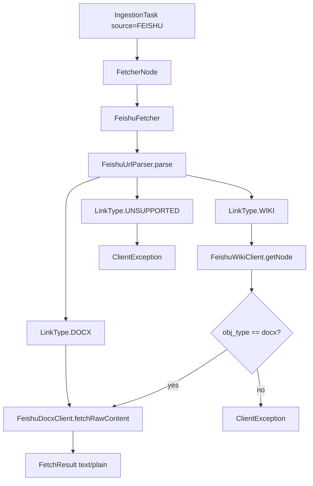

# 飞书知识库 Wiki 接入开发文档

## 1. 背景与问题

### 1.1 业务场景

用户希望通过**数据通道（Ingestion）**将飞书文档导入 RAG 系统。飞书存在两类常见链接：

| 产品 | 链接形态 | 示例 |
|------|---------|------|
| 云文档 docx | `/docx/{documentToken}` | `https://xxx.feishu.cn/docx/doccnXXXX` |
| 知识库 wiki | `/wiki/{nodeToken}` | `https://xxx.feishu.cn/wiki/wikcnXXXX` |

### 1.2 改造前的问题

改造前 [`FeishuFetcher`](../bootstrap/src/main/java/com/nageoffer/ai/ragent/ingestion/strategy/fetcher/FeishuFetcher.java) 仅对含 `/docx/`、`/docs/` 的链接调用飞书 Open API；其余链接走 **HTTP 直接下载网页**：

```
docx/docs URL → docx raw_content API → text/plain ✅
wiki URL      → HTTP GET 网页        → text/html ❌
```

wiki 分享页在浏览器中是 SPA 网页，HTTP 响应为 `text/html`，并非文档正文，导致：

- 解析/入库可能失败（如 `file_type` 超长等）
- 即便入库，分块内容也是无效 HTML

### 1.3 本次目标与范围

**已实现（P0）：**

- 支持粘贴**具体 wiki 页面**链接（含 `wikcn...` 等 node token）
- 经 Wiki Open API 解析节点，对 `obj_type = docx` 的节点复用 docx `raw_content` 拉取纯文本
- 继续沿用 `source.type = FEISHU`，不新增 SourceType
- 移除对飞书链接的 HTTP 网页兜底，未知格式明确报错

**未实现（后续扩展）：**

- 整库 / 子树批量导入
- 知识库文档上传页接入飞书/wiki
- wiki 下 sheet、旧版 doc 等非 docx 节点类型

---

## 2. 架构设计

### 2.1 调用链路

Ingestion 任务 `source.type = FEISHU` 时，由 [`FetcherNode`](../bootstrap/src/main/java/com/nageoffer/ai/ragent/ingestion/node/FetcherNode.java) 路由至 `FeishuFetcher`：



### 2.2 模块职责

| 类 | 路径 | 职责 |
|----|------|------|
| `FeishuFetcher` | `ingestion/strategy/fetcher/` | 编排入口：鉴权、URL 分流、组装 `FetchResult` |
| `FeishuUrlParser` | 同上 | 静态工具：识别 docx/wiki/unsupported，提取 token |
| `FeishuDocxClient` | 同上 | 调用 docx `raw_content`，解析 `data.content` |
| `FeishuWikiClient` | 同上 | 调用 wiki `get_node`，解析节点元数据 |
| `WikiNodeInfo` | 同上 | 记录 `title`、`objType`、`objToken`、`spaceId` |

### 2.3 与知识库上传的关系

| 能力 | 入口 | 飞书 wiki 支持 |
|------|------|----------------|
| Ingestion 任务 | 管理后台 Ingestion 页 / `POST /ingestion/tasks` | ✅ 本次实现 |
| 知识库文档 URL 上传 | 知识库 → 上传文档 | ❌ 仍走 `RemoteFileFetcher` HTTP，未接入 |

知识库上传若处理模式选「数据通道」，也是在**已下载的文件内容**上跑 Pipeline，不能替代本次 Ingestion + `FeishuFetcher` 路径。

---

## 3. 代码变更清单

### 3.1 新增文件

```
bootstrap/src/main/java/com/nageoffer/ai/ragent/ingestion/strategy/fetcher/
├── FeishuUrlParser.java      # URL 解析
├── FeishuDocxClient.java     # docx API 客户端
├── FeishuWikiClient.java     # wiki API 客户端
└── WikiNodeInfo.java         # wiki 节点 DTO

bootstrap/src/test/java/com/nageoffer/ai/ragent/ingestion/strategy/fetcher/
├── FeishuUrlParserTest.java
└── FeishuFetcherTest.java

docs/examples/
├── feishu-wiki-ingestion-example.md   # 使用示例（简版）
└── feishu-pipeline-request.json      # 飞书专用 Pipeline 配置示例
```

### 3.2 修改文件

| 文件 | 变更说明 |
|------|---------|
| [`FeishuFetcher.java`](../bootstrap/src/main/java/com/nageoffer/ai/ragent/ingestion/strategy/fetcher/FeishuFetcher.java) | 重构为编排类；注入 `FeishuDocxClient`、`FeishuWikiClient`；删除 HTTP 兜底 |
| [`IngestionPage.tsx`](../frontend/src/pages/admin/ingestion/IngestionPage.tsx) | 更新 feishu 来源的链接与凭证提示文案 |

### 3.3 未修改但相关的现有模块

- `SourceType.FEISHU` — 无变更
- `FetcherNode` — 无变更，仍按 `source.type` 路由
- `ParserNode` — wiki/docx 拉取结果均为 `text/plain`，需允许 `TEXT` 类型（见使用说明）

---

## 4. 核心实现说明

### 4.1 URL 解析（FeishuUrlParser）

解析优先级：

1. 路径含 `/docx/` 或 `/docs/` → `LinkType.DOCX`，token 为其后第一段路径（去掉 `?` 查询参数）
2. 路径含 `/wiki/` 或以 `/wiki` 结尾 → `LinkType.WIKI`，token 为 `wiki` 后第一段路径
3. wiki 无 token（如 `.../wiki/`）→ `ClientException("请提供具体 wiki 页面链接...")`
4. 其余 → `LinkType.UNSUPPORTED`

**注意：** docx 优先于 wiki 判断；同一 URL 不会同时命中两种类型。

### 4.2 鉴权（FeishuFetcher）

凭证 `credentials` 解析顺序（与改造前一致）：

1. `tenantAccessToken`
2. `accessToken`
3. `app_id` + `app_secret` → 请求 `tenant_access_token`

请求头：`Authorization: Bearer {token}`（token 为空时仍发起请求，与改造前 docx 行为一致；wiki API 通常需要有效 token）。

### 4.3 Wiki 节点查询（FeishuWikiClient）

**请求：**

```
GET https://open.feishu.cn/open-apis/wiki/v2/spaces/get_node?token={wikiNodeToken}
Authorization: Bearer {accessToken}
```

**响应处理：**

- `code != 0` → `ServiceException("飞书 Wiki API 请求失败: {msg}")`
- 从 `data.node` 读取 `title`、`obj_type`、`obj_token`、`space_id`
- `obj_type` / `obj_token` 缺失 → `ServiceException`

### 4.4 文档正文拉取（FeishuDocxClient）

**请求：**

```
GET https://open.feishu.cn/open-apis/docx/v1/documents/{documentToken}/raw_content
Authorization: Bearer {accessToken}
```

**响应处理（与改造前一致）：**

- 优先解析 JSON `data.content` 字段
- 解析失败则回退为响应体 UTF-8 字符串

### 4.5 文件名策略

`resolveFileName(preferredFileName, title, fallbackToken)` 优先级：

1. 用户传入 `source.fileName`
2. wiki 节点 API 返回的 `title` + `.txt`
3. `{documentToken}.txt`

### 4.6 返回值

统一：

```java
new FetchResult(contentBytes, "text/plain", fileName)
```

后续 `ParserNode` 将 MIME 识别为 `TEXT` 类型。

### 4.7 移除的 HTTP 兜底

改造前对非 docx 链接执行：

```java
httpClientHelper.get(location, headers);  // 下载网页 HTML
```

已删除。未知飞书链接抛出 `ClientException("不支持的飞书链接格式: ...")`，避免静默导入 HTML。

---

## 5. 错误处理

| 场景 | 异常类型 | 消息要点 |
|------|---------|---------|
| location 为空 | `ServiceException` | 飞书文档地址不能为空 |
| wiki 仅空间首页 | `ClientException` | 请提供具体 wiki 页面链接 |
| wiki 节点非 docx | `ClientException` | 暂仅支持 docx 类型的 wiki 节点，当前类型: {objType} |
| 不支持的飞书 URL | `ClientException` | 不支持的飞书链接格式 |
| Wiki API 业务失败 | `ServiceException` | 飞书 Wiki API 请求失败: {msg} |
| 令牌请求失败 | `ServiceException` | 飞书令牌请求失败 |

---

## 6. 飞书开放平台配置

### 6.1 应用权限

在 [飞书开放平台](https://open.feishu.cn/) 创建企业自建应用，开通（名称以平台当前文档为准）：

- **云文档只读** — docx `raw_content`
- **知识库节点读取** — wiki `get_node`

发布应用并安装到目标租户；确保目标 wiki 页 / 底层 docx 对应用可见。

### 6.2 凭证格式

任务 `source.credentials` 示例：

```json
{
  "app_id": "cli_xxxxxxxx",
  "app_secret": "xxxxxxxxxxxxxxxx"
}
```

或：

```json
{
  "tenantAccessToken": "t-xxxxxxxx"
}
```

---

## 7. 使用说明

### 7.1 创建 Pipeline

飞书拉取结果为纯文本，推荐流水线：

```
FETCHER → PARSER(TEXT) → CHUNKER → INDEXER
```

可参考 [`docs/examples/feishu-pipeline-request.json`](examples/feishu-pipeline-request.json) 创建。

### 7.2 创建 Ingestion 任务

**API：**

```bash
curl -X POST "http://localhost:9090/api/ragent/ingestion/tasks" \
  -H "Content-Type: application/json" \
  -H "Authorization: <token>" \
  -d '{
    "pipelineId": "<pipelineId>",
    "source": {
      "type": "FEISHU",
      "location": "https://xxx.feishu.cn/wiki/wikcnXXXXXXXX",
      "credentials": {
        "app_id": "cli_xxx",
        "app_secret": "xxx"
      }
    },
    "vectorSpaceId": {
      "logicalName": "<知识库 collectionName>"
    }
  }'
```

**管理后台：** Ingestion 页 → 来源选 **Feishu** → 粘贴链接 → 填写凭证 JSON。

更简明的操作步骤见 [`docs/examples/feishu-wiki-ingestion-example.md`](examples/feishu-wiki-ingestion-example.md)。

### 7.3 支持的链接

| 类型 | 示例 | 状态 |
|------|------|------|
| 云文档 docx | `https://xxx.feishu.cn/docx/doccnXXXX` | ✅ |
| 旧版 docs | `https://xxx.feishu.cn/docs/doccnXXXX` | ✅ |
| wiki 具体页面 | `https://xxx.feishu.cn/wiki/wikcnXXXX` | ✅（docx 节点） |
| wiki 空间首页 | `https://xxx.feishu.cn/wiki/` | ❌ |
| wiki 表格节点 | `obj_type = sheet` 等 | ❌ 明确报错 |

---

## 8. 测试

### 8.1 单元测试

| 测试类 | 覆盖点 |
|--------|--------|
| `FeishuUrlParserTest` | docx/docs/wiki URL 解析、wiki 首页拒绝、未知 URL |
| `FeishuFetcherTest` | docx 直链、wiki→docx 联动、非 docx wiki 节点、不支持 URL |

**运行：**

```bash
mvn install -DskipTests
mvn test -pl bootstrap "-Dtest=FeishuUrlParserTest,FeishuFetcherTest"
```

### 8.2 集成验证建议

1. 配置真实飞书 `app_id` / `app_secret`
2. 创建 [`feishu-pipeline-request.json`](examples/feishu-pipeline-request.json) 流水线
3. 对真实 `wiki/wikcn...` 链接创建 Ingestion 任务
4. 确认任务状态 `COMPLETED`，向量写入目标 `collectionName`

---

## 9. 后续扩展建议

| 优先级 | 内容 | 改动点 |
|--------|------|--------|
| P2 | 整库 / 子树批量导入 | `FeishuWikiClient.listChildNodes()` + 任务拆分 |
| P3 | 知识库上传支持飞书 | `KnowledgeDocumentServiceImpl` 注入 `FeishuFetcher` |
| P4 | sheet / 旧版 doc 节点 | 按 `obj_type` 扩展不同内容拉取策略 |

扩展 wiki 批量能力时，建议继续在 `SourceType.FEISHU` 下通过 `credentials` 或 `metadata` 传递 `importMode`，无需新增来源类型。

---

## 10. 变更记录

| 日期 | 说明 |
|------|------|
| 2026-06-29 | 初版：Wiki 单页导入（docx 节点）、模块拆分、移除 HTTP 兜底、单测与文档 |

---

## 11. 相关链接

- 使用示例：[`docs/examples/feishu-wiki-ingestion-example.md`](examples/feishu-wiki-ingestion-example.md)
- Pipeline 配置：[`docs/examples/feishu-pipeline-request.json`](examples/feishu-pipeline-request.json)
- PDF 摄取参考：[`docs/examples/pdf-ingestion-example.md`](examples/pdf-ingestion-example.md)
- 核心代码目录：`bootstrap/src/main/java/com/nageoffer/ai/ragent/ingestion/strategy/fetcher/`
