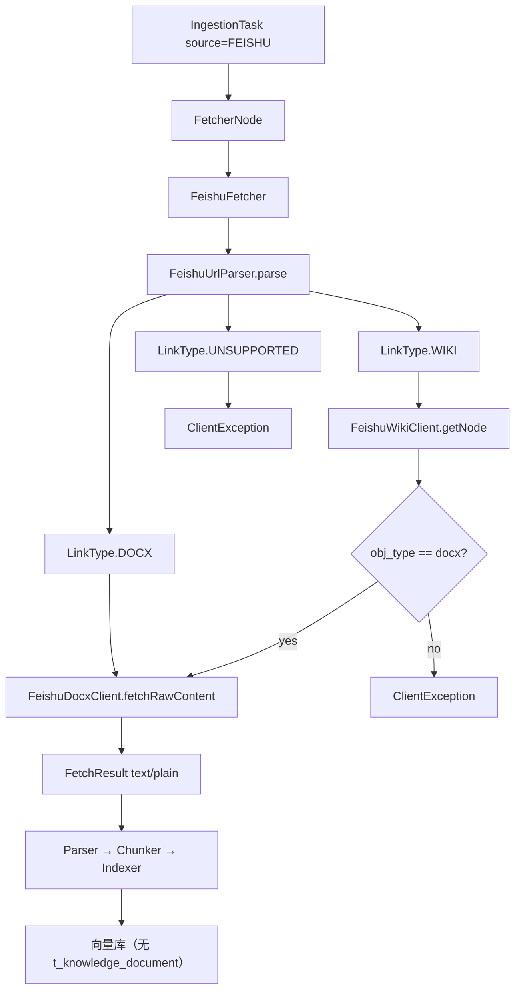
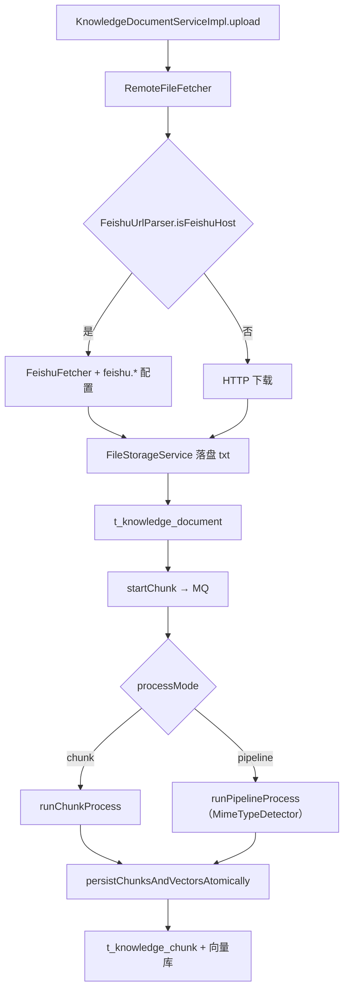

# 飞书知识库 Wiki 接入开发文档

## 1. 背景与问题

### 1.1 业务场景

用户希望将飞书云文档或知识库 Wiki 页面导入 RAG 系统。飞书存在两类常见链接：

| 产品 | 链接形态 | 示例 |
|------|---------|------|
| 云文档 docx | `/docx/{documentToken}` | `https://xxx.feishu.cn/docx/doccnXXXX` |
| 知识库 wiki | `/wiki/{nodeToken}` | `https://xxx.feishu.cn/wiki/wikcnXXXX` |

### 1.2 改造前的问题

改造前 [`FeishuFetcher`](../bootstrap/src/main/java/com/nageoffer/ai/ragent/ingestion/strategy/fetcher/FeishuFetcher.java) 仅对含 `/docx/`、`/docs/` 的链接调用飞书 Open API；知识库 Remote URL 及其它 HTTP 路径对 wiki 链接走 **直接下载网页**：

```
docx/docs URL → docx raw_content API → text/plain ✅
wiki URL      → HTTP GET 网页        → text/html ❌
```

wiki 分享页在浏览器中是 SPA 网页，HTTP 响应为 `text/html`，并非文档正文，导致：

- 解析/入库可能失败（如 `file_type` 超长等）
- 即便入库，分块内容也是无效 HTML

### 1.3 目标与实现范围

**已实现（P0 — Ingestion）：**

- 支持粘贴**具体 wiki 页面**链接（含 `wikcn...` 等 node token）
- 经 Wiki Open API 解析节点，对 `obj_type = docx` 的节点复用 docx `raw_content` 拉取纯文本
- Ingestion 任务使用 `source.type = FEISHU`，任务级 `credentials` 传凭证
- 移除 `FeishuFetcher` 对未知飞书链接的 HTTP 网页兜底

**已实现（P3 — 知识库 Remote URL）：**

- 知识库上传页 **Remote URL** 来源不变（`sourceType = url`），粘贴飞书链接时由 [`RemoteFileFetcher`](../bootstrap/src/main/java/com/nageoffer/ai/ragent/knowledge/handler/RemoteFileFetcher.java) 自动识别并走 Open API
- 飞书应用凭证通过 **`application.yaml` 的 `feishu.*` 配置**，不在 UI 填写
- 拉取结果落盘为 `text/plain` 文件，写入 `t_knowledge_document`，走完整文档生命周期（分块表、向量、定时刷新）
- 知识库 **Pipeline 处理模式**下使用 `MimeTypeDetector` 识别真实 MIME，避免 `fileType=txt` 被 Parser 误判

**未实现（后续扩展）：**

- 整库 / 子树批量导入
- Ingestion 任务 `source.type = URL` 自动识别飞书（须显式选 **Feishu** 来源或走知识库 Remote URL）
- wiki 下 sheet、旧版 doc 等非 docx 节点类型

---

## 2. 架构设计

### 2.1 Ingestion 任务链路

Ingestion 任务 `source.type = FEISHU` 时，由 [`FetcherNode`](../bootstrap/src/main/java/com/nageoffer/ai/ragent/ingestion/node/FetcherNode.java) 路由至 `FeishuFetcher`：



### 2.2 知识库 Remote URL 链路

知识库上传 `sourceType = url`，当 URL 为飞书域名时：



### 2.3 两条入口对比

| 维度 | Ingestion 任务 | 知识库 Remote URL |
|------|----------------|-------------------|
| 入口 | Ingestion 页 / `POST /ingestion/tasks` | 知识库 → 上传 → Remote URL |
| 来源类型 | `source.type = FEISHU` | `sourceType = url`（不变） |
| 飞书凭证 | 任务 `source.credentials` | `feishu.*` 配置文件 |
| 文档记录 | ❌ 仅 `t_ingestion_task` | ✅ `t_knowledge_document` + 分块表 |
| 向量 `doc_id` | 摄取任务 ID | 知识库文档 ID |
| 定时同步 | ❌ | ✅ URL 定时刷新（内容 SHA-256 比对） |
| FetcherNode | 执行 FeishuFetcher | 跳过（上传阶段已落盘） |

### 2.4 模块职责

| 类 | 路径 | 职责 |
|----|------|------|
| `FeishuFetcher` | `ingestion/strategy/fetcher/` | 编排入口：鉴权、URL 分流、组装 `FetchResult` |
| `FeishuUrlParser` | 同上 | 识别 docx/wiki/unsupported；`isFeishuHost` / `isSupportedDocumentUrl` |
| `FeishuDocxClient` | 同上 | 调用 docx `raw_content`，解析 `data.content` |
| `FeishuWikiClient` | 同上 | 调用 wiki `get_node`，解析节点元数据 |
| `WikiNodeInfo` | 同上 | 记录 `title`、`objType`、`objToken`、`spaceId` |
| `FeishuProperties` | `knowledge/config/` | 绑定 `feishu.*` 配置项 |
| `FeishuCredentialsProvider` | `knowledge/config/` | 校验并组装配置文件中的凭证 |
| `RemoteFileFetcher` | `knowledge/handler/` | Remote URL 上传/定时刷新；飞书域名分流 |

---

## 3. 代码变更清单

### 3.1 核心文件（Ingestion / 共用）

```
bootstrap/src/main/java/com/nageoffer/ai/ragent/ingestion/strategy/fetcher/
├── FeishuFetcher.java
├── FeishuUrlParser.java
├── FeishuDocxClient.java
├── FeishuWikiClient.java
└── WikiNodeInfo.java

bootstrap/src/test/java/.../ingestion/strategy/fetcher/
├── FeishuUrlParserTest.java
└── FeishuFetcherTest.java
```

### 3.2 知识库接入（P3）

```
bootstrap/src/main/java/com/nageoffer/ai/ragent/knowledge/
├── config/FeishuProperties.java
├── config/FeishuCredentialsProvider.java
├── handler/RemoteFileFetcher.java          # 飞书 URL 分流
└── service/impl/KnowledgeDocumentServiceImpl.java  # Pipeline MIME 修复

bootstrap/src/test/java/.../knowledge/handler/
└── RemoteFileFetcherFeishuTest.java

bootstrap/src/main/resources/application.yaml  # feishu.* 节
frontend/src/pages/admin/knowledge/KnowledgeDocumentsPage.tsx  # URL 提示文案
```

### 3.3 前端（Ingestion）

| 文件 | 变更说明 |
|------|---------|
| [`IngestionPage.tsx`](../frontend/src/pages/admin/ingestion/IngestionPage.tsx) | Feishu 来源的链接与凭证提示 |

### 3.4 示例与文档

```
docs/examples/
├── feishu-wiki-ingestion-example.md
└── feishu-pipeline-request.json
```

---

## 4. 核心实现说明

### 4.1 URL 解析（FeishuUrlParser）

解析优先级：

1. 路径含 `/docx/` 或 `/docs/` → `LinkType.DOCX`
2. 路径含 `/wiki/` 或以 `/wiki` 结尾 → `LinkType.WIKI`
3. wiki 无 token（如 `.../wiki/`）→ `ClientException`
4. 其余飞书链接 → `LinkType.UNSUPPORTED`

辅助方法（知识库 Remote URL 分流使用）：

| 方法 | 说明 |
|------|------|
| `isFeishuHost(url)` | 域名是否为 `*.feishu.cn` / `*.larksuite.com` / `*.larkoffice.com` |
| `isSupportedDocumentUrl(url)` | 是否为可 API 拉取的 docx/docs/wiki 页（不抛异常） |

**RemoteFileFetcher 分流规则：**

| URL | 行为 |
|-----|------|
| 非飞书域名 | 原有 HTTP 逻辑 |
| 飞书 + docx/docs/wiki | `FeishuFetcher` + 配置凭证 |
| 飞书 + 其它路径 | `ClientException`，**禁止 HTTP 兜底** |
| 飞书 + `feishu.enabled=false` | `ClientException("飞书集成未启用")` |

### 4.2 鉴权

**Ingestion（`FeishuFetcher` + 任务 credentials）：**

1. `tenantAccessToken`
2. `accessToken`
3. `app_id` + `app_secret` → 请求 `tenant_access_token`

**知识库（`FeishuCredentialsProvider` + 配置文件）：**

```yaml
feishu:
  enabled: true
  app-id: ${FEISHU_APP_ID:}
  app-secret: ${FEISHU_APP_SECRET:}
  tenant-access-token: ${FEISHU_TENANT_TOKEN:}  # 可选，非空时优先
```

请求头均为：`Authorization: Bearer {token}`。

### 4.3 Wiki 节点查询（FeishuWikiClient）

```
GET https://open.feishu.cn/open-apis/wiki/v2/spaces/get_node?token={wikiNodeToken}
Authorization: Bearer {accessToken}
```

- `code != 0` → `ServiceException`
- 从 `data.node` 读取 `title`、`obj_type`、`obj_token`、`space_id`

### 4.4 文档正文拉取（FeishuDocxClient）

```
GET https://open.feishu.cn/open-apis/docx/v1/documents/{documentToken}/raw_content
```

- 优先解析 JSON `data.content`
- 失败则回退为响应体 UTF-8 字符串

### 4.5 返回值

```java
new FetchResult(contentBytes, "text/plain", fileName)
```

### 4.6 知识库 Pipeline 模式的 MIME 处理

知识库 Pipeline 在上传阶段已将正文落盘，`FetcherNode` 会跳过拉取。`runPipelineProcess` 必须使用 **`MimeTypeDetector.detect(bytes, docName)`** 传入 Parser，不能直接使用 `documentDO.getFileType()`（存的是扩展名 `txt`，Parser 会识别为 `UNKNOWN`）。

```java
// KnowledgeDocumentServiceImpl.runPipelineProcess
String mimeType = MimeTypeDetector.detect(fileBytes, docName);
IngestionContext context = IngestionContext.builder()
        .rawBytes(fileBytes)
        .mimeType(mimeType)
        .source(DocumentSource.builder().fileName(docName).build())
        .skipIndexerWrite(true)
        .build();
```

知识库 Pipeline 推荐节点：`PARSER(TEXT) → CHUNKER`（无需 FETCHER / INDEXER，向量由 `persistChunksAndVectorsAtomically` 写入）。

### 4.7 定时刷新（飞书 URL 文档）

`ScheduleRefreshProcessor` 调用 `RemoteFileFetcher.fetchIfChanged`。飞书链接无 ETag，通过 **内容 SHA-256** 与 `last_content_hash` 比较判断是否变更。

---

## 5. 错误处理

| 场景 | 异常类型 | 消息要点 |
|------|---------|---------|
| location 为空 | `ServiceException` | 飞书文档地址不能为空 |
| wiki 仅空间首页 | `ClientException` | 请提供具体 wiki 页面链接 |
| wiki 节点非 docx | `ClientException` | 暂仅支持 docx 类型的 wiki 节点 |
| 不支持的飞书 URL | `ClientException` | 不支持的飞书链接格式 |
| 飞书集成未启用 | `ClientException` | 飞书集成未启用，请设置 feishu.enabled=true |
| 飞书凭证未配置 | `ClientException` | 请设置 feishu.app-id/app-secret 或 tenant-access-token |
| Wiki / 令牌 API 失败 | `ServiceException` | 飞书 Wiki API / 令牌请求失败 |
| Pipeline 类型不匹配 | `ClientException` | 文件类型不符合要求（检查 Parser rules 与 MIME） |
| 分块文本为空 | `ClientException` | 可分块文本为空（多为拉取到 HTML 而非正文） |

---

## 6. 飞书开放平台配置

### 6.1 应用权限

在 [飞书开放平台](https://open.feishu.cn/) 创建企业自建应用，开通：

- **云文档只读** — docx `raw_content`
- **知识库节点读取** — wiki `get_node`

发布应用并安装到目标租户；确保目标 wiki 页 / 底层 docx 对应用可见。

### 6.2 凭证方式

| 场景 | 配置方式 |
|------|---------|
| Ingestion 任务 | 任务 `source.credentials` JSON |
| 知识库 Remote URL | `application.yaml` 的 `feishu.*`（推荐环境变量注入 secret） |

Ingestion 凭证示例：

```json
{
  "app_id": "cli_xxxxxxxx",
  "app_secret": "xxxxxxxxxxxxxxxx"
}
```

或 `{"tenantAccessToken": "t-xxxxxxxx"}`。

---

## 7. 使用说明

### 7.1 创建 Pipeline

飞书拉取结果为纯文本，Parser 需允许 **TEXT**：

```
FETCHER → PARSER(TEXT) → CHUNKER → INDEXER    # Ingestion 任务
PARSER(TEXT) → CHUNKER                        # 知识库 Pipeline 模式（Fetcher/Indexer 可省略）
```

Parser settings 示例：

```json
{
  "rules": [{ "mimeType": "TEXT" }]
}
```

参考 [`docs/examples/feishu-pipeline-request.json`](examples/feishu-pipeline-request.json)。

### 7.2 知识库 Remote URL 导入（推荐完整文档管理）

**1. 配置 `application.yaml`：**

```yaml
feishu:
  enabled: true
  app-id: ${FEISHU_APP_ID:}
  app-secret: ${FEISHU_APP_SECRET:}
```

**2. 管理后台：** 知识库 → 上传文档 → 来源 **Remote URL** → 粘贴飞书链接。

**3. 处理模式：**

- **chunk**：直接分块，适合纯文本
- **pipeline**：选允许 TEXT 的 Pipeline；内容已在上传阶段落盘，Fetcher 节点会自动跳过

**4. 可选：** 开启 URL 定时刷新，飞书文档变更后按 cron 重新拉取并分块。

### 7.3 创建 Ingestion 任务（仅向量、无文档记录）

```bash
curl -X POST "http://localhost:9090/api/ragent/ingestion/tasks" \
  -H "Content-Type: application/json" \
  -H "Authorization: <token>" \
  -d '{
    "pipelineId": "<pipelineId>",
    "source": {
      "type": "FEISHU",
      "location": "https://xxx.feishu.cn/wiki/wikcnXXXXXXXX",
      "credentials": {
        "app_id": "cli_xxx",
        "app_secret": "xxx"
      }
    },
    "vectorSpaceId": {
      "logicalName": "<知识库 collectionName>"
    }
  }'
```

管理后台：Ingestion 页 → 来源 **Feishu** → 粘贴链接 → 填写凭证 JSON。

> **注意：** Ingestion 任务来源须选 **Feishu**，不要选 URL 粘贴飞书链接（URL 来源会 HTTP 下载网页，Parser 得到空文本）。

简明步骤见 [`docs/examples/feishu-wiki-ingestion-example.md`](examples/feishu-wiki-ingestion-example.md)。

### 7.4 支持的链接

| 类型 | 示例 | 状态 |
|------|------|------|
| 云文档 docx | `https://xxx.feishu.cn/docx/doccnXXXX` | ✅ |
| 旧版 docs | `https://xxx.feishu.cn/docs/doccnXXXX` | ✅ |
| wiki 具体页面 | `https://xxx.feishu.cn/wiki/wikcnXXXX` | ✅（docx 节点） |
| wiki 空间首页 | `https://xxx.feishu.cn/wiki/` | ❌ |
| wiki 表格节点 | `obj_type = sheet` 等 | ❌ |

---

## 8. 测试

### 8.1 单元测试

| 测试类 | 覆盖点 |
|--------|--------|
| `FeishuUrlParserTest` | docx/docs/wiki 解析、`isFeishuHost`、`isSupportedDocumentUrl` |
| `FeishuFetcherTest` | docx 直链、wiki→docx、非 docx wiki 节点 |
| `RemoteFileFetcherFeishuTest` | 知识库飞书落盘、unsupported 报错、hash 变更检测 |

**运行：**

```bash
mvn install -DskipTests
mvn test -pl bootstrap "-Dtest=FeishuUrlParserTest,FeishuFetcherTest,RemoteFileFetcherFeishuTest"
```

### 8.2 集成验证

**知识库路径：**

1. 配置 `feishu.enabled=true` 及凭证
2. 知识库上传 Remote URL（wiki 单页链接）
3. 触发分块，确认文档状态 `success`、分块数 > 0
4. RAG 检索可命中

**Ingestion 路径：**

1. 创建 feishu Pipeline（PARSER 允许 TEXT）
2. 来源选 **Feishu**，创建任务
3. 确认任务 `COMPLETED`，向量写入目标 `collectionName`

---

## 9. 后续扩展建议

| 优先级 | 内容 | 改动点 |
|--------|------|--------|
| P2 | 整库 / 子树批量导入 | `FeishuWikiClient.listChildNodes()` + 任务拆分 |
| P4 | sheet / 旧版 doc 节点 | 按 `obj_type` 扩展拉取策略 |
| P5 | Ingestion URL 来源识别飞书 | `HttpUrlFetcher` 分流（与 RemoteFileFetcher 对齐） |
| P6 | 知识库级 / 多租户飞书凭证 | `feishu.profiles.{name}` 或 KB 级配置 |

---

## 10. 变更记录

| 日期 | 说明 |
|------|------|
| 2026-06-29 | 初版：Wiki 单页 Ingestion、模块拆分、移除 FeishuFetcher HTTP 兜底 |
| 2026-06-29 | P3：知识库 Remote URL 自动识别飞书、`feishu.*` 配置、Pipeline MIME 修复、定时刷新 hash 比对 |

---

## 11. 相关链接

- 使用示例：[`docs/examples/feishu-wiki-ingestion-example.md`](examples/feishu-wiki-ingestion-example.md)
- Pipeline 配置：[`docs/examples/feishu-pipeline-request.json`](examples/feishu-pipeline-request.json)
- 核心 Fetcher 目录：`bootstrap/src/main/java/com/nageoffer/ai/ragent/ingestion/strategy/fetcher/`
- 知识库接入目录：`bootstrap/src/main/java/com/nageoffer/ai/ragent/knowledge/config/`、`knowledge/handler/`
