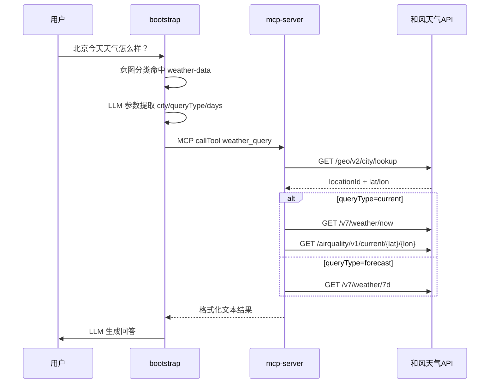

# 天气查询 MCP 改造说明

本文档记录 `weather_query` 工具从 Mock 数据切换为和风天气（QWeather）真实 API 的完整改造，包含代码结构、配置、意图树与参数提取提示词。

---

## 1. 改造目标

| 项目 | 改造前 | 改造后 |
|------|--------|--------|
| 数据来源 | `WeatherMcpExecutor` 内 Random 假数据 | 和风天气 API 实时数据 |
| 城市范围 | 20 城白名单 | GeoAPI 按名称解析，支持全国及全球主要城市 |
| 空气质量 | Mock AQI | 空气质量 API v1（`/airquality/v1/current`） |
| API Host | 无（本地生成） | 控制台专属 API Host（新账号必填） |
| 工具 ID | `weather_query` | 不变 |

**改动范围**：仅 `mcp-server` 模块；`bootstrap` 的 MCP Client 注册与 `weather_query` 工具 schema 保持兼容。

---

## 2. 架构与调用链



---

## 3. 代码变更清单

### 3.1 新增文件（mcp-server）

| 文件 | 职责 |
|------|------|
| `mcp/client/QWeatherClient.java` | 和风天气 HTTP 客户端：城市查询、实时天气、7 日预报、空气质量 v1 |
| `mcp/config/WeatherProperties.java` | `api-key`、`api-host`、`lang`、`timeout-ms` 配置 |

### 3.2 修改文件

| 文件 | 变更 |
|------|------|
| `mcp/executor/WeatherMcpExecutor.java` | 删除 Mock 逻辑，调用 `QWeatherClient` |
| `mcp/McpServerApplication.java` | `@EnableConfigurationProperties(WeatherProperties.class)` |
| `resources/application.yaml` | 增加 `weather.qweather` 配置 |
| `resources/application-local.yaml.example` | 本地 Key / Host 示例 |

### 3.3 删除 / 合并

| 文件 | 说明 |
|------|------|
| `mcp/config/WeatherConfiguration.java` | 配置启用合并至启动类 |
| Mock 相关代码 | `CITY_COORDINATES`、`generateWeatherForDate`、`Random` 等 |

### 3.4 未修改

- `bootstrap` 全部代码
- `McpServerConfig.java`（工具 Bean 自动收集）
- MCP 工具名 `weather_query` 与入参 schema（`city` / `queryType` / `days`）

---

## 4. 和风天气 API 说明（新账号）

新注册账号须使用控制台分配的**专属 API Host**，公共域名 `geoapi.qweather.com` / `devapi.qweather.com` 已不可用。

| 能力 | 路径 | 说明 |
|------|------|------|
| 城市查询 | `GET /geo/v2/city/lookup` | `location` + `range=cn` |
| 实时天气 | `GET /v7/weather/now` | `location` = LocationID |
| 7 日预报 | `GET /v7/weather/7d` | 取前 N 天（最多 7） |
| 实时空气质量 | `GET /airquality/v1/current/{lat}/{lon}` | v1 新接口，优先 `cn-mee` 指数 |

认证：请求头 `X-QW-Api-Key: {apiKey}`  
响应：Gzip 压缩 JSON，客户端需解压后解析。

---

## 5. 配置说明

### 5.1 mcp-server

`mcp-server/src/main/resources/application.yaml`：

```yaml
weather:
  qweather:
    api-key: ${QWEATHER_API_KEY:}
    api-host: ${QWEATHER_API_HOST:}
    lang: zh
    timeout-ms: 5000
```

本地开发复制示例并填写真实值：

```bash
cp mcp-server/src/main/resources/application-local.yaml.example \
   mcp-server/src/main/resources/application-local.yaml
```

```yaml
weather:
  qweather:
    api-key: 你的API_KEY
    api-host: xxxxx.re.qweatherapi.com   # 可省略 https://
```

`application-local.yaml` 已加入 `.gitignore`，勿提交密钥。

### 5.2 bootstrap

`bootstrap` 中 MCP Server 地址保持不变（默认 `http://localhost:9099`），无需为天气单独配置。

### 5.3 获取凭据

1. 登录 [和风天气控制台](https://console.qweather.com/)
2. [设置](https://console.qweather.com/setting) 复制 **API Host**
3. 项目管理中复制 **API Key**
4. 若空气质量 403，在凭据 **API 限制** 中开通空气质量 API v1

---

## 6. 工具参数定义

`weather_query` 工具 schema（与改造前一致）：

| 参数 | 类型 | 必填 | 默认 | 说明 |
|------|------|------|------|------|
| `city` | string | 是 | — | 城市名称 |
| `queryType` | enum | 否 | `current` | `current` 实时 / `forecast` 预报 |
| `days` | integer | 否 | `3` | 预报天数，仅 `forecast` 有效，最大 7 |

---

## 7. 意图树配置

### 7.1 节点结构

| intent_code | 名称 | level | mcp_tool_id | kind |
|-------------|------|-------|-------------|------|
| `weather` | 天气信息查询服务 | 0（DOMAIN） | — | 2（MCP） |
| `weather-data` | 天气查询 | 1（CATEGORY） | `weather_query` | 2（MCP） |

### 7.2 导入 SQL

```bash
# 1. 导入意图节点
psql -f docs/examples/mcp-intent-nodes-import.sql

# 2. 为天气节点配置专属参数提取提示词
psql -f docs/examples/mcp-intent-nodes-weather-prompt-update.sql
```

相关文件：

- [`docs/examples/mcp-intent-nodes-import.sql`](examples/mcp-intent-nodes-import.sql)
- [`docs/examples/mcp-intent-nodes-weather-prompt-update.sql`](examples/mcp-intent-nodes-weather-prompt-update.sql)

也可在管理后台「意图树」中为 `weather-data` 节点粘贴提示词文件内容。

### 7.3 参数提取提示词

- **全局默认**：`bootstrap/src/main/resources/prompt/mcp-parameter-extract.st`（销售、工单等 MCP 工具）
- **天气专属**：[`docs/examples/prompt/weather-mcp-parameter-extract.st`](examples/prompt/weather-mcp-parameter-extract.st)

天气专属提示在通用规则基础上增加：

- `queryType`：「明天」「未来」「这周」→ `forecast`；「今天」「现在」→ `current`
- `days`：「明天」→ 2，「一周」→ 7 等
- `city`：去除「的天气」等后缀

配置方式：写入意图节点 `param_prompt_template` 字段（见上方 UPDATE SQL）。

---

## 8. 启动与验证

### 8.1 启动顺序

```bash
# 1. 启动 mcp-server（端口 9099）
mvn -pl mcp-server spring-boot:run

# 2. 启动 bootstrap
mvn -pl bootstrap spring-boot:run
```

**注意**：`mcp-server` 重启后，需同步重启 `bootstrap`，否则可能出现 MCP Session 失效（`Session not found`）。

### 8.2 验证清单

| 检查项 | 预期 |
|--------|------|
| mcp-server 启动日志 | 无 `api-key` / `api-host 未配置` ERROR |
| bootstrap 启动日志 | `MCP 工具注册成功, toolId: weather_query` |
| 「北京今天天气怎么样？」 | 返回真实温度、湿度、风力 |
| 「上海未来 5 天天气预报」 | `forecast` + 5 天数据 |
| 空气质量行 | `优 (AQI xx)` 或「暂无数据」（未开通权限时） |

---

## 9. 常见问题

| 现象 | 原因 | 处理 |
|------|------|------|
| 404 on `/v2/city/lookup` | 路径或 Host 错误 | 使用 `/geo/v2/city/lookup` + 专属 API Host |
| URL 无 `https://` 立即失败 | `api-host` 未带协议 | 代码已自动补全，确认配置存在 |
| JSON 解析 CTRL-CHAR 错误 | Gzip 未解压 | 已在 `QWeatherClient` 处理 |
| 空气质量 403 | 未开通 v1 权限 | 控制台开通或使用旧版已弃用接口 |
| MCP Session not found | mcp-server 重启后 bootstrap 未重启 | 重启 bootstrap |
| 参数提取 `queryType` 错误 | 未配置天气专属提示词 | 执行 weather-prompt UPDATE SQL |

---

## 10. 本地文件索引

```
docs/
├── weather-mcp-integration.md          # 本文档
└── examples/
    ├── mcp-intent-nodes-import.sql     # 意图节点导入（含 weather 节点）
    ├── mcp-intent-nodes-weather-prompt-update.sql  # 天气专属 param_prompt
    └── prompt/
        └── weather-mcp-parameter-extract.st        # 天气参数提取提示词正文

mcp-server/
├── src/main/java/.../mcp/client/QWeatherClient.java
├── src/main/java/.../mcp/config/WeatherProperties.java
├── src/main/java/.../mcp/executor/WeatherMcpExecutor.java
└── src/main/resources/
    ├── application.yaml
    └── application-local.yaml.example  # 复制为 application-local.yaml 使用
```

---

## 11. 后续可选优化

- 在意图树增加更多 `examples` 覆盖「明天」「一周」等口语
- 增强 `WeatherMcpExecutor.buildTool()` 中参数 `description`，减轻对专属提示词的依赖
- ~~空气质量权限开通后，确认 `cn-mee` 指数返回中文 category~~
