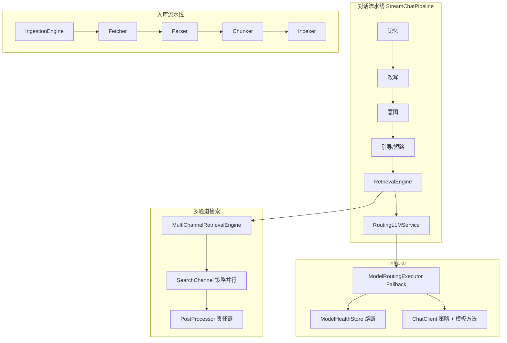

# 02.Ragent 设计模式全景解析

> 本文梳理 Ragent 后端（`bootstrap` / `infra-ai` / `framework` / `mcp-server`）中真实落地的设计模式，按「模式定义 → 项目落点 → 子项详解 → 选型机制 → 设计意图」展开，便于阅读源码与二次扩展。

Ragent 是一套面向企业知识问答的 RAG 系统。一次对话会穿过记忆加载、查询改写、意图识别、多通道检索、MCP 工具调用、Prompt 组装、多模型流式输出；离线侧还有文档拉取、解析、切分、索引流水线。这些链路天然需要**可替换算法、可编排步骤、可隔离故障、可插拔扩展**——设计模式正是解决这些问题的结构化手段。

项目没有为了模式而模式：绝大多数用法都直接服务于业务扩展点（换向量库、换模型供应商、加检索通道、加解析器），并用 Spring Bean 发现替代了传统 SPI。

---

## 0. 全景总览

| 模式 | 典型落点 | 解决什么问题 |
|------|----------|--------------|
| 模板方法 | `AbstractOpenAIStyleChatClient`、`AbstractParallelRetriever` | 固定调用骨架，差异下沉到钩子 |
| 策略 | `SearchChannel`、`DocumentParser`、`ChunkingStrategy`、`ChatClient` | 同一接口多算法，运行时切换 |
| 工厂 / 注册表 | `ChunkingStrategyFactory`、`DocumentParserSelector`、`DefaultMcpToolRegistry` | 按类型/枚举解析实现 |
| 建造者 | Lombok `@Builder` 的 `ChatRequest`、`IntentNode`、`SearchContext` | 复杂对象分步组装 |
| 责任链 / 流水线 | `IngestionEngine`、`StreamChatPipeline`、后置处理器链 | 有序步骤编排与短路 |
| 观察者 / 发布订阅 | `StreamCallback`、RocketMQ Producer/Consumer | 流式推送与异步解耦 |
| 状态 / 熔断 | `ModelHealthStore` | 模型三态健康与故障隔离 |
| 组合 | `IntentNode` 树、`Block` sealed IR | 树形意图与结构化文档块 |
| 访问者 | Markdown / MinerU AST Visitor | 遍历 AST 产出 Block |
| 适配器 | `RocketMQProducerAdapter`、供应商 `*ChatClient` | 第三方 API → 项目统一接口 |
| 装饰器 | `KeywordSyncingVectorStoreService` | 向量写入时旁路同步 ES |
| 外观 | `RetrievalEngine`、`RoutingLLMService` | 对外收敛复杂子系统 |
| 空对象 | `NoopRerankClient` | 降级时无操作实现 |
| 依赖注入 / 插件化 | Spring `List<T>` + `@ConditionalOnProperty` | 开闭扩展，配置切换实现 |



下文按模式逐一展开。

---

## 1. 模板方法模式（Template Method）

### 1.1 模式要点

父类定义算法骨架（`final` 或受控的主流程），可变步骤声明为钩子（`protected` 方法），子类只覆写差异点。适合「流程相同、细节不同」的家族实现。

### 1.2 OpenAI 兼容 Chat 客户端

**入口：** `infra-ai/.../chat/AbstractOpenAIStyleChatClient.java`

百炼、硅基流动、DeepSeek、Ollama、AIHubMix 等供应商都走 OpenAI 风格 HTTP 协议。同步调用骨架固定为：

1. 校验 Provider / API Key  
2. `ChatRequest` → JSON  
3. OkHttp POST  
4. 解析 choices → 文本  

#### 钩子方法详解

| 钩子 | 默认行为 | 谁覆写、为什么 |
|------|----------|----------------|
| `provider()` | 抽象，必须实现 | 每个子类返回自己的供应商标识，供 URL 解析、日志、路由 Map 的 key |
| `customizeRequestBody()` | thinking 时加 `enable_thinking` | 供应商特有字段（如不同厂商的 thinking / tools 开关） |
| `requiresApiKey()` | `true` | `OllamaChatClient` 可返回 `false`，本地部署无需 Key |
| `isReasoningEnabledForStream()` | 跟请求 `thinking` | 控制流式是否解析 `reasoning_content` |

```java
// 模板方法：同步调用骨架（节选）
protected String doChat(ChatRequest request, ModelTarget target) {
    AIModelProperties.ProviderConfig provider = HttpResponseHelper.requireProvider(target, provider());
    if (requiresApiKey()) {
        HttpResponseHelper.requireApiKey(provider, provider());
    }
    JsonObject reqBody = buildRequestBody(request, target, false);
    Request requestHttp = newAuthorizedRequest(provider, target)
            .post(RequestBody.create(reqBody.toString(), HttpMediaTypes.JSON))
            .build();
    try (Response response = syncHttpClient.newCall(requestHttp).execute()) {
        // 非 2xx → ModelClientException，供上层 Fallback 捕获
        // 2xx → 解析 choices[0].message.content
    }
}
```

流式路径同样由基类统一处理 SSE 行解析、`StreamCallback` 回调与取消句柄。子类几乎只声明 `provider()`，例如：

```java
@Component
public class BaiLianChatClient extends AbstractOpenAIStyleChatClient {
    @Override
    public String provider() {
        return ModelProvider.BAILIAN.getId(); // "bailian"
    }
}
```

Embedding 侧对称：`AbstractOpenAIStyleEmbeddingClient`，额外钩子含 `maxBatchSize()`（控制单次批量向量化上限）。

### 1.3 并行检索模板

**入口：** `bootstrap/.../retrieve/channel/AbstractParallelRetriever.java`

意图定向检索要对多个意图节点并行查库，集合并行检索要对多个 collection 并行查库——骨架完全一致：

1. 为每个 target 提交 `CompletableFuture`  
2. `join` 收集，失败记日志不拖垮整批  
3. 跨目标按 score 降序归并（保证下游 RRF 名次基准正确）  
4. 打统计日志  

```java
public final List<RetrievedChunk> executeParallelRetrieval(String question,
                                                           List<T> targets,
                                                           int topK) {
    // 1. supplyAsync(createRetrievalTask) → 2. join 收集
    // 3. allChunks.sort(by score desc) → 4. 统计日志
}
```

`final` 锁住骨架，防止子类改坏「失败隔离 + 归并排序」不变式。

#### 子类 1：`IntentParallelRetriever`

**谁用：** `IntentDirectedSearchChannel`  
**目标类型：** `IntentTask(NodeScore, intentTopK)`——每个命中意图对应一个知识库 collection，且 TopK 可按意图分数动态放大。

```java
@Override
protected List<RetrievedChunk> createRetrievalTask(String question, IntentTask task, int ignoredTopK) {
    IntentNode node = task.nodeScore().getNode();
    return retrieverService.retrieve(
            RetrieveRequest.builder()
                    .collectionName(node.getCollectionName())
                    .query(question)
                    .topK(task.intentTopK())
                    .build()
    );
}
```

失败时返回空列表而不是抛异常，保证「某个意图库挂了」不影响其它意图的并行召回。

#### 子类 2：`CollectionParallelRetriever`

**谁用：** `VectorGlobalSearchChannel`  
**目标类型：** `String`（collection 名）——按知识库集合做全库兜底召回，各库 TopK 相同。

```java
@Override
protected List<RetrievedChunk> createRetrievalTask(String question, String collectionName, int topK) {
    return retrieverService.retrieve(
            RetrieveRequest.builder()
                    .collectionName(collectionName)
                    .query(question)
                    .topK(topK)
                    .build()
    );
}
```

两者差异只在「目标是什么、怎么拼 RetrieveRequest」，并行与排序全部复用模板。

### 1.4 流式回调转发

`ForwardingStreamCallback` 封装「把事件转发给下游 + CAS 保证 `onComplete`/`onError` 只结束一次」的骨架。

| 钩子 | 作用 |
|------|------|
| `onFinish()` | 流正常或异常结束后的收尾（落库、解绑 task） |
| `onFirstContent()` | 可选，首个正文 token 到达时触发（首包探测、TTFT 打点） |

业务侧的 SSE Handler、infra 侧的 `ProbeStreamBridge` 都建立在这套转发约定上，避免多处手写「只结束一次」的并发控制。

### 1.5 设计意图

供应商协议高度同构时，模板方法比把公共逻辑抽成工具类更清晰：**公共流程可见、差异点可搜、子类无法跳过关键步骤**。

---

## 2. 策略模式（Strategy）

### 2.1 模式要点

定义算法族接口，客户端依赖接口；运行时按配置/上下文选择具体策略。Ragent 里策略与 Spring 注入深度结合：`List<Strategy>` 自动发现，再按 `isEnabled` / 枚举 / 配置属性筛选。

### 2.2 检索通道策略（核心）

**接口：** `SearchChannel`

```java
public interface SearchChannel {
    String getName();
    int getPriority();
    boolean isEnabled(SearchContext context);
    SearchChannelResult search(SearchContext context);
    SearchChannelType getType();
}
```

编排入口在 `MultiChannelRetrievalEngine`：

```java
List<SearchChannel> enabledChannels = searchChannels.stream()
        .filter(channel -> channel.isEnabled(context))
        .sorted(Comparator.comparingInt(SearchChannel::getPriority))
        .toList();
// 各通道 supplyAsync 并行 search，失败互不影响
```

#### 2.2.1 `IntentDirectedSearchChannel`（意图定向）

- **优先级：** 1（最高）  
- **何时启用：** 配置开启，且上下文存在带知识库的 KB 意图  
- **怎么查：** 用 `IntentParallelRetriever`，按每个意图节点的 `collectionName` 定向向量检索  
- **价值：** 精度最高——用户问「Redis 超时」，只扫 middleware-redis 相关库，而不是全库捞噪声  

```java
@Override
public boolean isEnabled(SearchContext context) {
    if (!properties.getChannels().getIntentDirected().isEnabled()) {
        return false;
    }
    return CollUtil.isNotEmpty(extractKbIntents(context));
}
```

#### 2.2.2 `KeywordSearchChannel`（关键词 / BM25）

- **优先级：** 介于意图定向与向量全局之间  
- **何时注册：** `@ConditionalOnProperty(rag.keyword.type=es)`，未开 ES 时整个 Bean 不存在  
- **怎么查：** 调 `KeywordRetrieverService`，支持 `global` / `intent` 两种模式（配置决定）  
- **价值：** 补向量短板——工单号、错误码、专有名词等「精确词」召回  

#### 2.2.3 `VectorGlobalSearchChannel`（向量全局兜底）

- **优先级：** 10（较低）  
- **何时启用：** 配置开启；若意图定向关闭则强制启用（否则无通道可用）；或意图为空 / 置信不足时作为兜底  
- **怎么查：** `KbCollectionProvider` 列出相关 collection，经 `CollectionParallelRetriever` 并行召回  
- **价值：** 意图失败或覆盖不全时仍能答上一般性问题  

三个通道可同时开启：并行召回后交给后处理链融合，而不是「三选一」。

### 2.3 检索后置处理策略

**接口：** `SearchResultPostProcessor`  
按 `getOrder()` 串联（也可视为轻量责任链）。引擎依次调用，单处理器异常只打日志并继续。

#### 2.3.1 `DeduplicationPostProcessor`（order = 1）

- **始终启用**  
- **作用：** 多通道可能命中同一 chunk；按内容指纹（digest）合并，保留分数更高的一份  
- **为何最先：** 不去重直接 RRF/Rerank 会浪费名次与模型配额  

#### 2.3.2 `FusionPostProcessor`（order = 5）

- **算法：** Reciprocal Rank Fusion  
  `score(chunk) = Σ_channel 1 / (k + rank_channel)`  
- **为何用 RRF：** 向量余弦分与 BM25 量纲不同，不能直接比；RRF 只看名次，跨模态可比  
- **额外动作：** 按 `rerankCandidateLimit` 截断候选池，控制下游 Rerank 成本  
- **单通道：** 跳过融合，仅做截断  

名次取自各通道**原始** `SearchChannelResult` 列表，因此即便上游去重已合并 chunks，仍保留「多路命中」信息。

#### 2.3.3 `RerankPostProcessor`（order = 10）

- **作用：** 调用 `RerankService` 对候选精排，输出最终 Top-K  
- **可关闭：** `isEnabled` 受配置控制；关闭或走 `NoopRerankClient` 时相当于透传截断  
- **为何最后：** 精排贵且慢，只对粗排后的小候选集执行  

```text
通道并行召回 → Dedup → RRF 融合截断 → Rerank → 最终 TopK
```

### 2.4 文档解析 / 拉取 / 切分

#### 2.4.1 `DocumentParser` 族

**选择器：** `DocumentParserSelector`（按 `parserType` 或 MIME `supports()` 首个匹配）

| 实现 | 适用场景 | 产出特点 |
|------|----------|----------|
| `TikaDocumentParser` | PDF/Word/通用办公文档兜底 | Tika 抽文本，再结构化 |
| `MarkdownDocumentParser` | `.md` / 飞书导出 md | Visitor 遍历 AST → `Block` 列表 |
| `CsvDocumentParser` | CSV | 表格型 Block |
| `ExcelDocumentParser` | xls/xlsx | 多 sheet 表格 Block |
| `MinerUDocumentParser` | 复杂 PDF（版面/公式） | 调 MinerU 服务，UnpackVisitor 解包 |
| `ImageDocumentParser` | 图片 | 走 VLM/OCR 路径再入 IR |

```java
// 选择器构造期注册
this.strategyMap = parsers.stream()
        .collect(Collectors.toMap(DocumentParser::getParserType, Function.identity(), ...));

// 使用：显式类型 或 MIME 自动匹配
DocumentParser parser = selector.select(ParserType.MARKDOWN);
// 或 selector.selectByMimeType("text/markdown");
```

#### 2.4.2 `DocumentFetcher` 族

**装配：** `FetcherNode` 构造时 `SourceType → DocumentFetcher`

| 实现 | SourceType | 行为 |
|------|------------|------|
| `LocalFileFetcher` | 本地上传 | 读本地/对象存储落盘路径 |
| `HttpUrlFetcher` | HTTP URL | 下载远程文件 |
| `S3Fetcher` | S3 兼容存储 | 按 bucket/key 拉取 |
| `FeishuFetcher` | 飞书文档/Wiki | 调飞书 API 导出再落地 |

节点执行时按上下文 `DocumentSource` 的类型取 Fetcher，拿不到实现则失败，避免 silent skip。

#### 2.4.3 `ChunkingStrategy` 族

**工厂：** `ChunkingStrategyFactory` + `ChunkingMode`

| 实现 | 模式 | 行为 |
|------|------|------|
| `FixedSizeTextChunker` | 固定窗口 | 按字符/token 窗口切，实现简单，结构不敏感 |
| `StructureAwareTextChunker` | 结构感知 | 吃 `Block` IR，按标题层级与块边界打包，语义更完整 |

`ChunkerNode` 读节点配置里的 mode，`requireStrategy(mode)` 取实现后切分。

### 2.5 向量 / 关键词后端策略

通过 `@ConditionalOnProperty` 在启动期选定唯一实现，属于**配置驱动策略**：

| 接口 | 实现 | 配置 | 说明 |
|------|------|------|------|
| `RetrieverService` / `VectorStoreService` | `Milvus*` | `rag.vector.type=milvus` | 生产常用，独立向量库 |
| 同上 | `Pg*` | `rag.vector.type=pg` | pgvector，部署更轻 |
| `KeywordRetrieverService` / `KeywordIndexService` | `Es*` | `rag.keyword.type=es` | 开启后才有关键词通道与双写装饰器 |

同一时刻只装载一套向量实现，业务代码始终依赖接口，换库不改调用方。

### 2.6 模型供应商策略

| 接口 | 实现 | 路由方式 |
|------|------|----------|
| `ChatClient` | BaiLian / SiliconFlow / DeepSeek / Ollama / AIHubMix | `RoutingLLMService` 内 `provider → client` Map |
| `EmbeddingClient` | SiliconFlow / Ollama / AIHubMix 等 | `RoutingEmbeddingService` |
| `RerankClient` | `BaiLianRerankClient` / `NoopRerankClient` | `RoutingRerankService` |

```java
// RoutingLLMService 同步路径（概念）
return executor.executeWithFallback(
        ModelCapability.CHAT,
        selector.selectChatCandidates(...),
        target -> clientsByProvider.get(target.candidate().getProvider()),
        (client, target) -> client.chat(request, target)
);
```

业务只依赖 `LLMService`，看不到具体供应商——策略被外观层进一步封装。

### 2.7 其它策略型接口

| 接口 | 实现 | 在链路中的位置 |
|------|------|----------------|
| `IntentClassifier` | `DefaultIntentClassifier` | 意图树分类；`IntentResolver` 用 `@Qualifier` 注入 |
| `QueryRewriteService` | `MultiQuestionRewriteService` | 改写 + 子问题拆分，供意图与检索复用 |
| `McpParameterExtractor` | `LLMMcpParameterExtractor` | 从用户话里抽 MCP 入参（LLM + Prompt 模板） |
| `ConversationMemoryStore` | `JdbcConversationMemoryStore` | 会话消息持久化抽象 |
| `TokenCounterService` | `HeuristicTokenCounterService` | 摘要截断、上下文预算的近似 token 计数 |
| `ContextFormatter` | `DefaultContextFormatter` | 检索结果格式化为 Prompt 片段 |

### 2.8 设计意图

RAG 与入库最常变的是「怎么查、怎么解析、怎么切」。策略接口 + Spring 列表注入，让**新增一种算法 = 新增一个 `@Component`，编排器零改动**。

---

## 3. 工厂与注册表（Factory / Registry）

### 3.1 简单工厂：切分策略

**入口：** `ChunkingStrategyFactory`

`@PostConstruct` 把所有 `ChunkingStrategy` Bean 装进 `EnumMap<ChunkingMode, ChunkingStrategy>`，重复类型直接启动失败，避免静默覆盖。

```java
@PostConstruct
public void init() {
    Map<ChunkingMode, ChunkingStrategy> map = new EnumMap<>(ChunkingMode.class);
    chunkingStrategies.forEach(s -> {
        ChunkingStrategy old = map.put(s.getType(), s);
        if (old != null) {
            throw new IllegalStateException("Duplicate ChunkingStrategy for type: " + s.getType());
        }
    });
    this.strategies = Map.copyOf(map);
}

public ChunkingStrategy requireStrategy(ChunkingMode type) {
    return findStrategy(type)
            .orElseThrow(() -> new IllegalArgumentException("Unknown strategy: " + type));
}
```

### 3.2 选择器工厂：解析器

`DocumentParserSelector` 兼具工厂与注册表：

- `select(parserType)`：流水线节点配置了明确解析器时  
- `selectByMimeType(mime)`：按文件类型自动选，遍历 `supports()`  

二者都从构造期建好的 `strategyMap` / `strategies` 列表取值，调用方不 `new` 具体解析器。

### 3.3 节点注册表：入库引擎

`IngestionEngine` 构造时：

```java
this.nodeMap = nodes.stream()
        .collect(Collectors.toMap(IngestionNode::getNodeType, n -> n));
```

执行时用配置里的 `nodeType` 字符串取节点实现，再沿 `nextNodeId` 链式前进——**拓扑在 DB，实现在代码**。

### 3.4 MCP 工具注册表

**入口：** `DefaultMcpToolRegistry`

```java
@PostConstruct
public void init() {
    for (McpToolExecutor executor : autoDiscoveredExecutors) {
        register(executor); // toolId → executor
    }
}
```

问答链路：意图节点绑定的 `toolId` → `registry.get(toolId)` → 参数提取 → `executor.call`。新增工具只需实现 `McpToolExecutor` 并声明 Bean。

### 3.5 其它工厂

#### `IntentTreeFactory`

静态工厂，`buildIntentTree()` 产出演示/测试用意图树，不走 DB。生产路径由 Mapper + `IntentTreeCacheManager` 加载。

#### `StreamCallbackFactory`

创建绑定了 SSE 推送、记忆落库、任务取消句柄的流式回调实现，避免 `RAGChatService` 里手写一大段匿名回调。

#### Spring `@Configuration` 条件工厂

| 配置类 | 产出 |
|--------|------|
| `MilvusConfig` | Milvus Client / 相关 Bean |
| `EsClientConfig` | Elasticsearch Client |
| `McpClientAutoConfiguration` | 远程 MCP 客户端与工具执行器适配 |

配合 `@ConditionalOnProperty`，相当于「按环境装配的抽象工厂」。

### 3.6 设计意图

工厂/注册表把「创建与使用」分离，配合策略模式形成标准扩展路径：**实现接口 → 注册进 Map → 按 key 取用**。

---

## 4. 建造者模式（Builder）

项目大量使用 Lombok `@Builder` 组装请求与上下文，而非 GoF 带 Director 的完整建造者。

#### `ChatRequest` / `ChatMessage`（framework）

统一大模型请求：messages、temperature、thinking、enableTools 等可选字段多。业务侧：

```java
ChatRequest.builder()
        .messages(List.of(ChatMessage.user(prompt)))
        .thinking(true)
        .build();
```

同步/流式、路由层与各 `ChatClient` 共用同一请求模型。

#### `IntentNode`

构建意图树节点时字段极多（id、kbId、level、examples、mcpTools、promptTemplate…）。管理端批量导入、缓存反序列化、测试造数都依赖 Builder，避免超长构造器。

#### `SearchContext` / `RetrievalContext` / `PromptContext`

流水线各阶段的不可变风格快照：把子问题意图、TopK、历史、检索结果等一次组装，后续阶段只读，减少「隐式改字段」的副作用。

#### `PipelineDefinition` / `NodeConfig` / `NodeLog`

入库流水线的配置与执行日志对象。`NodeConfig` 含 `nodeId`、`nodeType`、`nextNodeId`、条件表达式与 settings JSON，Builder 便于从 DB 行映射到内存对象。

#### `MessageWrapper`

MQ 统一外壳：`keys` + `body`。`RocketMQProducerAdapter` 发送前：

```java
MessageBuilder
        .withPayload(MessageWrapper.builder().keys(keys).body(body).build())
        .setHeader(MessageConst.PROPERTY_KEYS, keys)
        .build();
```

#### `StreamChatHandlerParams`

把 conversationId、taskId、callback、userId 等流式处理参数收成一个对象，交给 `StreamCallbackFactory`，避免方法参数列表膨胀。

**设计意图：** RAG 阶段对象字段多、可选字段多，Builder 避免构造器爆炸，并让流水线各阶段以快照风格传递上下文。

---

## 5. 责任链与流水线（Chain of Responsibility / Pipeline）

### 5.1 入库链式引擎（经典链）

**入口：** `IngestionEngine`

节点通过 `nextNodeId` 连成有向链（启动时校验无环）。每个 `IngestionNode`：评估条件 → 执行 → 写日志 → 前进或终止。

#### 节点子项详解

| 节点 | nodeType 角色 | 做什么 |
|------|---------------|--------|
| `FetcherNode` | 拉取 | 按 `SourceType` 选 `DocumentFetcher`，把字节/本地路径写入 `IngestionContext` |
| `ParserNode` | 解析 | 经 `DocumentParserSelector` 得到 `ParsedDocument`（Block IR） |
| `EnhancerNode` | 增强 | 可选：LLM 润色、清洗、元数据补全（配置驱动） |
| `ChunkerNode` | 切分 | `ChunkingStrategyFactory` 选策略，Block → `VectorChunk` 列表 |
| `EnricherNode` | 富化 | 可选：摘要、关键词、embedding 前置字段补全 |
| `IndexerNode` | 索引 | 调 `VectorStoreService`（可能已被关键词装饰器包裹）写入向量库 |

```java
public interface IngestionNode {
    String getNodeType();
    NodeResult execute(IngestionContext context, NodeConfig config);
}
```

引擎通用、拓扑可配：换顺序或跳过 Enhancer，只需改流水线配置，不必改 Java。

### 5.2 对话流水线（阶段编排 + 短路）

**入口：** `StreamChatPipeline`

```java
public void execute(StreamChatContext ctx) {
    loadMemory(ctx);
    rewriteQuery(ctx);
    resolveIntents(ctx);
    if (handleGuidance(ctx)) return;      // 短路：歧义引导
    if (handleSystemOnly(ctx)) return;    // 短路：系统直答
    RetrievalContext retrievalCtx = retrieve(ctx);
    if (handleEmptyRetrieval(ctx, retrievalCtx)) return;
    streamRagResponse(ctx, retrievalCtx);
}
```

#### 各阶段详解

| 阶段 | 行为 | 是否短路 |
|------|------|----------|
| `loadMemory` | 加载历史并追加本轮 user 消息 | 否 |
| `rewriteQuery` | 指代消解 + 子问题拆分，写入 `RewriteResult` | 否 |
| `resolveIntents` | 对每个子问题跑意图分类，得到 `SubQuestionIntent` | 否 |
| `handleGuidance` | 歧义过高则直接 SSE 输出引导文案并 `onComplete` | **是** |
| `handleSystemOnly` | 全是系统意图（闲聊/能力说明）则走系统 Prompt 流式答，不检索 | **是** |
| `retrieve` | `RetrievalEngine`：KB 多通道 + MCP | 否 |
| `handleEmptyRetrieval` | KB/MCP 皆空则返回兜底话术 | **是** |
| `streamRagResponse` | `RAGPromptService` 组装 Prompt → `LLMService.streamChat` | 终点 |

`handleXxx` 返回 `true` 表示本轮已结束。比对象化 Handler 链更贴合「一次请求一条主路径」的对话场景。

### 5.3 检索后处理链

见 §2.3。结构上：

```text
并行 SearchChannel → Dedup → Fusion(RRF) → Rerank
```

前半并行、后半串行，兼顾召回广度与结果质量。

### 5.4 设计意图

- 入库：步骤可增删、顺序可配 → 链式引擎  
- 对话：阶段固定但需短路 → 方法级流水线  
- 检索后处理：可选、有序、可容错 → 有序策略链  

---

## 6. 观察者与发布订阅（Observer / Pub-Sub）

### 6.1 流式观察者

**接口：** `StreamCallback`

| 回调 | 时机 |
|------|------|
| `onContent(String)` | 正文 token / 片段到达 |
| `onThinking(String)` | 思考链片段（若开启） |
| `onComplete()` | 正常结束 |
| `onError(Throwable)` | 失败结束 |

模型 SSE 解析线程是「被观察的主体」，业务 Handler 是观察者：把 token 推到前端 `SseEmitter`，完成时写记忆。

`ProbeStreamBridge`：在确认首包成功前缓冲事件；首包失败则不把半截内容转给真实回调，便于流式 Fallback 换模型。

### 6.2 RocketMQ 发布订阅

| 角色 | 类 | 说明 |
|------|-----|------|
| 抽象生产者 | `MessageQueueProducer` | 业务只依赖该接口发消息 |
| RocketMQ 适配 | `RocketMQProducerAdapter` | 封装 `RocketMQTemplate`、keys、事务发送 |
| 文档分块消费 | `KnowledgeDocumentChunkConsumer` | 异步触发入库/切分流水线，避免上传接口阻塞 |
| 飞书 Wiki 导入 | `FeishuWikiImportConsumer` | 批量拉飞书页面并导入知识库 |
| 知识库清理 | `KnowledgeBaseCleanupConsumer` | 删库后异步清理向量与附属资源 |
| 消息反馈 | `MessageFeedbackConsumer` | 用户点赞/点踩等反馈落库或统计 |

领域事件载荷：`KnowledgeDocumentChunkEvent`、`FeishuWikiImportEvent`、`MessageFeedbackEvent` 等，经 `MessageWrapper` 序列化。

事务消息：`DelegatingTransactionListener` + `TransactionChecker`——本地事务成功才提交半消息，失败则回滚，防止「消息发出去了但 DB 没写上」。

### 6.3 AOP「监听」横切

| 切面 | 作用 |
|------|------|
| `IdempotentConsumeAspect` | 消费端用 Redis 记业务键，重复投递直接跳过 |
| `IdempotentSubmitAspect` | API 提交幂等，防用户连点重复建任务 |

从模式看是对入口的环绕通知，保证「同一业务键只成功一次」。

### 6.4 设计意图

同步问答用 Observer 推流；重活（分块、飞书导入、清理）用 MQ 解耦，避免阻塞 HTTP 线程。

---

## 7. 状态模式与熔断器（State / Circuit Breaker）

### 7.1 三态模型健康

**入口：** `ModelHealthStore`

| 状态 | 行为 |
|------|------|
| `CLOSED` | 正常放行；`consecutiveFailures` 达阈值 → `OPEN` |
| `OPEN` | `openUntil` 前拒绝；到期 → `HALF_OPEN` |
| `HALF_OPEN` | 仅允许一次探测（`halfOpenInFlight`）；成功 → `CLOSED`，失败 → 再 `OPEN` |

```java
public boolean allowCall(String id) {
    // OPEN 未到期 → false
    // OPEN 到期 → 切 HALF_OPEN，放行一次
    // HALF_OPEN 已有探测在途 → false
    // CLOSED → true
}

public void markFailure(String id) {
    // HALF_OPEN 失败 → 立即 OPEN
    // CLOSED 累计失败 ≥ failureThreshold → OPEN，写入 openUntil
}
```

阈值与打开时长来自 `AIModelProperties.selection`。`isUnavailable(id)` 供 `ModelSelector` 在选候选时直接过滤。

### 7.2 与 Fallback 协作

```java
for (ModelTarget target : targets) {
    C client = clientResolver.apply(target);
    if (!healthStore.allowCall(target.id())) continue;
    try {
        T response = caller.call(client, target);
        healthStore.markSuccess(target.id());
        return response;
    } catch (Exception e) {
        healthStore.markFailure(target.id());
        // 尝试下一个候选
    }
}
```

**状态机管「这个模型能不能打」，Fallback 管「换谁打」**。流式路径另有首包探测版 Fallback：首包失败才切候选，避免半截流重复推送。

### 7.3 设计意图

大模型 HTTP 调用不稳定且成本高。三态熔断避免雪崩式重试，候选链保证用户侧仍有可用模型。

---

## 8. 组合模式（Composite）

### 8.1 意图树

**入口：** `IntentNode`

```java
@Data
@Builder
public class IntentNode {
    private String id;
    private String parentId;
    private IntentLevel level; // DOMAIN / CATEGORY / TOPIC
    @Builder.Default
    private List<IntentNode> children = new ArrayList<>();
    // kbId / collectionName / examples / mcpTools / promptTemplate ...
    public boolean isLeaf() { return CollUtil.isEmpty(children); }
}
```

叶子与中间节点同一类型：中间节点有 children，叶子挂知识库或 MCP。

#### 树上的典型操作

| 操作 | 位置 | 做什么 |
|------|------|--------|
| `flatten()` | `DefaultIntentClassifier` | 树 → 扁平列表，供分类打分 |
| 歧义上溯 | `IntentGuidanceService` | 多个子意图冲突时沿 `parentId` 找可引导的父节点 |
| `mergeIntentGroup()` | `IntentResolver` | 多子问题意图合并/去重，形成检索输入 |
| 缓存整树 | `IntentTreeCacheManager` | Redis key `ragent:intent:tree`，避免每次查库建树 |

### 8.2 文档 Block IR（密封组合）

**入口：** `Block` sealed interface

```java
public sealed interface Block
    permits HeadingBlock, ParagraphBlock, TableBlock,
            ImageBlock, CodeBlock, ListBlock {
    String id();
}
```

| 子类型 | 含义 | 切分时注意点 |
|--------|------|--------------|
| `HeadingBlock` | 标题层级 | 作为结构边界，StructureAware 切块常按标题分段 |
| `ParagraphBlock` | 正文段落 | 最常见文本块 |
| `TableBlock` | 表格 | 渲染为 markdown 表，避免拆散行列 |
| `ImageBlock` | 图片 | 关联资产 key / OCR 文本 |
| `CodeBlock` | 代码 | 尽量整块保留，少跨块切断 |
| `ListBlock` | 列表 | 保持条目完整性 |

解析器产出 `List<Block>`，`ChunkerNode` 按类型渲染 Markdown 并打包 `VectorChunk`。`sealed` 保证新增类型时 switch 必须穷举。

### 8.3 设计意图

意图是树、文档结构是异构块列表——组合（及密封接口）让「整体与部分」用同一抽象处理。

---

## 9. 访问者模式（Visitor）

Markdown 解析使用 CommonMark 的 `AbstractVisitor`：

#### `MarkdownDocumentParser.BlockExtractingVisitor`

遍历 Heading / Paragraph / Code / List 等 AST 节点，映射为项目内 `Block`。Visitor 把「怎么走树」留在 CommonMark，把「怎么变成 IR」集中在一个类。

#### `MinerUResultUnpacker.UnpackVisitor`

MinerU 返回的结构化结果同样用 Visitor 思路解包成 `Block`，与 Markdown 路径对齐，后续 Chunker 无感。

**设计意图：** AST 节点类型固定、操作（抽 Block）可扩展；避免在每种节点类上堆业务方法。集合遍历本身多用 JDK Stream，未再封装自定义 Iterator。

---

## 10. 适配器、装饰器、外观、代理（结构型）

### 10.1 适配器（Adapter）

#### `RocketMQProducerAdapter`

- **适配：** `RocketMQTemplate`  
- **目标：** `MessageQueueProducer`  
- **用法：** 业务发「文档分块 / 清理」等事件时只调接口；换 MQ 实现时只改适配器  

#### 供应商 `*ChatClient` / `*EmbeddingClient`

- **适配：** 百炼、硅基流动、Ollama 等 HTTP API 细微差异  
- **目标：** 统一 `ChatClient` / `EmbeddingClient`  
- **配合模板方法：** 公共 HTTP 流程在基类，差异在钩子  

#### `McpClientToolExecutor`

- **适配：** 远程 MCP SDK（tool schema、call 协议）  
- **目标：** 本地 `McpToolExecutor`，与进程内工具同一注册表、同一调用方式  

### 10.2 装饰器（Decorator）

**入口：** `KeywordSyncingVectorStoreService`

```java
public void indexDocumentChunks(...) {
    delegate.indexDocumentChunks(...); // 先写向量（主成功路径）
    syncKeyword(docId, () -> keywordIndexService.indexDocumentChunks(...)); // best-effort
}
```

| 写操作 | 装饰行为 |
|--------|----------|
| `indexDocumentChunks` | 向量写入成功后同步建 ES 索引 |
| `updateChunk` | 同步更新关键词侧 |
| `deleteDocumentVectors` 等 | 同步删关键词侧 |

由 `KeywordSyncVectorStorePostProcessor`（`BeanPostProcessor`）在容器启动时织入——**调用方零改动，覆盖全部写入口**。关键词失败只打日志不回滚向量。

`ForwardingStreamCallback` / `ProbeStreamBridge` 也可视为对流式回调的装饰/代理。

### 10.3 外观（Facade）

| 外观类 | 对外一句话 | 内部藏了什么 |
|--------|------------|--------------|
| `RetrievalEngine` | `retrieve(subIntents, topK)` | 多通道 KB、MCP 参数提取与调用、上下文格式化 |
| `RoutingLLMService` | `chat` / `streamChat` | 选模、熔断、Fallback、具体 ChatClient |
| `RoutingEmbeddingService` | `embed` / `embedBatch` | 同上，面向向量化 |
| `RoutingRerankService` | `rerank` | 同上，面向精排 |
| `MultiChannelRetrievalEngine` | `retrieveKnowledgeChannels` | 通道并行 + 后处理链 |
| `DefaultConversationMemoryService` | `loadAndAppend` 等 | 存储 + 摘要压缩 + 并行加载 |
| `RAGPromptService` | 组装最终 Prompt | 模板加载、变量填充、上下文拼接 |

Controller / `StreamChatPipeline` 只依赖外观，内部策略与模板方法可独立演进。

### 10.4 空对象（Null Object）

```java
public List<RetrievedChunk> rerank(..., int topN, ModelTarget target) {
    // 不调模型，直接按原序 limit(topN)
    return candidates.stream().limit(topN).collect(Collectors.toList());
}
```

`NoopRerankClient` 在 rerank provider 配为 `noop` 时启用，避免业务代码到处 `if (rerankEnabled)`。

---

## 11. 依赖注入与插件化扩展（DI / Plugin-like）

### 11.1 Spring 作为模式运行时

标准扩展四步：定义接口 → 多个 `@Component` → 编排器注入 `List<T>` / `@Qualifier` / `@Primary` → 可选 `@ConditionalOnProperty`。

| 扩展点 | 如何新增 | 生效方式 |
|--------|----------|----------|
| `SearchChannel` | 实现接口 + `@Component`，实现 `isEnabled`/`search` | 自动进入并行通道列表 |
| `SearchResultPostProcessor` | 同上 + `getOrder` | 自动进入后处理链 |
| `IngestionNode` | 同上 + 唯一 `getNodeType` | 流水线配置引用该 type |
| `DocumentParser` | 实现 `getParserType`/`supports`/`parseStructured` | 进入 `DocumentParserSelector` |
| `DocumentFetcher` | 实现 `supportedType`/`fetch` | 进入 `FetcherNode` 的 Map |
| `ChunkingStrategy` | 实现 + 新 `ChunkingMode` | 进入 `ChunkingStrategyFactory` |
| `McpToolExecutor` | Bean 即可 | `@PostConstruct` 自动注册 |
| `ChatClient` 等 | Bean + `AIModelProperties` 候选 | Routing 层按 provider 选用 |

**未使用** `ServiceLoader` SPI；Spring 扫描已足够，且与配置、条件装配一体。

### 11.2 服务定位器（谨慎使用）

`ApplicationContextHolder` 提供静态取 Bean，用于非 Spring 管理的边界代码。属于服务定位器变体，应优先构造器注入。

### 11.3 单例

业务 Bean 默认 Spring 单例作用域；`ModelHealthStore`、工具注册表等共享状态建立在此之上。没有手写双重检查单例。

---

## 12. 仓储 / DAO 分层

数据访问以 **MyBatis-Plus Mapper + DO** 为主（非 JPA Repository 命名）：

| 层次 | 约定 | 例子 |
|------|------|------|
| Mapper | `*Mapper` extends `BaseMapper<*DO>` | `IntentNodeMapper`、`KnowledgeDocumentMapper` |
| DO | 表映射对象 | `IntentNodeDO`、`ConversationMessageDO` |
| Service | 业务编排 | `*ServiceImpl` |
| 记忆仓储 | `ConversationMemoryStore` | `JdbcConversationMemoryStore` |

`mcp-server` 中 `SalesOrderDao`、`SupportTicketDao` 等为工具侧轻量 DAO，直接服务天气/销售/工单等 MCP 工具查询。

这是经典三层架构下的数据访问模式，保证领域服务不直接绑 SQL。

---

## 13. 模式协作：一次问答里的组合拳

以用户发起流式问答为例，模式如何叠加：

```text
Controller
  └─ StreamChatPipeline（流水线 + 短路）
        ├─ ConversationMemoryService（外观）
        ├─ QueryRewriteService（策略）
        ├─ IntentResolver → IntentClassifier（策略）
        │     └─ IntentNode 树（组合）+ Redis 缓存
        ├─ IntentGuidanceService（沿组合树上溯）
        ├─ RetrievalEngine（外观）
        │     ├─ MultiChannelRetrievalEngine
        │     │     ├─ SearchChannel×N（策略，并行）
        │     │     │     └─ AbstractParallelRetriever（模板方法）
        │     │     └─ PostProcessor×M（策略/责任链）
        │     └─ MCP：McpToolRegistry（注册表）+ Executor（适配远程）
        ├─ RAGPromptService（外观 + Builder 上下文）
        └─ LLMService → RoutingLLMService（外观）
              ├─ ModelSelector + ModelHealthStore（状态/熔断）
              ├─ ModelRoutingExecutor（Fallback）
              └─ ChatClient（策略）→ AbstractOpenAIStyleChatClient（模板方法）
                    └─ StreamCallback（观察者）→ SSE
```

离线入库则是另一条模式链：

```text
MQ 消费（发布订阅）
  └─ IngestionEngine（责任链）
        ├─ FetcherNode → DocumentFetcher（策略）
        ├─ ParserNode → DocumentParserSelector（工厂+策略）
        │     └─ Visitor → Block（组合 IR）
        ├─ ChunkerNode → ChunkingStrategyFactory（工厂+策略）
        └─ IndexerNode → VectorStoreService
              └─ KeywordSyncingVectorStoreService（装饰器）→ ES
```

---

## 14. 模块 × 模式速查

| 模块 | 最集中的模式 |
|------|--------------|
| **infra-ai** | 模板方法、策略（供应商）、外观（Routing*）、状态/熔断、Fallback、观察者（流式） |
| **bootstrap/rag** | 流水线、检索策略与后处理链、意图组合树、MCP 注册表、装饰器（关键词同步） |
| **bootstrap/ingestion** | 链式引擎、Fetcher/Parser/Chunker 策略、节点注册表 |
| **bootstrap/core** | 解析策略、Visitor、Block 组合 |
| **framework** | MQ 适配器、AOP 幂等、上下文、统一异常抽象 |
| **mcp-server** | 工具 Bean 暴露、DAO、外部 API 适配 |

---

## 15. 未采用或仅弱相关的模式

| 模式 | 说明 |
|------|------|
| 命令模式（Command） | 无命令队列；取消用 `StreamCancellationHandle`，异步用 MQ 事件 |
| 享元（Flyweight） | 无共享享元池；意图树走 Redis 缓存，性质不同 |
| Java SPI | 由 Spring Bean 发现替代 |
| 手写单例 | 交给 Spring 作用域 |
| 统一重试框架 | 无 Resilience4j/Spring Retry；重试体现在模型 Fallback 与飞书/MinerU 轮询 |

---

## 16. 扩展实践建议

1. **加检索通道**：实现 `SearchChannel`，用配置控制 `isEnabled`，不必改 `MultiChannelRetrievalEngine`。  
2. **加模型供应商**：继承 `AbstractOpenAIStyleChatClient`，注册 Bean，并在 `AIModelProperties` 配候选；熔断与 Fallback 自动生效。  
3. **加入库步骤**：实现 `IngestionNode`，在流水线配置中连线 `nextNodeId`。  
4. **加解析格式**：实现 `DocumentParser`（`supports` + `getParserType`），由 `DocumentParserSelector` 自动纳入。  
5. **加 MCP 工具**：实现 `McpToolExecutor` 或在 mcp-server 暴露 Tool Spec，注册表与意图节点 toolId 绑定即可。  

遵循「接口 + Spring 发现 + 注册表/选择器」这一条主路径，比引入新的模式框架成本更低，也与现有代码风格一致。

---

## 17. 小结

Ragent 的设计模式用法可以概括为三句话：

1. **变化用策略，流程用模板/流水线，结构用组合**——对应检索/解析/模型、Chat 与并行检索、意图树与 Block。  
2. **故障用状态机 + Fallback，集成用适配器/装饰器/外观**——对应多模型调度与中间件/双写/子系统收敛。  
3. **扩展用 Spring 插件化**——`List<T>` 注入与条件装配代替手写 SPI，让开闭原则落地到日常加通道、加供应商、加节点。

理解这些落点后，阅读 `StreamChatPipeline`、`MultiChannelRetrievalEngine`、`IngestionEngine`、`RoutingLLMService` 四条主线，即可把大部分后端架构串起来。
