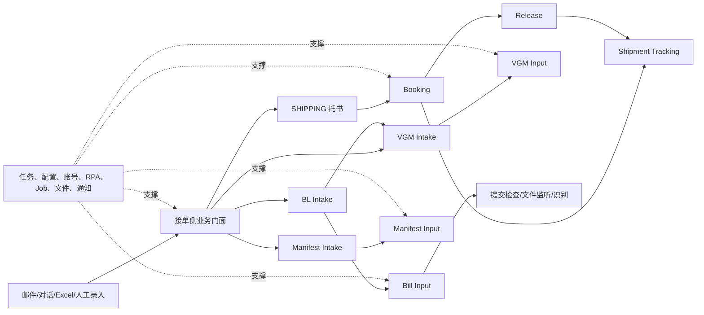

# 产品与业务地图

## 目的、读者与边界

本文面向第一次理解 `cube-control-desk` 的后端、前端、测试和运维人员，用“业务事实由谁维护、何时跨域”的方式建立全景图。它不替代各模块的状态定义，也不根据页面菜单反推后端领域归属。

## 业务全景

## 十一个核心业务域

### 1. 接单 / SHIPPING

邮件或对话记录进入 `entrusted_*` 记录，由 Agent 与创建策略生成 `entrusted_work_order`、`entrusted_info`，再经历接单、保存、审核、去订舱、关闭与重试。共享邮件记录必须按 `work_order_type` 隔离；`WorkOrderManagerImpl` 只按 SHIPPING 理解。

### 2. Booking

Web、OpenAPI 或接单侧把数据装配为 `BookingParam`，创建 `biz_task` / `biz_customer_task` 并维护 `biz_advance_booking` 当前态。`bookingCallback` 消费执行回执；`SUCCESS_RUN` 只证明订舱执行成功。

### 3. Release

订舱成功且租户、船司能力允许时创建 `RELEASE_SPACE` 任务。API、Website、Email、ASTA 监听结果统一为 `ReleaseResultDto`，经 `releaseSpaceCallback` 更新订舱当前态并写放舱历史。Release 成功是独立生命周期事实。

### 4. BILL / BL Intake

BL 接单复用 Entrust 的邮件、模板、配置基础设施，但使用 `bl_entrusted_info`、`bl_work_order` 及 Mongo 详情文档。它负责接单门面、异常修复、字段来源、VC 邮件、Tracking 事件及调用 Bill Input，不拥有 Bill Input 的通道状态机。

### 5. Bill Input

Bill Input 是官网补料基础能力：采集、二次清洗、船司规则、提交、回执、提交检查、文件监听、文件识别和比对。当前主要支持官网通道；主记录为 `biz_bill_record`，详情快照在 Mongo。

### 6–7. VGM Intake 与 VGM Input

接单侧当前态是 `vgm_info`、Mongo `vgm_detail`；通道侧主数据是 `biz_vgm_record` / `biz_vgm_container`。前者可从 BL 初始化并调用后者提交，但不能混用当前态、幂等键和人工操作边界。

### 8–9. Manifest Intake 与 Manifest Input

Manifest 同样拆成接单门面与通道提交能力。当前仓库同时存在 `app/modular/manifest`、`biz/modular/manifest`、通道侧任务契约和设计文档；具体能力必须在对应模块文章按源码逐项确认，不能仅凭设计稿认定上线。

### 10. Shipment Tracking

该域处理货运状态获取、映射、订阅与通知；它消费业务单据标识，但追踪状态、订阅记录和推送结果有自己的数据与任务边界。

### 11. Plan / Schedule

计划与船期能力为订舱等业务提供计划查询、监控和时间维度数据。它与 Booking 有调用关系，但不能把计划状态等同于订舱任务状态。

## 关键领域边界

- “接单侧”维护人工业务工作流与业务门面；“Input 通道侧”维护官网执行任务、回执和通道状态。
- 通用 `biz_task` / `biz_customer_task` 是任务壳，不是所有业务当前态真源。
- 历史快照、操作日志和回调记录用于追溯，不应覆盖当前态表的语义。
- 共享邮件、账号、配置、文件、通知或 RPA 基础设施，不代表基础设施拥有调用方业务。

## 为什么采用这种分层

源码显示，同一外部动作通常同时包含人工业务状态、可重试的机器执行任务、配置差异和异步回调。将接单门面与通道能力分开，可以让人工修改、事实投影和机器执行各自保留幂等与状态约束；公共任务/配置/RPA 则避免每个业务重复建设执行基础设施。

## 风险与限制

- 历史 Wiki 中的 Bill 语义可能仍指旧能力，阅读时必须回到 `bl_*` 与 `biz_bill_*` 当前代码。
- Manifest、Tracking、Plan/Schedule 的部分历史文档比实现范围更宽；正式模块文档需列出差异。
- 页面按钮、路由或文案只能证明前端呈现，不能单独证明后端权限和领域边界。

## 面试深挖

1. 为什么 BL Intake 与 Bill Input 不合并？应从人工工单、通道任务、主数据、回调和失败恢复边界回答。
2. 为什么订舱成功不等于放舱成功？应说明两个外部生命周期、独立任务及当前态/历史写入。
3. 通用任务表为什么不是业务事实表？应说明任务可重试、重放和调度状态与业务当前态不同。

## 文档/代码差异与未知项

- 差异：旧 Wiki 的模块粒度与当前 Intake/Input 分域不完全一致，以当前 Controller、实体和调用链为准。
- 当前代码无法确认：各租户实际启用的船司、通道、Agent、Job 与脚本配置值；仓库只能证明读取逻辑和示例配置。

## 直接来源

- `AGENTS.md`
- 根 `pom.xml`
- `cube-control-desk-app/src/main/java/info/data/cube/control/desk/app/modular/`
- `cube-control-desk-biz/src/main/java/info/data/cube/control/desk/biz/modular/`
- `cube-control-desk-biz/src/main/java/info/data/cube/control/desk/biz/core/`
- `cube-control-desk-model/src/main/java/info/data/cube/control/desk/model/`
- `doc/README.md`、`doc/design/`、`doc/onboarding/`
- `sql/`

