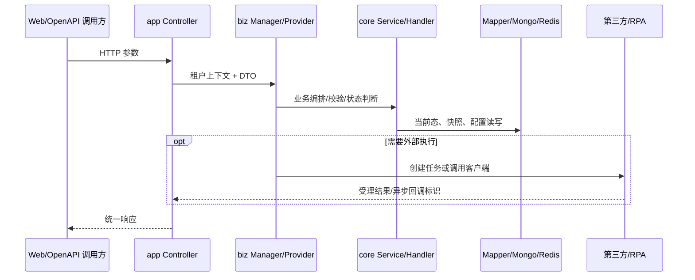
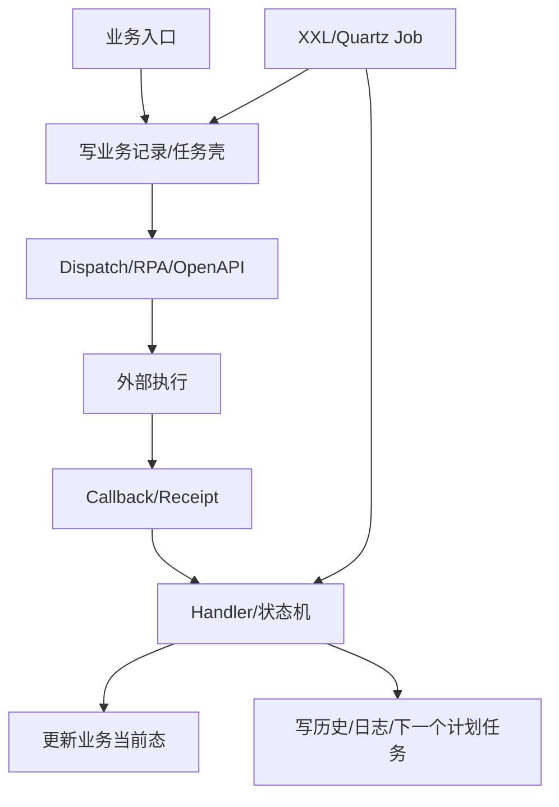

# 系统架构与模块地图

## 目的与非目标

本文说明一次请求、任务或回调在 Maven 模块和代码分层中的典型位置，帮助读者定位真实入口与写入点。本文不宣称所有调用都遵循固定四层，也不把包名当作事务边界。

## Maven 模块

根 `pom.xml` 当前声明五个子模块：

- `cube-control-desk-app`：Spring Boot 启动器、Controller、AOP 与运行配置装配。
- `cube-control-desk-biz`：业务编排、领域服务、Mapper、状态机、Job、第三方客户端和公共中间件封装。
- `cube-control-desk-api`：内部 OpenAPI/Feign 契约与跨服务 DTO。
- `cube-control-desk-model`：实体、枚举、通用 DTO/VO 和持久化模型。
- `cube-control-desk-integration`：外部服务 Feign consumer 与集成契约。

`CubecontrolDeskApplication` 使用 `@SpringBootApplication`、`@MapperScan("info.data.cube.**.mapper")` 和 `@EnableFeignClients` 装配应用，因此 Mapper 与 Feign consumer 虽分布在不同模块，最终在 app 启动上下文生效。

## 典型同步请求链

Controller 负责协议与请求装配；Manager/Provider 负责跨服务编排；`biz/core` Service 通常维护 CRUD 与领域写入；Mapper、MongoTemplate、缓存/对象存储形成数据层。实际链路可能从 XXL-Job、MQ listener、Feign provider 或回调 Controller 起步。

## 异步任务与回调链

必须分别确认：任务创建事务是否已提交、外部调用是否在事务内、回调幂等键、状态迁移前置条件、失败是否由 Job/业务重试补偿。仅找到“发送成功”不能证明最终业务状态成功。

## 数据与配置架构

- MySQL：业务当前态、关系、任务、配置、可查询索引与操作日志。
- Mongo：复杂表单详情、字段来源、快照和部分对象存储。
- Redis/Redisson：缓存、短期协调与分布式锁；Key 和过期策略以调用点为准。
- OSS/文件服务：附件、模板产物、识别文件和临时授权。
- `sys_config`、租户配置、船司配置、账号配置、Groovy 脚本：表达运行时差异。

同一业务可能采用“MySQL 当前态 + Mongo 详情快照 + OSS 文件 + 任务表”的组合。跨存储没有天然原子事务，代码通常依靠调用顺序、幂等键、状态检查和补偿收敛。

## 技术机制与设计原因

- 策略/Processor：把船司、通道差异隔离在明确扩展点，避免 Controller 条件分支膨胀。
- 状态机/Handler：集中管理允许迁移与副作用，减少任意 Service 直接改状态。
- Provider/OpenAPI：稳定跨服务契约，隔离内部模型与外部 DTO。
- Job + 回调：外部 RPA/官网执行时间不可控，使用任务和回执实现最终一致性。
- 配置与脚本：租户差异变化快，适合配置化；但核心安全/一致性规则仍应由 Java 代码兜底。

## 事务、并发与异常关注点

1. `@Transactional` 只能覆盖同一事务管理器内的数据库操作，不能自动覆盖 Mongo、OSS、HTTP 或 RPA。
2. 同一业务可能被 Web 重试、Job 扫描和回调并发触发，需检查唯一键、条件更新、锁与幂等查询。
3. 回调晚到、重复或乱序时，不能无条件覆盖更晚状态。
4. 配置缺失应区分“不支持”与“系统异常”，避免把配置问题写成业务失败。

## 排查与验证入口

先从路由/Job/回调名定位入口，再追主数据写入、外部调用、回调和最终状态；运行证据优先使用相应 `api-test/scenarios`，没有场景时明确说明只完成静态核验。

## 文档差异、未知项和风险

- `doc/wiki` 的传统 Controller-Service-Mapper 图可用于定位，但不能证明所有新业务都遵循该形态。
- 当前代码无法确认生产环境实际启用的 profile、外部地址、Job 开关和租户配置。
- 多存储一致性与外部调用事务边界需在各模块文章逐方法核验，不能由总体架构图推断。

## 面试深挖

- 如何保证外部 RPA 回调最终一致？回答应覆盖任务状态、业务当前态、幂等、乱序和补偿。
- 为什么 MySQL 与 Mongo 混用？回答查询维度、表单结构演进、事务代价和重建/补偿边界。
- 配置化和策略模式各解决什么问题？配置表达数据差异，策略承载可测试的行为差异。

## 直接来源

- 根 `pom.xml`
- `cube-control-desk-app/.../CubecontrolDeskApplication.java`
- `cube-control-desk-app/src/main/resources/config/application.yml`
- `cube-control-desk-biz/src/main/java/.../biz/{modular,core,component}/`
- `cube-control-desk-api/src/main/java/`
- `cube-control-desk-model/src/main/java/`
- `cube-control-desk-integration/src/main/java/`

