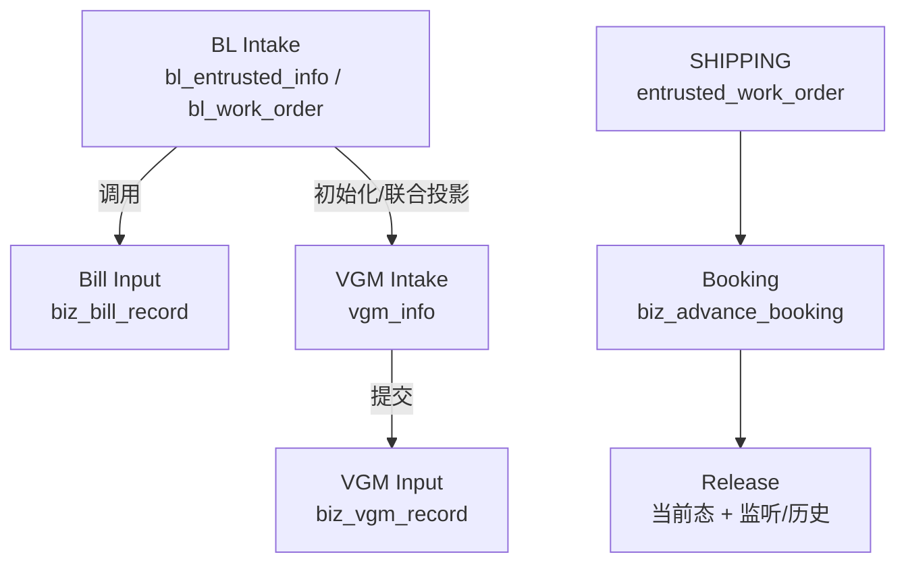

# 术语与领域边界

## 使用说明

术语相同不代表表、状态或所有权相同。遇到“工单、任务、Bill、VGM、回调、成功”等词，必须结合调用入口、主数据和当前状态枚举解释。

## 核心术语

| 术语 | 项目内含义 | 不能误解为 |
| --- | --- | --- |
| SHIPPING | 托书接单链，主表为 `entrusted_work_order`、`entrusted_info` | 所有 Entrust 类型的统一工单主表 |
| BILL / BL Intake | 提单接单门面，使用 `bl_*` 与 Mongo BL 文档 | Bill Input 通道能力；历史“invoice/OCR”语义 |
| Bill Input | 提单补料官网提交、回执、文件监控基础能力 | BL 工单或其附件模块 |
| VGM Intake | 接单侧 VGM 当前态和人工操作门面 | 通道侧 `biz_vgm_record` |
| VGM Input | 独立官网 VGM 填写任务 | BL 详情中的箱/VGM 快照 |
| Manifest Intake/Input | 舱单接单门面/通道执行能力 | 一个共享主表的两种页面 |
| Booking | 订舱任务及 `biz_advance_booking` 当前态 | 放舱完成 |
| Release | 放舱监听、回调、当前态更新与历史 | `bookingCallback` 的同义词 |
| `biz_task` | 任务定义或任务壳 | 业务最终事实表 |
| `biz_customer_task` | 租户/客户维度的执行任务 | 任意业务主记录 |
| 当前态 | 页面和后续动作应读取的事实状态 | 历史快照或日志中最后一条文本 |
| 回执/Callback | 外部执行结果回流入口 | HTTP 接口返回 200 即业务成功 |
| TEMP | Bill Input 暂存流程 | 正式官网校验已通过 |
| `SUCCESS_RUN` | 订舱执行回执成功 | 放舱成功或全链完成 |
| `pending` | 放舱审核阶段 | 放舱失败 |
| `confirm/update/cancel` | 首次确认/后续更新/取消的放舱事件 | 同一状态值的三个别名 |
| `AI_SERVICE` | BL 接单侧消费 Input 能力的来源标识 | Bill Input 归 BL 域所有 |

## 数据所有权边界

- 上游保存下游 taskNo、sourceId 或快照，是关联，不是数据合并。
- 历史表、操作快照和回调日志用于解释变化；修改当前态时仍应走所属 Manager/Handler/状态机。
- `BizBookingAccount` 是 Booking/Bill Input/VGM 等当前账号基础，不应回退到旧 `sys_tenant_account`。

## “成功”的四层含义

1. 接口受理成功：请求通过校验并创建了记录/任务。
2. 任务下发成功：消息或 RPA 调用已接受。
3. 执行回执成功：官网/RPA 报告本次命令成功。
4. 业务链完成：所属业务当前态和必要后续动作均已收敛。

文档和排障必须指出具体层级，避免用“成功”掩盖未完成的异步阶段。

## 边界场景

- 同一邮件基础设施可承载 SHIPPING 与 BILL，必须通过类别、`work_order_type` 或业务标识隔离。
- 同一订舱账号枚举被多个 Input 能力复用，不表示所有通道都已支持；规则分发点才是事实。
- 前端能力开关只决定展示；后端接口是否校验租户、角色和状态要独立核验。

## 面试深挖

- 如何识别领域边界？看独立生命周期、当前态真源、事务/幂等边界和对外契约，而不是类名前缀。
- 为什么保留投影而不是直接读下游表？投影服务于上游页面与人工流程，避免把通道内部状态暴露为接单事实。
- 如何定义异步系统的“完成”？以可观察的业务不变量和最终状态为准，而不是消息发送结果。

## 差异与未知项

- 差异：历史文档存在 Bill 旧语义，本文按当前 `bl_*`、`biz_bill_*` 源码重新界定。
- 当前代码无法确认：生产业务对部分状态文案的最终产品解释；需由产品/业务确认，但不影响代码状态值和写入链事实。

## 直接来源

- `AGENTS.md`
- `model/enums` 下 Booking、Release、Bill、VGM、Manifest 状态枚举
- 对应模块 Controller、Manager/Provider、Entity/Document 与 SQL

