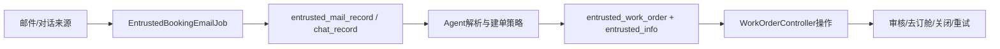

# SHIPPING 从邮件到托书工单的端到端链路

## 证据合同与实现核验

本文面向需要追请求到数据库结果的新后端；非目标是 Booking/Release 的后续实现。真实入口为 `POST /api/v1/workOrder/v2/create` 和 `/createCorrespondence`：Controller 先按 `recordId + recordType` 读取来源，解析并保存 `workOrderType`，再 `EntrustedOrderCreateFactory#getByStrategy` 调用 `AbstractShippingOrderCreate`；失败时 helper 回写来源状态并发失败通知。成功后工单操作走 `WorkOrderController → WorkOrderManagerImpl`。

来源、调用方和被调用方已核对：`EntrustedRecordManager`、`EmailRecordOrderHelper`/`ChatRecordOrderHelper`、`EntrustedWorkOrderService`、`EntrustedInfoService`、`NoticeManager`。转交在 `@Transactional(rollbackFor=Exception.class)` 内更新跟进人/协作者，但通知外发与数据库提交的最终一致性当前代码无法证明。

代码/文档差异：不能把建单成功写成 Booking 成功，也不能省略 `work_order_type` 分派。边界未知：Agent 异步重试和幂等协议当前代码无法确认。测试证据为 `WorkOrderContextResolverRegistryTest`、`WorkOrderPageQueryServiceImplTest`；源码列表同上述类及对应 Mapper/XML；最后验证日期 2026-08-26。

## 主流程

1. `EntrustedBookingEmailJob` 拉取接单邮件并转换为 `EntrustedMailRecord`；邮件线程、读取游标和附件由对应记录及公共邮件能力承载。
2. 待处理记录由 `EntrustedBookingWaitProcessEmailJob` 处理，处理中超时记录由 `EntrustedBookingProcessingEmailJob` 处理。代码中的 Job 名称和调度注解是当前实现证据。
3. 建单策略根据记录和配置生成工单与委托信息。`AbstractShippingOrderCreate` 是 SHIPPING 建单策略基类。
4. 前端通过 `WorkOrderController` 查询详情并执行 `claim`、`acceptCommission`、`submitReview`、`goBooking`、`close` 等动作。
5. 去订舱后会进入 Booking 相关任务链；本模块只负责接单侧动作，不把 Booking 回调当作本模块的状态写入。

## 排查入口

先确认邮件/对话记录是否落库，再确认 `work_order_type`、Agent 状态和建单结果，最后追踪工单操作方法。不要仅凭页面列表判断邮件是否已被 Agent 消费。
