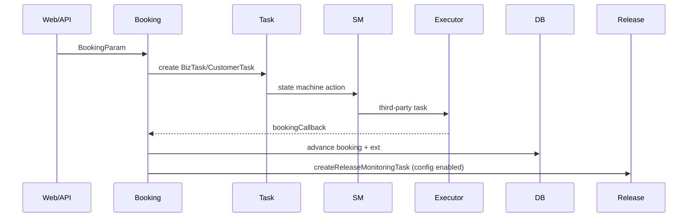
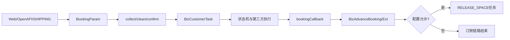

# Booking 订舱端到端链路

## 证据合同与实现核验

真实调用方为三个 Web Controller、`ICommandBookingOpenApi` provider 和委托链；被调用方为 `BizCommandBookingManager`、`BizCustomerTaskService`、`BizTaskService`、状态机 actions、`BizAdvanceBookingService`。回调处理先定位 task/booking，再推进当前态；成功后才判断 Release 配置。非目标是用 BL/Release 文档替代当前 Booking 代码。

代码/文档差异：计划/迁移记录是历史证据，不能证明当前状态流；Release 是独立事实。测试有 `BizCommandBookingControllerTest`，而主链 api-test 稳定性当前代码无法确认。未知项、源码列表同上述类与 `cube-control-desk-app/src/test/.../BizCommandBookingControllerTest.java`；最后验证日期 2026-08-26。

1. Web、OpenAPI 或接单域组装 `BookingParam`，经过 collect/clean/confirm 等回调阶段。
2. `CommandBookingOpenApiProvider` 与 `BizCommandBookingManager` 创建或推进 `BizCustomerTask`，由 `StateMachineBuilderBookingConfig` 对不同订舱模式执行动作。
3. 外部执行结果进入 `bookingCallback`；Provider 处理回执、更新主记录/扩展记录并发送相关通知。
4. `processBookingRecordWhenBookingCallback` 继续判断是否需要 `createReleaseMonitoringTask`，再创建 `TaskCommandEnum.RELEASE_SPACE` 任务。

不同入口可能有额外分支；本文只描述当前代码能确认的主路径。
