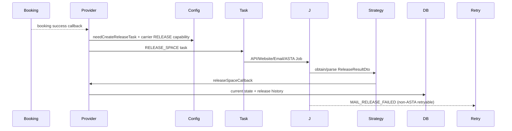
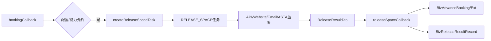

# Release 放舱端到端链路

## 证据合同与实现核验

Job 先按租户/邮箱/到期任务读取监听数据，策略解析为统一结果，再由 callback 推进当前态。`pending` 是审核阶段，`confirm/update/cancel` 是操作语义；历史表 `BizReleaseResultRecord` 是快照，不是当前态真源。非目标是将所有 Email 异常都视为可重试，实际需满足 `EmailReleaseJob` 条件。

代码/文档差异：订舱成功不等于放舱成功；`BusinessRetryJob` 不替代旧 Push Retry。测试证据：`ApiReleaseJobTest`、`WebsiteReleaseJobTest`、`EmailReleaseJobTest`、`AstaEmailReleaseJobTest`。未知项为外部邮件/API SLA；源码列表为四类 Job、策略、Provider、回调、release service/entity/SQL；最后验证日期 2026-08-26。

订舱回调中 `processBookingRecordWhenBookingCallback` 判断是否创建监听；四类 Job 分别读取自己的监听表并调用对应 Strategy。Strategy 将来源结果转换为统一结果，再调用 `releaseSpaceCallback`。回调实现更新当前订舱记录、扩展结果、历史快照和相关日志。

Email 监听还存在 `MAIL_RELEASE_FAILED` 业务重试链：提交 `biz_business_retry_task`，由 `BusinessRetryJob` 调度 `MailReleaseFailedRetryHandler` 重放。该补偿链不等同于历史 Push Retry Job。
