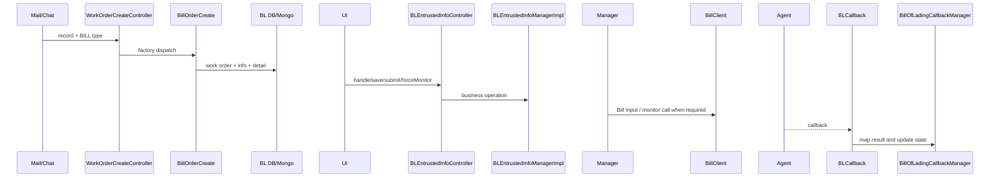
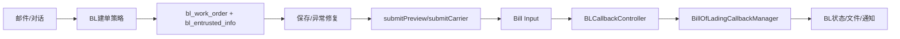

# BILL/BL 接单端到端链路

## 证据合同与实现核验

核心调用方/被调用方为共享建单 Controller、`EntrustedOrderCreateFactory`、`AbstractBillOrderCreate`、`BLEntrustedInfoManagerImpl`、`BLEntrustedInfoService`/DetailService、`BLExceptionEngine`、`BillClient`。关闭、处理、异常修复在 manager 事务内更新主表、异常投影和操作日志；外部调用与本地事务的原子性当前代码无法确认。非目标是把通道侧 Bill Input 文件监听写成本模块职责。

代码/文档差异：BL 强制监听可调用 Bill Input，但 ownership 仍在 Bill Input。测试为 manager close/forceMonitor、callback compare/original-issued tests；源码列表为上述类、entity、Mongo document、`sql/bill`；未知项与最后验证日期 2026-08-26。

建单策略由 `AbstractBillOrderCreate`、`EmailBillOrderCreate`、`ChatBillOrderCreate` 和 `StandardBLDataGenerator` 组成；人工操作由 `BLEntrustedInfoController` 进入 Manager。提交预览件或船公司会通过 `BillClient` 调用 Bill Input。回调进入 `BLCallbackController` 后，按 dataType 路由到 BL、VGM 或 Manifest；BL 分支由 `BillOfLadingCallbackManager` 映射状态、更新异常/文件并触发通知及必要的 VGM 投影。

`sourceFrom=AI_SERVICE` 只是上层调用 Bill Input 的来源标记，不改变 Bill Input 的 ownership。
