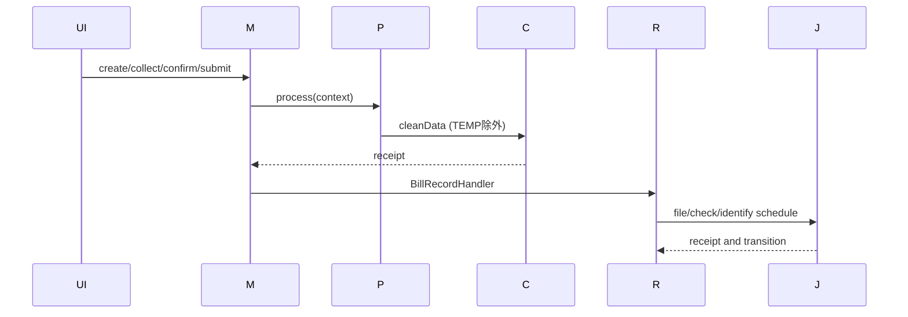
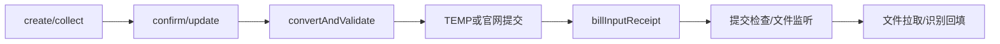

# Bill Input 端到端流程

## 逐步调用链

Web `create/collect` 经 `BizCommandBillInputController` 到 `BizCommandBillManager`，confirm/update 进入 `BillInputConfirmProcessor` 或 `BillInputUpdateProcessor`。`AbstractBillInputProcessor.process` 固定执行任务准备、DTO 构建、`convertAndValidate`、锁处理和状态机推进。规则由 `BillInputRuleTools.getBillInputRuleStrategy(carrier, channel)` 选择；非 TEMP 调用 `ClusterOpenApiService.billInputCleanDataApi`，TEMP 只保存 `TEMPORARY_SAVED`。

回执 Provider 按 taskNo 定位任务，Manager 转交 `BillRecordHandler`。`submitAction`/`fileMonitorConfig` 决定 PREVIEW、DRAFT、COPY、AUDIT_FAIL schedule；`BillFilePullJob` 选择 Website/Mail 策略，`pullFileSuccess` 必要时创建 COPY；识别由 `BillFileIdentificationJob` 发起，提交检查由 SendJob/TimeoutJob 闭环。

锁只保护代码包围的处理窗口，不证明外部 exactly-once；当前代码无法确认跨 MySQL/Mongo 原子性。来源：Processor、Provider、Manager、Handler、Job；最后核验 2026-08-26。

Web 先 create/collect 清洗和填充；确认或 OpenAPI 提交进入 Confirm/Update Processor。`AbstractBillInputProcessor.convertAndValidate` 按 carrier+channel 选择规则策略。TEMP 只保存本地记录；正式提交经回执推进 `BillRecordHandler`。开启提交检查时由 `BillSubmitCheckSendJob`/TimeoutJob 管理检查；文件任务由 `BillFilePullJob` 拉取，识别由 `BillFileIdentificationJob` 下发，结果经 receipt 回填。草稿件成功后可继续创建 COPY 监听。
