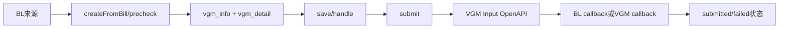

# 接单侧 VGM Intake 端到端流程

`createFromBill` 校验独立 VGM 配置、BL 状态、重复未关闭记录和官网 precheck，然后将 BL 当前 formData 写入 VGM detail。后续保存修改 VGM 自己的快照；提交构造 VGM Input payload。独立提交回调由 `VgmInfoManagerImpl.handleCallback` 推进。BL 联合提交只有在船公司提交成功且快照为 `CONTAINER_AND_VGM` 时，才由 `VgmCombinedProjectionManager` 投影本地 VGM。

## 独立链逐步解析

1. `precheck`/`createFromBill` 从当前登录租户读取来源 BL，`VgmConfigResolver` 校验委托客户与船司的独立能力。
2. Manager 校验 BL 状态、同来源未关闭 VGM，并通过 `BillClient.queryVgmInfo` 查询官网是否已经提交；创建阶段不以缺少 `CONTAINER_NO` 阻断，箱号在正式提交时校验。
3. 创建 `vgm_info` 并把 BL 当前 `formData` 保存为独立 `vgm_detail`。此后 `/save` 修改 VGM 自己的快照；账号变化同步到 `vgm_info.account`，不反写 BL。
4. `/submit` 从详情抽取标准 VGM 结构，携带 `id`、截图文件和账号上下文调用内部 VGM Input；通道返回的稳定 taskNo 写回接单侧用于回调定位。
5. `BLCallbackController` 将 VGM 类型数据交给 `VgmCallbackManagerImpl`，最终调用 `VgmInfoManagerImpl.handleCallback` 更新接单侧状态和错误信息。

## 联合与强制监听链

BL 预览成功只产生 `SUBMIT_PREVIEW` 快照，不投影 VGM。只有船公司提交成功进入 `SUBMITTED_CARRIER`，且最近 `SUBMIT_CARRIER` 快照的 `vgmSubmitMode=CONTAINER_AND_VGM`，才调用 `createSubmittedFromBill`。`forceMonitor` 成功也可按监听结果投影；两条路径都以 `sourceTaskNo` 幂等。

## 一致性、验证与差异

外部提交、MySQL 当前态、Mongo 详情和操作日志不在一个原子事务内；重复回调、晚到回调和创建失败后的重试必须保留 source/task 标识。验证应覆盖独立创建/保存/提交、当前 VGM 排除自身的 precheck、预览不投影、联合成功投影、重复 sourceTaskNo 和强制监听。设计文档是协作基线，生产配置与外部官网结果当前代码无法确认。
