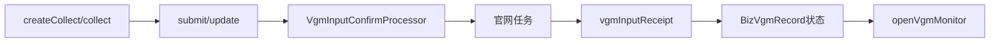

# 独立 VGM Input 端到端流程

Web 先创建采集任务并 collect；submit/update 由 `BizCommandVgmManager` 校验官网状态、账号和参数后进入 Processor。OpenAPI `internal/vgm/submit` 也走自动检测保存；`internal/vgm/monitor` 创建监听任务或更新已提交上下文。回执由 Provider 加锁后调用 manager，成功/失败分别由 `VgmRecordHandler` 推进记录。

## 逐步执行

1. Web createCollect/collect 或内部 submit 形成统一 VGM 参数；Manager 按当前租户、船司和账号读取 `BizBookingAccount`。
2. `VgmWebsiteInfoQueryService.queryVgmInfo` 可强制查询官网，用于判断是否已提交及监控上下文；它将账号和订舱号转换为 Cluster 查询 DTO。
3. `VgmInputConfirmProcessor` 经 RuleTools 选择官网策略，执行参数/跨字段校验、清洗、保存 `biz_vgm_record`/containers 与 Mongo 快照，并创建 `VGM_INPUT` customer task。
4. dispatch/RPA 执行官网填写；`/openApi/v1/task/vgm/receipt` 通过 taskNo 找到 `BizCustomerTask`，Provider 用 receipt lock 调 `BizCommandVgmManager.vgmInputReceipt`。
5. `VgmRecordHandler` 依据成功/失败结果更新通道记录和容器；已提交后 `openVgmMonitor` 或 `VgmSubmitStatusPollJob` 查询官网状态，避免只依赖单次提交回执。

## 并发、一致性与失败

提交受理、官网执行、回执和状态轮询是四个事实；任何一个成功都不能替代后续阶段。相同 taskNo 回执可能重复，轮询与回调可能并发，更新必须检查当前状态并避免终态回退。外部 HTTP status、业务 body 与解析异常要分层保留，HTML 403 不能被归类为 JSON 业务失败。

## 验证与差异

测试至少覆盖账号/配置缺失、规则失败、官网已提交、首次 submit、失败重提、重复 receipt、回调与轮询并发、容器部分失败和超时 Job。设计中的更多船司/渠道不等于当前实现；生产集群、官网和 Job 时序当前代码无法确认。
