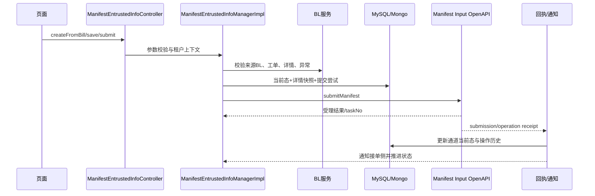

# Manifest 接单端到端流程

## 创建与编辑

`POST /api/v1/manifest/createFromBill` 由 manager 读取当前登录租户，检查来源 BL 是否存在、是否允许创建、船司是否有唯一键策略；策略注册表生成规则和值，SHA-256 形成锁键，`RedisLockUtil.autoLock` 串行同租户/船司/业务键创建。事务服务随后写接单当前态、详情文档及来源投影。`save` 只允许 `ManifestEntrustedStatusEnum.editableStatuses()`（待提交、提交失败、已保存草稿），详情更新带 `version`，并保存用户、备注及操作快照。

## 提交与回调

`submit` 读取当前详情并解析 `ManifestData`，由 `ManifestSubmissionConfigResolver` 决定动作和能力，生成提交快照、递增 `submit_attempt_no`，调用通道契约。接单侧保存 `task_no`、`submit_snapshot_id` 与受理状态；通道异步执行结果通过 `/openApi/v1/task/manifest/receipt`，官网操作历史通过 `/openApi/v1/task/manifest/operation/receipt` 返回。回执先由 `ManifestReceiptTransactionService`/`ManifestOperationReceiptService` 在本地事务中落库，再由 `ManifestNotificationDispatcher` 推送，避免通知失败回滚状态。

## 失败与重提

提交失败保留提交尝试、错误摘要和快照，当前态进入可编辑失败状态；重提必须基于新详情版本。回调找不到记录、taskNo 不匹配或重复操作属于需要查看幂等键和日志的边界，不能仅依据页面状态判断已成功。

## 未知项

当前代码无法确认外部 Manifest Input 集群何时真正执行官网动作，也无法从仓库证明所有船司均支持相同状态集合。

## 源清单

Controller/Manager、`ManifestEntrustedTransactionService`、`ManifestSubmissionService`、`ICommandManifestInputOpenApi`、`CommandManifestInputOpenApiProvider`、`ManifestReceiptManager`、Manifest SQL。

## 文档与代码差异

设计稿把 Intake 到 Input 描述为完整产品链；当前代码能证明的是接单事务、标准 DTO 转换、Input 提交和回执投影这些断点。外部执行、通知和最终用户可见状态尚无本轮运行证据，因此流程图中的外部阶段不是“已联调通过”的声明。
