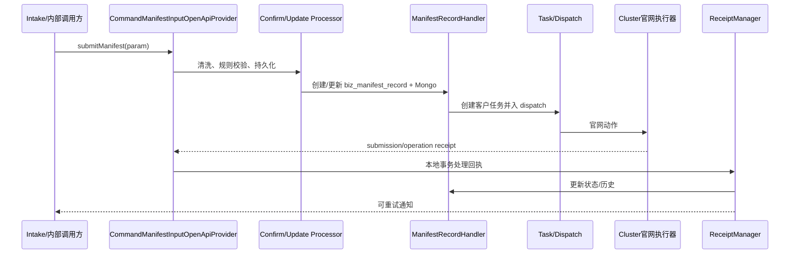

# Manifest Input 端到端流程

Provider 按 `submitProcess` 选择首次确认或失败重提处理器；处理器通过 `ManifestPreparedSubmission` 固定发送快照，规则策略校验标准数据，再由 `ManifestRecordHandler` 写 MySQL 当前态与 Mongo 数据并创建任务。`ManifestApiTaskDispatchService`/公平调度服务负责执行资源分配。官网提交回执与官网操作历史是两类事件，`ManifestReceiptManager` 先调用本地 receipt transaction，再由 `ManifestNotificationDispatcher` 独立发送通知。

失败重提不能覆盖原尝试的审计信息；`business_no`、identity、taskNo 和 error 字段用于定位。当前源码未证明所有回执都同步返回，外部执行时序属于未知项。源清单：Provider、两类 Processor、Handler、dispatch、ReceiptManager、OperationReceiptService。

## 文档与代码差异

`manifest_input_design.md` 描述了更完整的船司与监控目标；当前规则 Registry 中可直接确认的实现只有 `COSCO_WEB_ManifestInputRuleStrategy`。因此流程结构可扩展到其他船司，不等于当前 checkout 已具备其他 `{carrier}_WEB` 策略。

## 当前代码无法确认的运行时行为

Cluster 是否 exactly-once、外部回调是否重放以及官网动作的真实网络超时，当前代码无法确认；这些行为必须用任务日志、原始回执和生产配置补证，不能从本地状态 40/50 反推。

## 提交、持久化与任务分支

`ManifestSubmitProcessEnum` 决定首次确认、更新或失败重提的处理路径。Processor 先生成 `ManifestPreparedSubmission`，完成标准数据转换、默认值与船司规则，再委托 `ManifestRecordHandler` 创建或替换当前动作。Handler 产出的可追踪键包括 manifestId、Mongo dataId、taskId/customerTaskId 和 identity；失败重提生成新的任务和快照，不应覆盖原尝试审计。

如果 Mongo 快照已写而 MySQL 后续失败，Handler 的 `compensateSnapshot` 只代表尝试清理，跨存储是否补偿成功必须以日志和数据核对为准。任务进入 dispatch 后，外部 Cluster 执行器才产生官网副作用；当前仓库无法确认其协议、重试和并发额度。

## 回执时序与并发

提交回执按 taskNo 定位 CustomerTask，再定位 manifest。事务服务忽略重复/迟到任务，DRAFT 成功进入 20，正式提交进入 40，失败进入 90；后续官网接受申报才可能进入 50。操作回执单独以 operationHash 幂等并更新 latest operation，不能替代提交回执的主状态条件。

应验证同一 identity 并发提交、旧任务失败回执覆盖新重提、重复 operation receipt、Mongo 异常、通知失败、监控配置为空等场景。现有 `ManifestReceiptTransactionServiceTest`、`ManifestRecordHandlerTest` 和 `ManifestApiTaskDispatchServiceTest` 能锁定本地分支，但不能证明官网成功。
