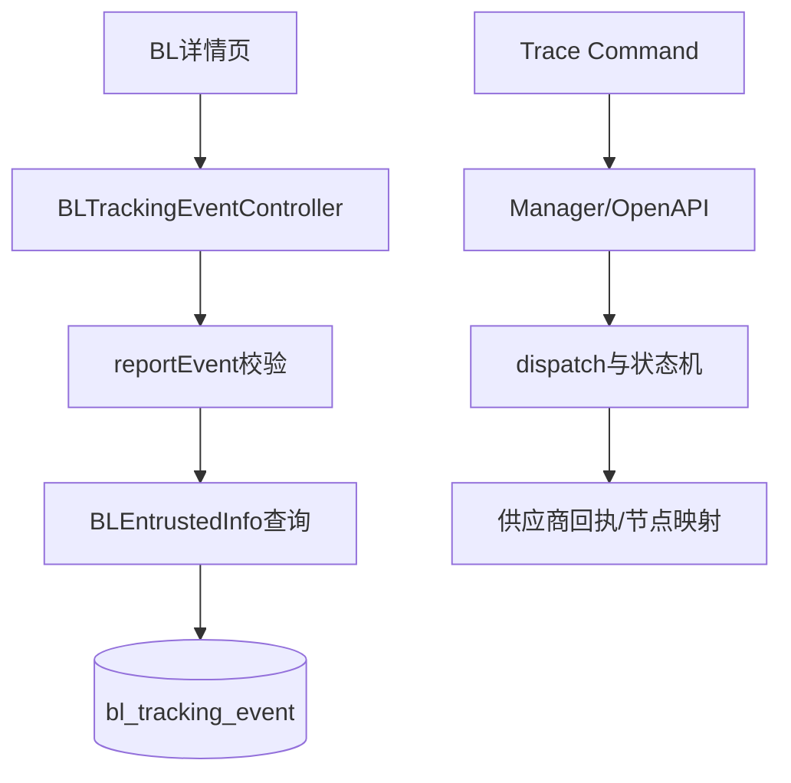

# Shipment Tracking 模块概览

本目录覆盖两条不能混为一谈的链路：BL 详情页 Tracking Event 埋点，以及 Trace/containerInput 的追踪任务与状态机。前者入口 `BLTrackingEventController`（`/api/v1/bl/tracking`），服务 `BLTrackingEventServiceImpl`，数据表 `bl_tracking_event`；后者由 Trace Command/Manager、`TraceOpenApiService`、dispatch 和状态机动作协同，面向追踪任务执行与结果推送。BL 事件不是供应商追踪结果，也不改变 BL 主状态。

BL 事件服务校验登录用户、mblId、事件时间（最多未来 5 分钟）、事件类型、当前 BL 状态和 EXIT 原因，在事务内从 BL 记录投影 cid/blNo/carrier 后保存，并提供按时间/id 稳定排序的分页查询。其 `calcStatus` 支持后续 pending session 计算，具体计算 Job/规则需看 Mapper 与调用方。Trace 的供应商协议、节点映射和任务状态属于另一边界。

源清单：BLTrackingEventController/ServiceImpl、`BLTrackingEvent`、`TrackingEventTypeEnum`、BL tracking Mapper/XML、Trace controller/manager/openapi/state machine。当前代码无法确认第三方供应商实时 SLA、追踪结果完整性和生产消息延迟。

## 1. 边界与运行位置

Tracking 不是单一的轨迹状态表。BL 埋点衡量提单详情页打开、活跃、心跳和退出；Trace 是面向任务执行的供应商追踪编排。两者没有共享状态机，不能将 `BLTrackingEvent` 当作船司轨迹结果。

## 2. 实现证据与调用关系

`BLTrackingEventController` 接收 `/api/v1/bl/tracking/report` 和分页查询，`BLTrackingEventServiceImpl` 完成参数校验、读取 `BLEntrustedInfo` 投影 `cid/blNo/carrier`，在事务中保存事件。计算侧由 `getPendingSessionCalcList`、`listSessionEvents` 和 `markAsCalculated` 组成增量接口。Trace 从 Command/Manager 进入 `TraceOpenApiService`，经 dispatch、状态机动作和节点映射处理供应商结果。

## 3. 设计取舍、风险与验证

事件与 BL 主表解耦，观测失败不影响接单主状态；`calcStatus` 与 session/eventId 游标为异步统计留下边界。风险是 `reportEvent` 校验登录用户，却未在该方法中确认用户是否有权访问任意 mblId；这项授权需由上层框架或运行环境补证。已静态核对 Controller、Service、实体、枚举和 Mapper/XML；未执行外部供应商调用。

## 4. 面试深挖

可追问为何分页必须 `eventTime + id` 双排序、为什么 `calcStatus` 不等价于 BL 当前状态、为什么供应商回执应保留在 Trace 状态机，以及跨租户查询应在哪一层建立授权边界。
