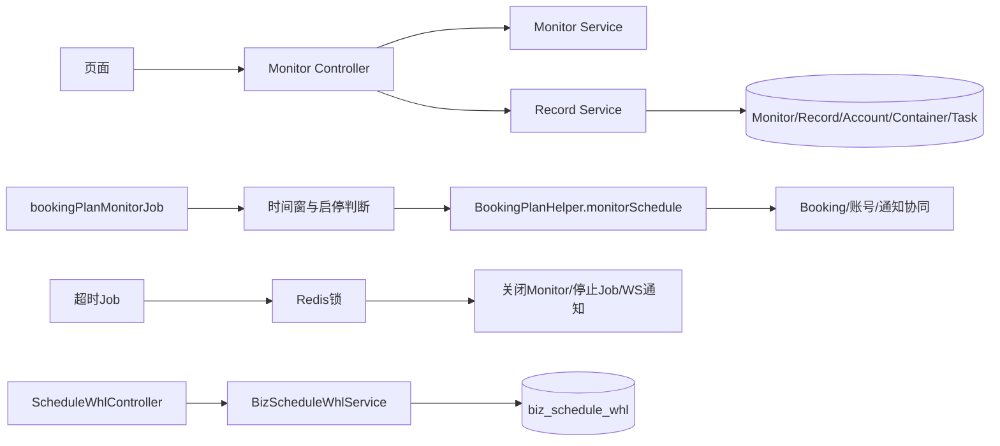

# Plan 与 Schedule 端到端流程

创建 Monitor 时 Controller 校验计划列表和每个账号，Service 创建 monitor、plan record、箱信息、账号和 schedule task；复制先读源 monitor 的 plans 再转换为 create DTO。Job 解析 monitorId/taskId，缺数据、日期/时间不在窗口、禁用状态则跳过；到期调用 `closeMonitorByIdAndStopJob`。Schedule `/list` 做 area/船名/航次模糊查询；`/save` 校验每个账号区域有采集列表后清表并每 50 条批量保存。

计划是否产生订舱数据由 BookingPlanHelper/相关 Service 决定，不能由本稿推断全部下游细节。源清单：Controller、Plan services/Job/helper、Schedule service。未知项：具体采集器和外部数据源运行时配置。

## 1. Monitor 创建与调度

Controller 校验计划、账号和箱明细，Service 创建 Monitor、Record、RecordAccount、Container 与 ScheduleTask。复制操作读取源 Monitor 的计划集合，转换成新的创建 DTO，不应复用源主键。`bookingPlanMonitorJob` 用 `XxlParamParseUtil` 解析 monitorId/taskId；缺记录、日期未开始、时间未到、超过结束时间或 `enabled=1` 均跳过，结束时调用 `closeMonitorByIdAndStopJob`。

## 2. 通知与超时关闭

首次运行由 `sendOpenNotification` 发送网站消息，并条件更新 sendOpenStatus/status，再通过 websocket 队列刷新页面。每十分钟的 `bookingPlanMonitorTimeoutCloseJob` 分页查 status 非 3 且 maxEndDateTime 到期的 Monitor，在租户+monitor Redis 锁内二次校验时间，发送关闭消息并停止 Job。通知失败被记录后仍继续关闭状态，体现通知与状态的故障隔离。

## 3. Schedule 刷新

`/api/v1/schedule/whl/list` 按 area、船名/航次条件查询；`save` 校验账号区域采集列表，清空后按批次写入。空输入与非空但区域无采集项是不同错误。外部采集器和生产调度来源当前无法确认。
