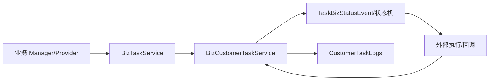

# 任务与状态机能力

## 目的与边界

该能力把 Booking、Release、Bill Input 等业务动作统一抽象为任务壳、客户任务、扩展信息、日志和状态事件；不拥有任何业务模块的当前态。核心模型是 `BizTask`、`BizCustomerTask`、`BizCustomerTaskExt`、`BizCustomerTaskLogs`，状态/命令由 `TaskStatusEnum`、`TaskBizStatusEnum`、`TaskCommandEnum`、`TaskTypeEnum` 描述。

代码入口包括 `TaskController`、`TaskOpenApiProvider`、`TaskManager`、`TaskJobManager` 和各业务状态机（如 `StateMachineBuilderBookingConfig`）。状态迁移由调用方事件驱动，任务壳承载调度身份，业务表承载最终业务真相。并发、重试和回调幂等必须看具体业务实现，平台抽象不自动提供跨表原子性。

证据合同：关键代码为上述 controller/provider/manager/service/entity/enum；测试为 `TaskJobTest`、`CustomerTaskExtServiceTest`；数据/SQL 以 `biz_task`、`biz_customer_task` 相关 Mapper/XML/DDL 为准。代码/文档差异：不能将 Task 状态等同 Booking/Release 状态。未知项：生产锁、重放窗口、跨库事务当前代码无法确认。源码列表同本节；最后验证日期 2026-08-26。

## 机制、并发与面试追问

`BizTask` 保存调度标识与生命周期，`BizCustomerTask` 保存租户、业务命令和关联主体，Ext/Logs 分别承载可演进参数与审计明细。`TaskBizStatusEvent` 表示事件，不是领域最终状态；Booking 的状态机决定事件是否可接受。Job 领取后调用外部系统无法被本地事务回滚，必须依靠业务回调和具体补偿策略收口。当前公共抽象未证明统一锁、版本号或唯一业务键，因此重复领取、重复回调、旧事件覆盖新状态是改动风险。面试可追问任务与领域状态为何分离、如何设计幂等键、如何处理乱序回调；答案边界以具体实现为准。
