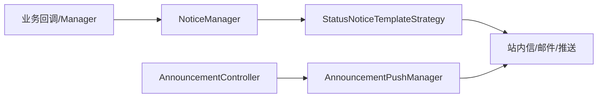

# 邮件、通知、推送、消息与公告

该能力承接业务状态后的站内信、邮件、IM/RPA 消息和公告，不拥有 Booking/Release/BL 业务状态。入口包括 `BizNoticeController`、`NoticeEmailConfigController`、`AnnouncementController`、`OpsImNoticeController`；编排核心为 `NoticeManager`、`AnnouncementPushManager`、`StatusNoticeTemplateUtil/Strategy`。模板实现包含 Booking/Release 成功、失败和填充结果策略。

证据合同：模型有 `SysNotice`、`SysNoticeReadStatus`、`BizNoticeEmailConfig`，枚举有 `NoticeTypeEnum`；测试 `StatusNoticeTemplateTest`。代码/文档差异：通知成功不等于业务事务成功；未知项：渠道供应商 SLA、重试和送达回执当前代码无法确认。源码列表为上述 controller/manager/strategy/entity/enum/SQL；最后验证日期 2026-08-26。

## 机制与风险

业务事件由 `NoticeManager` 接收，模板策略按状态选择内容和接收人，随后写 `SysNotice` 或调用邮件/推送渠道；阅读状态由 `SysNoticeReadStatus` 单独维护。公告经 `AnnouncementController → AnnouncementPushManager`，不应与业务状态更新耦合。当前代码未证明统一事件幂等、outbox 或发送回执；并发重复事件、事务回滚后外发、模板枚举新增漏分支是主要风险。面试可追问模板策略扩展、站内信与送达语义、失败重试和多租户接收人隔离。
