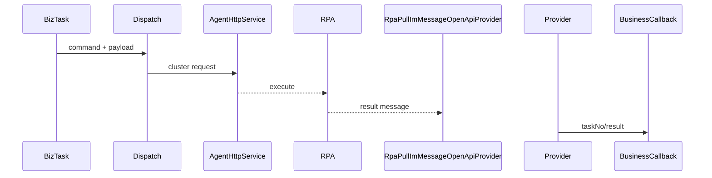

# Agent、RPA 集群与任务调度

该能力把业务任务转换为 Agent/浏览器/RPA 可执行消息，并接收处理结果；不拥有具体 Booking、Release 或 Bill 业务当前态。核心代码包括 `AgentHttpService`、`AgentServiceUtil`、`AsyncAgentHelper`、`AgentMessageUtils`、`RpaDispatchServiceAgency`，任务调度入口包括 `ApiTaskFairSchedulingController`、`RpaFairSchedulingController`、`RpaPullImMessageOpenApiProvider`。

证据合同：Agent 配置/响应为 `AgentConfigDTO`、`AgentMsgResponseDTO`，RPA 消息模型为 `BizRpaImChannelMsg`；测试 `RpaChannelMsgTest`、`EmailAgentTest`、`RpaDispatchServiceAgencyTest`。代码/文档差异：派发成功不等于业务成功；未知项：集群选主、租约、供应商 SLA 当前代码无法确认。源码列表为 agent/dispatch/provider/controller/entity/tests；最后验证日期 2026-08-26。

## 机制与风险

业务任务携带 taskNo、command、payload，经 dispatch service 选择通道，由 `AgentServiceUtil`/`AsyncAgentHelper` 组装 `AgentConfigDTO`，`AgentHttpService` 传输；结果经 `RpaPullImMessageOpenApiProvider` 解析后交业务 callback。传输成功与业务成功分离，依赖 messageId/taskNo 关联。当前未证明统一租约、节点健康和去重，故重复派发、超时后 Agent 已执行、旧回调覆盖新结果都需按具体实现核对。面试可追问至少一次投递、幂等和集群公平调度。
