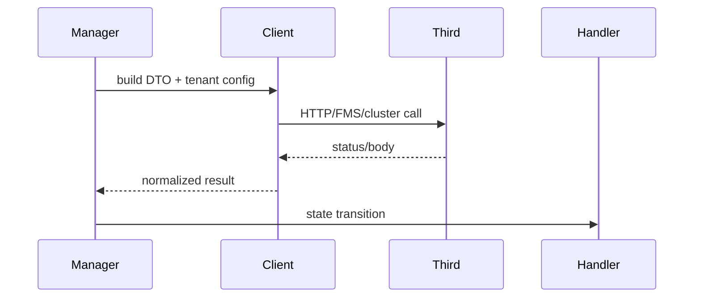
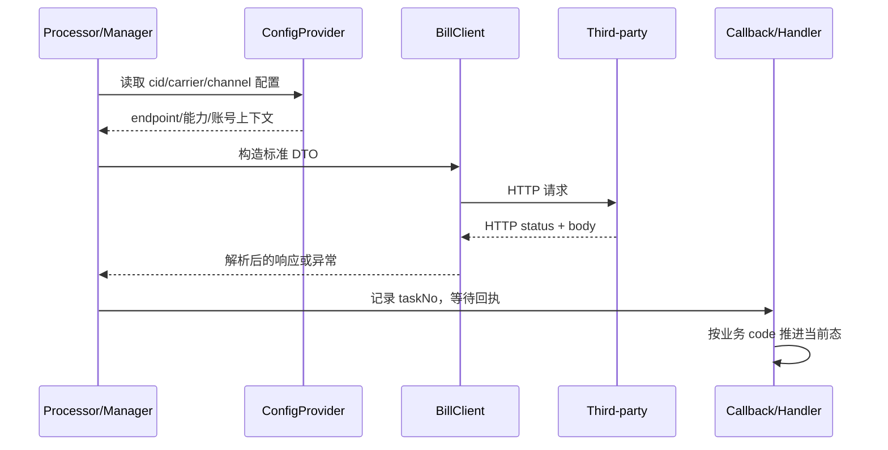

# 集成调用与配置

`BillClient` 被 BL/VGM Manager 调用查询字段配置、提交和 monitor；Bill Input 配置由 `BizBookingCarrierConfigService#getBillInputConfig(cid, carrier, channel)` 读取，类型为 `CarrierConfigTypeEnum.BILL_INPUT`。BILL OpenAPI 使用 `THIRD_API:BILL_DESK:{tenantId}` 及客户级后缀；VGM standalone 使用 `VGM_SUBMISSION:{tenantId}`。FMS 清洗入口为 `FmsCleanController`，具体 client/cluster 将请求 DTO 转成外部协议。

调用前必须校验 cid、carrier、channel 和账号归属；调用后保留 request/taskNo、HTTP 状态、业务错误和原始回执。配置缺失、HTML 403、超时和空 body 必须在适配层/调用方分别处理。源码能证明 key 和调用关系，无法确认线上密钥来源、重试次数及证书轮换。来源：`BillClient`、配置 Provider、各 Manager、`sql/third-party/`；最后核验 2026-08-26。

## 配置解析顺序与租户隔离

Bill Input 的船司配置通过 `BizBookingCarrierConfigService#getBillInputConfig(cid, carrier, channel)` 读取，配置类型是 `CarrierConfigTypeEnum.BILL_INPUT`；`channel=1` 代表官网通道。BILL OpenAPI 的配置 key 分为 `THIRD_API:BILL_DESK:{tenantId}` 与客户级 `...:CUSTOMER:{entrustedCustomerCode}`，客户级配置只应覆盖对应委托客户。独立 VGM 提交使用 `VGM_SUBMISSION:{tenantId}`，其值表达委托客户到船司列表的能力关系。

调用链应按“当前登录租户 → 业务记录 cid → 账号归属 → carrier/channel 配置 → client”顺序校验。不能先读取全局 URL 再把 cid 当作请求参数信任，也不能用旧 `sys_tenant_account` 替代当前 `BizBookingAccountService` 的账号来源。

## 请求与响应的状态边界

`BillClient` 的响应应分为 HTTP 层和业务层两级：HTTP 2xx 只代表网关/服务返回了响应，业务 code、`success`、taskNo 和错误明细仍需检查；4xx/5xx、空 body、HTML body 和 JSON 字段缺失属于不同故障。调用方在成功后必须保存或传递 taskNo，供异步回执定位；不能在 client 内直接假设本地状态已经推进。

线上密钥、TLS 证书、连接池、重试和熔断参数在当前仓库无法确认；这些必须由部署配置和运行指标补证，而不是写成代码事实。
