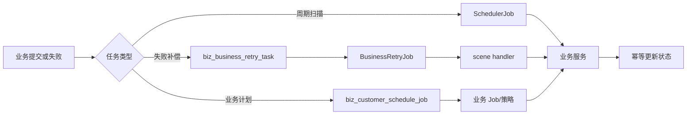

# Job、重试、调度与脚本

## 任务模型

BusinessRetryJob 扫描 biz_business_retry_task 并按 scene 路由 handler；BillFilePullJob 扫描 biz_customer_schedule_job 并按 monitorMode 选择 Website/Mail；VGM Poll/Timeout Job 围绕 taskNo 与提交记录收口。SchedulerJob 是触发器，不是业务状态真源。

至少一次执行要求状态条件、唯一键或下游幂等。脚本 key 如 RELEASE_SPACE_FILLED_{cid} 由领域策略解释，沙箱、版本和生产权限当前代码无法确认。

能力由实现 `SchedulerJob` 的业务 Job、`BusinessRetryJob`/retry handler、`biz_customer_schedule_job` 调度记录以及租户 Groovy/脚本配置组成。它解决异步外部任务、文件监听、提交检查、失败补偿和定时扫描；不拥有具体业务主数据。

典型链为业务提交→写 schedule/retry task→调度器扫描到期记录→handler 重放→成功关闭或失败递增重试。邮件放舱失败示例使用场景 `MAIL_RELEASE_FAILED`、`biz_business_retry_task` 和 `MailReleaseFailedRetryHandler`。Job 至少可能重复执行，因此业务处理必须幂等。证据：`BusinessRetryJob`、retry handler、`BillFilePullJob`、VGM Poll/Timeout jobs、`sql/retry/biz_business_retry_task.sql`；最后核验 2026-08-26。

## 三类运行模型

1. **固定周期 Job**：业务类实现 `SchedulerJob`，由 XXL-Job 等运行时触发后扫描数据库或调用外部系统。例如 Bill 文件拉取、VGM 轮询与超时收口。Job 是触发器，不应成为业务状态真源。
2. **场景化失败补偿**：`BusinessRetryJob` 扫描 `biz_business_retry_task`，再按 scene 路由到对应 handler。`MAIL_RELEASE_FAILED` 将邮件放舱失败从原 Job 中解耦，handler 负责按 `biz_id=emailId` 恢复业务上下文并重放。
3. **业务计划任务**：`biz_customer_schedule_job` 保存与业务对象绑定的到期任务。Bill Input 文件监听按文件类型和 monitorMode 创建记录，由 `BillFilePullJob` 扫描后分派 Website/Mail 策略；关闭当前 DRAFT 监听后还可能继续创建 COPY 监听。

脚本能力与调度能力相邻但职责不同：租户 Groovy Hook、`ScriptService` 或原生 SQL Job 提供动态逻辑，调度器只决定何时执行。脚本输入、返回值和权限必须由调用方约束，不能把任意脚本执行视为普通业务重试。

设计上的核心约束是“至少一次触发、业务侧幂等收口”。数据库状态更新成功但调度器未收到返回、节点在外部调用后宕机、多个实例同时扫描，都可能造成重复执行；因此业务唯一键、状态条件更新、锁或下游幂等协议比单纯增加重试次数更重要。
