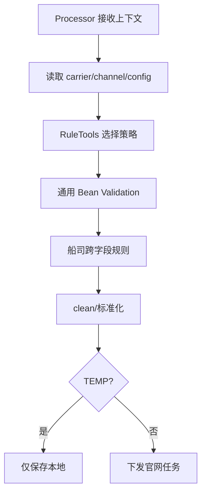

# 校验策略与扩展点

## 处理器到策略

AbstractBillInputProcessor#convertAndValidate 读取 carrier/channel 和动态配置，BillInputRuleTools 选择 {carrier}_WEB 策略，随后执行通用校验、船司跨字段规则及 clean。TEMP 只保存最低条件，正式模式才下发；VGM 使用独立 Processor、RuleTools 和数据模型。

多个 group 是约束集合，只有显式 GroupSequence 才有顺序短路。当前可确认的 VGM 专用策略是 COSCO_WEB；规则版本和配置快照保存能力当前代码无法确认。

该能力把通用参数校验、上下文配置校验、船司差异策略和跨字段业务规则分层。Bill Input 代表实现是 `BillInputRuleStrategy`、`BillInputRuleTools`、`*_WEB_BillInputRuleStrategy` 与 `AbstractBillInputProcessor`；VGM 对应 `VgmInputRuleStrategy`、`VgmInputRuleTools`、`COSCO_WEB_VgmInputRuleStrategy` 和 `AbstractVgmInputProcessor`。

调用链是 Processor 读取 carrier/channel 与配置→工具选择策略→转换为单条 DTO→通用/船司校验→集群 clean→保存或下发。扩展点的价值是新增船司规则不改 Controller；边界是 TEMP 等流程可能跳过正式提交校验。多约束是并集而非顺序执行。证据：Bill/VGM Processor、Rule、Strategy tests；最后核验 2026-08-26。

## 分层机制与项目约束

Bean Validation 适合单字段和稳定结构约束；Processor 掌握 tenant、carrier、channel、提交阶段与动态配置，负责决定本次应执行哪些校验；`RuleTools` 根据 `{carrier}_WEB` 命名寻找船司策略；具体策略承担官网协议差异和跨字段规则。这样的分层避免 Controller 硬编码船司分支，也避免把动态租户配置固化成注解。

Bill Input 的多个校验 group 在一次 `validate` 调用中表示约束集合，并不会天然形成先后顺序；只有显式使用 `@GroupSequence` 才有分阶段短路语义。`TEMP` 暂存只应保证可持久化的最低条件，正式 `DRAFT`/`SUBMIT` 才进入官网所需规则、二次 clean 与下发链路。VGM Input 当前源码中可确认的船司专用实现是 `COSCO_WEB_VgmInputRuleStrategy`，不能据此推断其他船司已有同等支持。

风险主要来自规则分散与配置漂移：字段在 DTO、Mongo formData、配置 fieldMapping 和船司策略之间可能命名不一致；策略 Bean 缺失时若静默回退，会把“不支持”误当作“无需校验”；动态配置升级也可能让旧单据重放时采用新规则。长期维护应为每个 carrier/channel 建立契约测试，并保留关键配置快照以支持问题复现。
