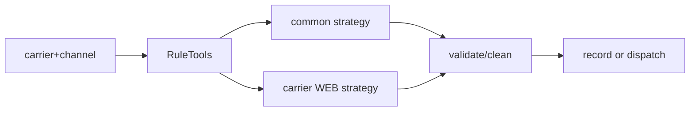

# 策略选择与接入

## 接入检查

新增 carrier 策略需遵循 RuleTools 的 Bean 命名/注册约定，确认 Spring 扫描、非官网 channel 的不支持分支，并补 TEMP、正式提交、空数据、非法字符和跨字段测试。配置由 BizBookingCarrierConfigService 与 BizBookingAccountService 提供，策略不应回查旧租户账号表。

策略选择、规则执行、clean 和回执是不同边界；配置缺失不等于无约束。

Bill `getBillInputRuleStrategy(carrier, shippingChannel)` 将官网 channel=1 映射到 `{carrier}_WEB`；VGM 通过 carrier/channel 选择对应 Web 策略。通用配置从 booking carrier config 或 context 进入 Processor，账号从 `BizBookingAccountService` 注入；规则策略只负责领域约束，不应读取旧租户表或把客户值硬编码。

新增策略需注册/命名、补边界测试并确认非官网渠道行为；当前代码无法确认所有船司配置完整性、规则优先级业务意图和运行时热更新机制。来源：RuleTools、Strategy、Processor、配置 Service、测试；最后核验 2026-08-26。
