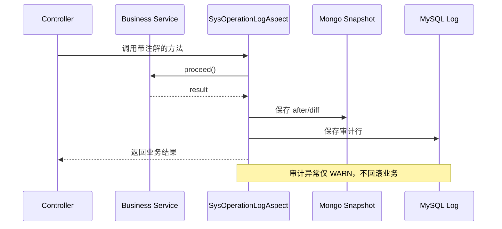

# 集成与配置

`TenantConfigController#getCommonConfig` 使用 `UserContext.getTenantId()`；`getConfig` 接收 tenantId 且标注 `@Login(false)`，因此调用方、网关和服务层必须额外确认是否允许跨租户读取。配置值是 JSON 字符串，解析失败行为取决于 JsonUtil/fastjson。操作日志由 `desk.sys-operation-log.enabled` 条件控制，默认启用；切面 SpEL 从方法参数/结果解析 targetId，计算 before/after 差异后写 Mongo snapshot 和 MySQL log。

部署时应同时核对 SSO 登录上下文、租户配置表、日志配置、异常拦截器和敏感字段脱敏策略。业务服务应使用当前租户而非客户端传入 cid；必须保留 owned-record 查询。配置迁移 SQL/生产值不在当前代码中完整可见，不能编造默认租户策略。源清单：TenantConfigController、SysOperationLogAspect/Properties、SnapshotDiffer、BizTenantConfig、`sys_operation_log_create.sql`。

## 配置解析和调用方责任

`BizTenantConfig.value` 是 JSON 文本而非强类型列。`getCommonConfig` 用 `JsonUtil.toJSONObject` 后只取 `commonConfig`，没有记录时返回空 Map；`getConfig` 用 fastjson 的 `JSONObject.parseObject` 直接返回整段配置，没有记录时返回空字符串。调用方不能把两种“空结果”混为同一种配置缺失，也不能把 JSON 解析成功误判为配置内容已经通过业务校验。

审计注解接入时，`targetIdExpr` 必须能在 AOP 上下文访问：方法参数会以真实参数名及 `p0`、`p1` 形式注册，返回值名为 `result`。目标 ID、before/after 的 cid 解析失败不会阻断主业务，但会使审计记录缺失或 cid 为空；因此注解变更要同时检验 SpEL、DTO 序列化和 snapshot/log 两端。对返回 Collection、数组或简单值，切面会封装为 `value`，这会影响 diff 的字段粒度。

## 部署核对项

运行环境应分别核对：SSO 是否给 `UserContext` 注入 cid；网关是否保护免登录配置入口；`desk.sys-operation-log.enabled` 是否按预期生效；Mongo snapshot 索引、MySQL 审计表和日志保留是否满足查询量。上述生产配置无法由仓库确认，本文不将其写成已验证事实。
