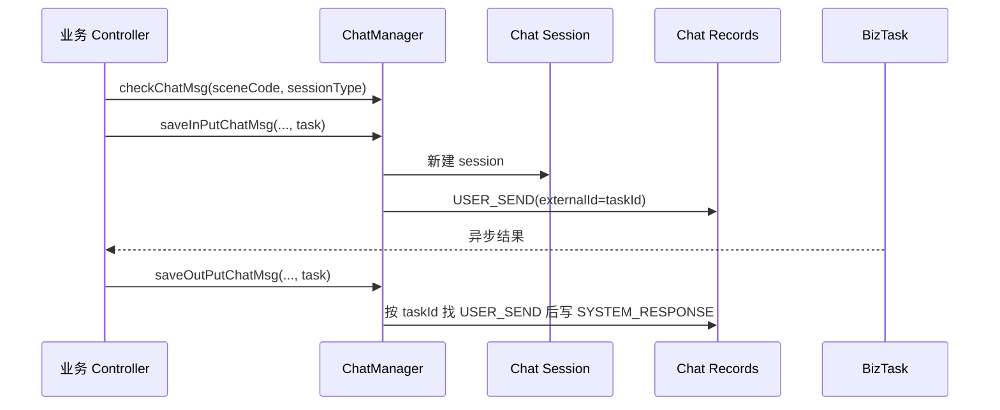

# Chat 与内部协同能力概览

Chat 能力记录业务场景中的用户输入、系统响应和会话，供页面回看及任务协同。入口 `BizChatSessionController` 的 `/api/v1/chatSession/latestChat` 将当前登录 userId 写入查询，再由 `ChatManager.pageList` 查询。写入侧通过 `checkChatMsg` 校验大写场景码和 `ChatSessionTypeEnum`，`saveChatMsg` 按 saveType 决定保存输入、输出或两者。

`BizChatSessionEntity` 关联应用场景、用户和会话类型；`BizChatRecordsEntity` 关联 session、内容、类型、外部任务 ID 和版本。系统响应封装 `MsgContentResult`，没有任务时使用错误码和 `NULL_TASK_ID`。`saveInPutChatMsg/saveOutPutChatMsg` 支持异步任务先记输入、后按 externalId 找回 session 写输出。该能力不等于 Agent 推理或业务任务状态机。源清单：Chat Controller/Manager、chat service interfaces、实体/枚举、Task entity。

## 写入顺序与关联键

`ChatManager#checkChatMsg` 把 sceneCode 转大写后查 `BizApplicationSceneEntity`，并用 `ChatSessionTypeEnum.getByV` 校验会话类型。`saveChatMsg` 总是先通过 `saveChatSession` 新建 `BizChatSessionEntity`，再按 saveType 保存 USER_SEND、SYSTEM_RESPONSE 或两者；系统消息的内容是序列化后的 `MsgContentResult`，其 `direction`、`title`、`code` 不是普通聊天文本。`saveInPutChatMsg` 与 `saveOutPutChatMsg` 将异步下发拆开：前者保存 USER_SEND，后者按 taskId 查询 USER_SEND 的 externalId，取第一条记录的 sessionId 后写 SYSTEM_RESPONSE。

这说明 Chat 的一致性由外部任务 ID 关联，而不是由一次数据库事务覆盖“建会话、建任务、收到回执”。若任务下发成功而输入消息未保存，后续输出会找不到关联记录并返回 null；若多个回调共用 taskId 或重试，当前代码能否靠数据库唯一约束去重，需要结合实体/DDL进一步确认。`NULL_TASK_ID` 只表达“没有任务对象”，不能作为可重放任务的业务键。

## 文档边界与验证

旧材料若把 Chat 描述成通用 IM 或 Agent 推理状态机，与当前代码不一致：它是业务操作消息的持久化与回看能力，任务当前态仍属于 BizTask/业务模块。验证应覆盖 sceneCode 大小写、saveType 三分支、task 为 null、输出先到、重复 taskId、当前用户分页和删除记录。实时推送、跨设备同步、全文检索、表索引和保留策略当前代码无法确认。
