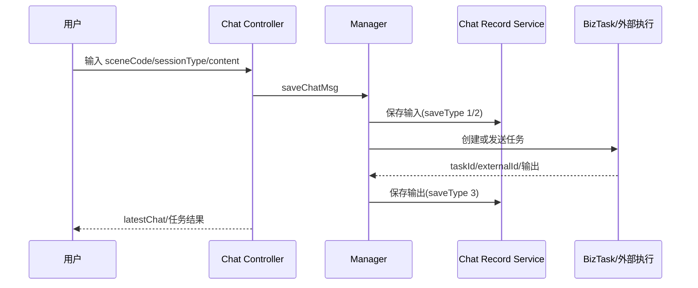

# 排障与验证

会话不显示：核对 LoginContext userId、`latestChat` 分页转换和 records service 用户条件。输入缺失：检查 sceneCode 大写匹配、sessionType、saveType 是否为 1/2。输出缺失：核对 BizTask ID、USER_SEND externalId、异步调用顺序及 saveType=3。错误消息显示“指令发送失败”时检查 task 是否为空和 `MsgContentResult.code`。

静态定位：`rg -n "latestChat|saveChatMsg|saveOutPutChatMsg|ChatRecordTypeEnum|ChatSessionTypeEnum"`。当前未执行真实登录、消息推送或 API-test；表结构、保留策略、并发写入顺序和生产消息重试属于未知项。源清单：Controller/Manager、chat service interfaces、DTO/entity/enums。

## 会话、任务与消息的关联链

Chat 链路不是单纯的消息表 CRUD。用户输入先按当前登录用户、sceneCode 和 sessionType 进入会话，再由 manager 创建或关联 `BizTask`；输入消息通常使用 `saveType=1/2`，任务输出由 `saveOutPutChatMsg` 以 `saveType=3` 保存，并通过 USER_SEND 类型和 externalId 关联外部执行结果。因此“输入已保存”不能证明任务已下发，“任务成功”也不能证明输出消息已持久化。

| 现象 | 关键证据 | 边界 |
| --- | --- | --- |
| 最近会话缺失 | userId、分页 records、sessionType | 当前用户过滤可能隐藏其他会话 |
| 输入存在但无任务 | sceneCode、BizTask ID、下发异常 | 数据库写入与外部调用不是原子事务 |
| 任务完成但无输出 | externalId、saveType=3、异步异常 | 需要确认是否有补偿或可重放入口 |
| 消息顺序错乱 | 创建时间、业务序号、并发回调 | 当前代码无法确认生产有全局有序保证 |
| 重复输出 | 回调幂等键、externalId、唯一约束 | 网络重试可能造成至少一次回调 |

验证应覆盖同一用户多会话、不同 sceneCode、重复 externalId、任务为空、输出先后竞争和分页边界。消息推送通道、生产重试、数据保留与归档策略在当前仓库中无法完整确认，需结合运行配置与真实接口补证。
