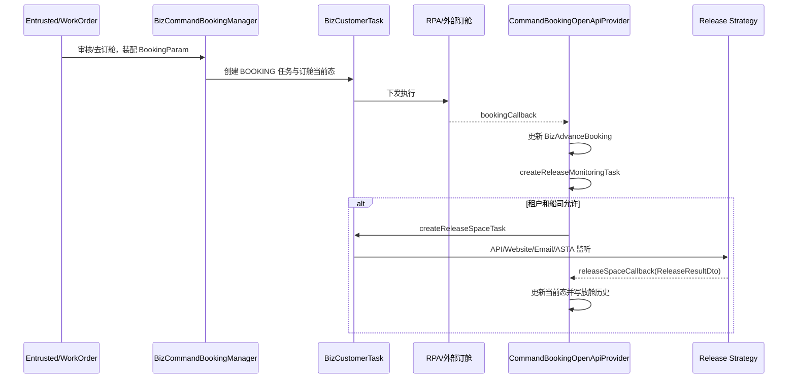

# 接单到订舱再到放舱

> 状态：源码静态核验；最后核验：2026-08-26。读者：后端、测试、运维。非目标：不描述单一船司的全部字段和生产配置值。

## 端到端链路

SHIPPING 工单的“去订舱”把接单数据转换为订舱参数，但从这一刻起，订舱主事实由 `BizAdvanceBooking` 和任务状态维护。`bookingCallback` 成功后，`CommandBookingOpenApiProvider.createReleaseMonitoringTask` 再判断 `TenantConfigValue.releaseConfig.needCreateReleaseTask`、船司 RELEASE 能力和监听方式；符合条件才创建 `RELEASE_SPACE` 任务。

## 一致性与边界

- 三段链路拥有不同当前态；工单审核成功、订舱 `SUCCESS_RUN`、放舱 `confirm/update` 不能互相替代。
- 回调和监听可能重复、延迟或乱序，必须依赖业务标识、状态前置条件和历史记录去重，不能按 HTTP 到达顺序无条件覆盖。
- 邮件放舱可由 `BusinessRetryService` 以 `MAIL_RELEASE_FAILED` 补偿；它不替代正常监听 Job。
- 订舱/放舱外部调用不属于单一数据库事务，整体是任务与回调驱动的最终一致性。

## 风险、验证与面试追问

风险集中在配置缺失、任务已创建但下发失败、回调号关联不到订舱记录、重复创建监听、当前态与历史不一致。验证至少覆盖工单到 Booking 参数、`bookingCallback`、Release 任务创建判定和 `releaseSpaceCallback` 四个断点；现有仓库缺少稳定覆盖全主链的单一 api-test，不能把邻接 YAML 当作全链通过。

面试可追问“为什么拆成两个成功事实”“如何处理乱序回调”“分布式事务为什么不适用”。回答应落到任务壳、业务当前态、幂等键、条件更新和补偿。

## 差异、未知项与来源

- 历史文档可能把订舱成功表述为流程完成；当前代码证明 Release 是独立派生链。
- 当前代码无法确认生产租户实际启用的监听方式与 Job 参数。
- 来源：`WorkOrderManagerImpl`、`BizCommandBookingManager`、`CommandBookingOpenApiProvider`、`AbstractReleaseStrategy`、`StateMachineBuilderBookingConfig`、`BusinessRetryJob`、Booking/Release 实体与 SQL。

