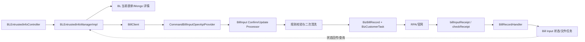

# BL Intake 到 Bill Input

> 状态：源码静态核验；最后核验：2026-08-26。非目标：不把两域合并成统一 Bill 模块。

## 调用链

BL 接单侧保存 `bl_entrusted_info`、`bl_work_order` 与 Mongo 表单快照。提交、强制监听或异常重提时，`BLEntrustedInfoManagerImpl` 通过 `BillClient` 消费 Bill Input 内部 OpenAPI；`sourceFrom=AI_SERVICE` 用于标识接单侧来源和触发特殊流程分支。Bill Input 创建自己的 `biz_bill_record`、任务和 Mongo 详情，执行船司/通道规则并处理回执。

## 为什么保持两域

BL 关心人工接单、协同补料、异常、附件与工单状态；Bill Input 关心官网账号、通道规则、执行回执、提交检查和文件监听。拆分后，BL 可保存调用关系和结果投影，而不会让人工工单直接修改通道内部状态。

## 边界与故障

- BL 表单修改不等于 `biz_bill_record` 已更新；每次提交使用当次标准 payload/快照。
- Bill Input 受理成功不等于官网提交成功；要等 `billInputReceipt` 及后续检查/文件阶段。
- `AI_SERVICE` 可能强制监听、跳过预览比对或允许特定状态重提，修改时要同时验证两域。
- HTTP 成功但业务 code 失败应按业务失败处理；错误消息写库还受字段长度约束。

## 验证、差异和未知项

建议用 `api-test/scenarios/bill-desk/` 验证 BL 门面，再补 Bill Input 主链场景验证通道记录和回执。历史 Wiki 中 Bill 旧语义不能证明当前行为。生产 `THIRD_API:BILL_DESK:*` 值、船司配置与外部返回当前代码无法确认。

## 面试深挖与来源

追问重点：防腐层的价值、跨域 DTO、异步最终一致性、状态投影和失败恢复。来源：`BLEntrustedInfoController`、`BLEntrustedInfoManagerImpl`、`BillClient`、`CommandBillInputOpenApiProvider`、`AbstractBillInputProcessor`、`BillRecordHandler`、`BizBillRecord`、BL/Bill SQL。

