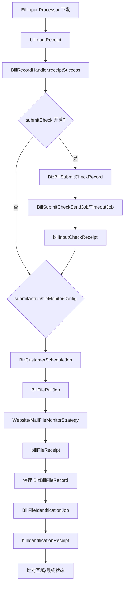

# Bill Input 提交检查与文件监听

> 状态：源码静态核验；最后核验：2026-08-26。本文聚焦正式提交后的异步收口。

## 数据流

提交回执只是异步阶段起点。`BillRecordHandler.receiptSuccess` 根据 `BillInputConfig` 决定提交检查、预览识别或 DRAFT/COPY/AUDIT_FAIL 监听；`BillFilePullJob` 扫描到期 schedule job，按 `monitorMode` 分发网站或邮件策略。DRAFT 成功后可继续创建 COPY 监听，AUDIT_FAIL 推进 `INFO_EXCEPTION`。

## 核心机制

- `biz_bill_record` 维护当前态；`biz_bill_submit_check_record` 和 `biz_bill_file_record` 记录子流程事实。
- 文件监听任务使用 `biz_customer_schedule_job`，允许按类型和时间独立重试。
- 状态推进集中在 `BillRecordHandler` 与状态机，避免 Job 直接任意改主表。
- 配置决定是否创建任务；未配置的 monitor mode 默认 WEBSITE，修改默认值会影响历史租户。

## 并发、异常和验证

重复回执、Job 重扫、文件晚到和识别回调乱序都可能发生。需要验证条件更新/关闭旧 schedule、文件幂等标识、当前态前置条件，以及错误分支是否仍保留可重试证据。测试不能只调用 `billInputReceipt`；至少覆盖 Pull Job、识别 Job、`pullFileSuccess` 和后续任务创建。

当前代码无法确认生产 Job 调度周期和外部文件生成时延。来源：`BillRecordHandler`、`BillSubmitCheckSendJob`、`BillSubmitCheckTimeoutJob`、`BillFilePullJob`、`WebsiteFileMonitorStrategy`、`MailFileMonitorStrategy`、`BillFileIdentificationJob`、相关实体与配置模型。

面试追问：为何采用 Saga/状态收敛而非全局事务；如何让重复回调幂等；schedule job 与业务当前态如何防止漂移。

