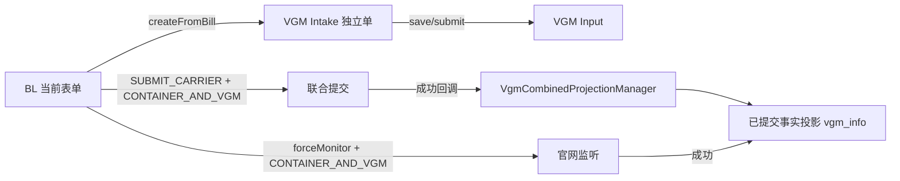

# BL 与 VGM 独立、联合提交流程

> 状态：源码静态核验；最后核验：2026-08-26。

## 三条路径

独立 VGM 在 `createFromBill` 时复制 BL 当前 `formData` 到自己的 `vgm_detail`，之后保存不反写 BL。联合提交不预建 VGM；只有 BL 进入 `SUBMITTED_CARRIER`，且最近 `SUBMIT_CARRIER` 操作快照为 `CONTAINER_AND_VGM`，才由 `VgmCombinedProjectionManager.createSubmittedFromBill` 投影事实。强制监听成功也可投影。

## 幂等与权限边界

- `sourceTaskNo` 是联合提交/监听投影的幂等键；通道 taskNo 对同一 VGM 稳定。
- 独立 VGM 支持接单、保存、关闭、备注、提交；联合投影是事实记录，不支持这些人工操作。
- `submitPreview` 只写 `SUBMIT_PREVIEW` 快照并流转等待提交，不能触发联合 VGM 投影。
- 独立提交能力由 `VGM_SUBMISSION:{tenantId}`，联合能力由 Bill Input `fieldConfig.vgmInput` 解析。

## 风险与验证

风险包括错误地从 BL 详情实时读取导致 VGM 保存被覆盖、按错误快照类型投影、对当前 VGM 做重复排重、taskNo 空或复用。验证应覆盖独立创建/保存/提交、联合成功投影、预览不投影、重复回调幂等和强制监听。

差异：旧设计若描述“BL 提交前先生成 VGM”，与当前成功后事实投影不一致。当前代码无法确认生产租户配置值。

来源：`VgmInfoController`、`VgmInfoManagerImpl`、`VgmCombinedProjectionManager`、`VgmConfigResolverImpl`、`BLEntrustedInfoManagerImpl`、`BillClient`、`vgm_info`/`vgm_detail`/`biz_vgm_record` 模型与 SQL。

面试追问：事实投影与双写的区别、幂等键选择、为什么不同来源的 VGM 操作权限不同。

