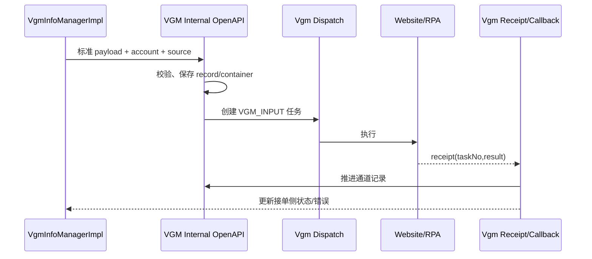

# VGM Intake 到 VGM Input

> 状态：源码静态核验；最后核验：2026-08-26。

接单侧 `/api/v1/vgm/submit` 从 `vgm_detail` 抽取标准 `BILL_INFO` 和 `CONTAINER_LIST`，结合 `vgm_info` 的租户、船司、账号与来源信息构造内部 VGM OpenAPI 请求。通道侧创建/更新 `biz_vgm_record`、`biz_vgm_container` 与 Mongo `ODS_VGM_RECORD`，再通过任务调度执行官网填写；回执用稳定 taskNo 定位并推进通道状态，接单侧由回调管理器更新自己的事实投影。

两个域必须独立处理事务与重试：接单侧提交状态不能因 HTTP 受理就直接标成官网成功；通道侧重复回执不得重复创建容器或覆盖终态。账号与船司能力解析失败应在下发前失败，外部失败应保留 taskNo 和错误用于重提。

验证至少覆盖 payload 映射、容器号必填、配置/账号校验、任务创建、成功/失败/重复回执和接单侧状态同步。生产官网行为、账号有效性和 RPA 返回当前代码无法确认。

来源：`VgmInfoManagerImpl.submit`、`VgmCallbackManagerImpl`、VGM Input Provider/Processor/Dispatch/Receipt、`BizVgmRecord`、`BizVgmContainer`、`sql/vgm/`。面试可追问跨域状态同步、taskNo 幂等和回调乱序处理。

