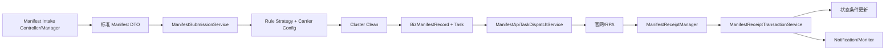

# Manifest Intake 到 Manifest Input

> 状态：当前源码静态核验；最后核验：2026-08-26。设计文档只作辅助，代码优先。

Manifest Intake 保存接单侧工单、详情与人工操作；提交时转换为 `ManifestInputOpenApiParam`。`ManifestSubmissionService.submit` 校验租户/请求、按船司与通道从 `ManifestInputRuleStrategyRegistry` 取策略、读取 `getManifestInputConfig`、调用 Cluster 清洗，再在锁保护下判断已有 `BizManifestRecord` 是幂等返回、拒绝还是允许从草稿/失败重提。

`ManifestReceiptTransactionService` 只接受 `SUBMITTING` 记录，通过条件更新推进为草稿成功、官网提交成功或失败；成功后 `ManifestSubmitSuccessPolicyResolver` 可创建后续监控任务，操作回执可推进 `ACCEPTED_DECLARATION`。这种设计把接单门面、提交事务、通知和监控拆开，便于幂等和扩展。

风险：设计稿与实现阶段不一致、重复提交锁粒度、清洗成功但记录创建失败、回执到达时状态已变化。验证应覆盖首次提交、重复提交、草稿重提、失败重提、乱序回执和通知失败不回滚主状态。

当前代码无法确认已启用船司/通道与外部 Cluster/RPA 行为。来源：Manifest Controller/Manager、`ManifestSubmissionService`、策略 Registry、`ManifestRecordHandler`、`ManifestApiTaskDispatchService`、Receipt/Monitor/Notify 组件、Manifest 实体/SQL与 `doc/design/manifest/`。

