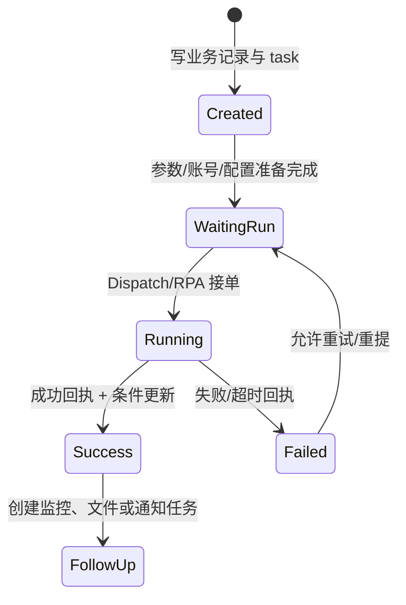

# 任务下发、回调与状态流转

> 状态：源码静态核验；最后核验：2026-08-26。本文讲平台通用模式，不替代业务状态机。

通用 `biz_task`、`biz_customer_task` 承载命令、租户任务和外部执行标识；`RpaDispatchService`、`ApiTaskDispatchService` 及业务专用 dispatch 把任务交给执行端。回调/receipt 先用 taskNo 等稳定标识找到任务，再由 Handler 或 COLA 状态机检查前置状态、更新业务当前态、写历史并触发后继任务。

关键原则：任务状态与业务状态分别维护；下发成功不等于业务成功；回调必须幂等；状态更新要带旧状态条件；通知、历史和后续任务失败不能悄悄伪装成主状态失败或成功。跨 MySQL、Mongo、MQ、HTTP 的一致性依靠可重试步骤收敛，而非一个本地事务。

排障从 taskNo/业务 id 同时追：任务是否创建、executor 是否接单、回调是否到达、Handler 是否因前置状态拒绝、业务当前态是否更新、后继任务是否生成。验证需包含重复、晚到、乱序、超时和重试。

差异：历史代码可能存在 Job 直接改状态的旧路径，不能由通用图推断已全部迁移。当前代码无法确认生产 executor 在线情况。来源：任务实体/枚举、COLA stateMachine、`component/dispatch/rpa`、各业务 Provider/Receipt/Handler、XXL 监控 Job。

面试追问：至少一次投递如何幂等、乐观条件更新如何防乱序、状态机与数据库状态字段如何分工。

