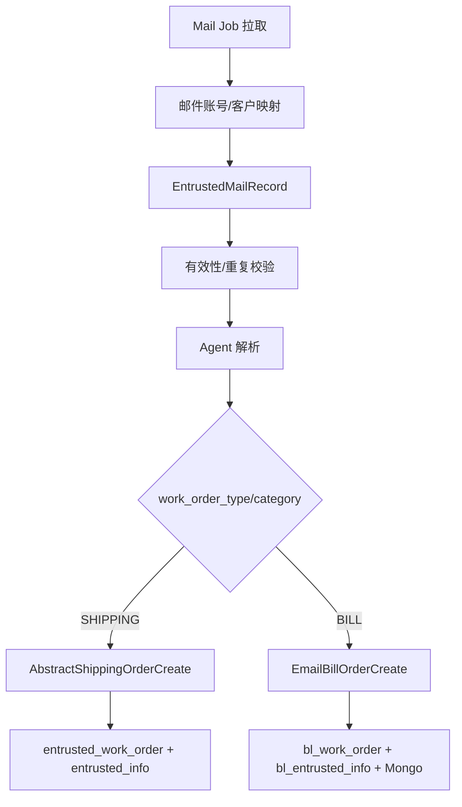

# 邮件、Agent 与工单创建

> 状态：源码静态核验；最后核验：2026-08-26。

SHIPPING 与 BILL 都可从邮件进入，但使用独立业务创建策略。Job 按邮件类别和 `biz_mail_read_record.type` 维护读取游标，把邮件保存为 `entrusted_mail_record`；规则校验发件人、租户映射和重复性后调用 Agent 解析，再由 `MailRecordOperator`/`AbstractShippingOrderCreate` 或 `EmailBillOrderCreate` 生成对应工单与详情。

共享基础设施的隔离点包括邮箱类别、读取游标类型、`work_order_type`、创建策略和目标主表。Agent 返回是输入证据而不是最终事实：创建策略仍负责标准化、事务写入、附件关联、异常记录和幂等。

风险包括邮件重复/转发导致 message-id 不稳定、游标推进后业务创建失败、Agent 超时或返回不完整、同一邮件被不同类型误消费。排障必须同时看邮件记录状态、Agent 请求/响应、工单业务号和附件映射。

测试可从 `api-test/scenarios/entrusted` 与 `bill-desk` 邻接场景验证记录/工单，但实际邮箱拉取和 Agent 可用性需要环境证据。当前代码无法确认生产邮箱规则和 Agent 模型行为。

来源：Entrusted/Bill 邮件 Job、`EntrustedMailRecordServiceImpl`、`MailRecordOperator`、Shipping/Bill OrderCreate 策略、Agent client、邮箱映射与 SQL。面试追问：游标与幂等如何配合、Agent 不确定输出如何进入确定性业务流程。

