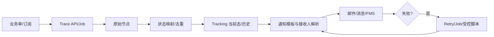

# Tracking、通知与异常补偿

> 状态：源码静态核验；最后核验：2026-08-26。

Tracking 链路从订阅/业务关联开始，经外部轨迹查询或推送得到原始节点，做船司/来源特定映射与去重，保存追踪当前信息/历史，再通过通知模板、消息或第三方 FMS 推送给使用方。发送失败、解析失败或业务超时由 Job、重试表或人工脚本补偿，但补偿不能绕过业务幂等。

关键一致性问题是“状态已保存但通知失败”和“通知已发但发送日志写入失败”。实现应使用稳定事件标识、发送记录、可重试状态和幂等消费；不能用回滚业务状态来假装撤回已发送的外部消息。映射规则执行顺序也可能影响最终状态，优化时必须保持候选顺序与异常时机。

排障按业务号、订阅号、原始节点、映射后状态、通知模板、接收人、发送日志和重试任务逐段核对。验证应覆盖重复节点、乱序节点、映射缺失、空字段、通知渠道失败和重放。

当前代码无法确认外部 Trace/FMS 实时数据质量、生产告警阈值和接收人配置。来源：`biz/core/trace`、状态映射策略、Notice/Push/Template 服务、BusinessRetry 模块、相关 Job/SQL/测试。面试追问：Outbox/幂等消费、顺序敏感规则优化、业务状态与通知副作用解耦。

