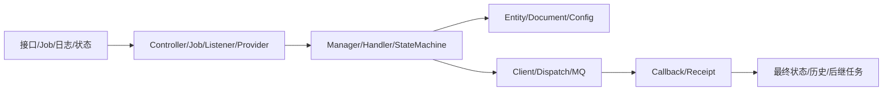

# 如何定位入口

> 最后核验：2026-08-26。目标是从用户现象找到真实控制流，不是只列类名。

## 检索顺序

1. 在 `cube-control-desk-app` 搜 `RequestMapping`、路由片段、接口名和页面动作。
2. 在 `cube-control-desk-biz/modular` 搜 Manager、Provider、Job、Strategy、Callback/Receipt。
3. 在 `cube-control-desk-biz/core` 搜 Service、Handler、Processor、Mapper。
4. 在 `cube-control-desk-model` 搜 Entity、Document、DTO、Enum、`@TableName`。
5. 追 `cube-control-desk-api` / integration 的跨服务契约。
6. 最后定位 SQL、配置读取点和 `api-test/scenarios`。

异步问题不一定有 Controller：XXL-Job 用 `@XxlJob`，MQ 用 listener 注解/容器，OpenAPI provider 实现 Feign 接口，RPA 结果从 callback/receipt 入口进入。

## 必须回答的六个问题

入口接收什么标识；租户如何得到；读取哪个当前态；调用哪个下游；回调如何定位；最终写哪个状态/历史。任何一个缺失，都不能称为完整调用链。

## 常见误区

- 只看同名 Service，遗漏 Manager 或 Provider 的业务编排。
- 从页面目录推断后端鉴权。
- 找到消息发送点后停止，没有追消费和回执。
- 广泛搜索结果被截断却当作全量证据。

## 来源与未知项

来源：`AGENTS.md` 检索顺序、各 Maven 模块结构和当前注解入口。生产网关重写、前端实际路由和外部服务入口当前代码无法完全确认。面试追问：怎样在陌生系统定位最终一致性链路。

