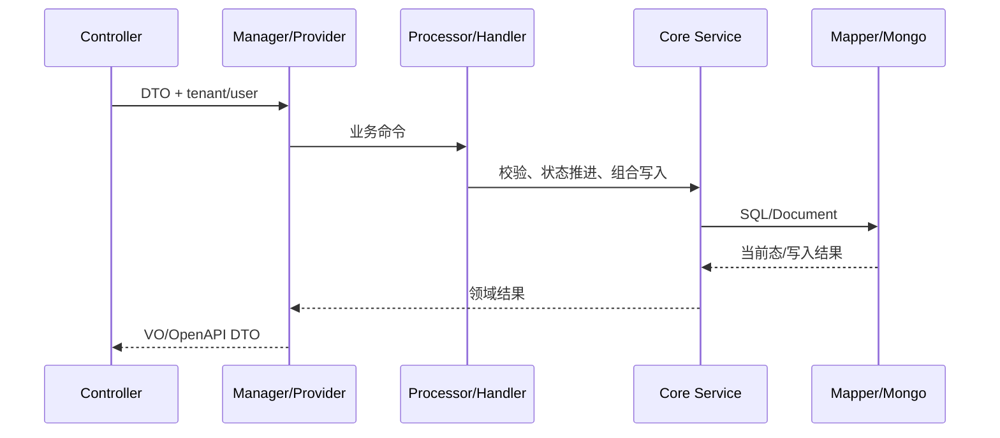

# Controller、Manager、Service、Mapper 链

> 最后核验：2026-08-26。本文描述项目常见分层及例外。

Controller 负责 HTTP 契约、参数校验、当前用户/租户上下文和返回包装；Manager/Provider 负责跨实体、跨服务与状态编排；core Service 负责可复用的领域读写；Mapper/Mongo repository 完成持久化。Bill Input、Manifest Input 等复杂链又在 Manager 与 Service 之间引入 Processor、Handler、Rule Strategy。

## 事务与职责

事务应放在拥有完整数据库不变量的方法上。Controller 不应包长事务；Manager 若在事务中调用外部 HTTP/RPA，会延长锁时间且不能回滚外部副作用。Service 自调用还可能绕过 Spring 代理。跨 MySQL/Mongo/OSS 需显式设计顺序、幂等和补偿。

Mapper 注解或 XML 中的租户/数据权限拦截也会改变查询；遇到未知列或数据缺失，需要检查拦截器与表结构，而非只看 SQL 文本。

## 变更原则

- 协议字段改动先确认 API/DTO、转换、Mongo/MySQL round-trip 和调用方。
- 状态改动集中在 Handler/状态机，不让多个 Service 任意 set。
- 船司差异优先策略，租户差异优先配置/脚本，核心不变量保留 Java 校验。

## 证据与边界

事实来源：Controller、Manager/Provider、Bill/Manifest Processor、core Service/Mapper、`MybatisOperInterceptor`。并非所有旧模块都严格分层；每篇业务文档列出真实例外。面试追问：贫血 Service 和编排 Manager 的权衡、事务边界、DTO 转换防腐。

