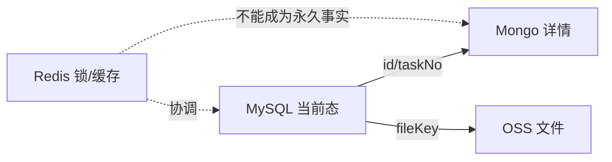

# MySQL、Mongo、Redis、OSS 数据边界

> 最后核验：2026-08-26。非目标：不列生产连接信息。

## 项目中的职责

- MySQL 保存可查询的业务当前态、关系、任务、配置和操作日志。
- Mongo 保存结构变化频繁的表单详情、字段来源、操作快照及部分对象存储。
- Redis/Redisson 用于缓存、短期状态、锁和去重。
- OSS/文件服务保存附件、模板产物、官网文件与识别输入输出。

Bill Input 是典型组合：`biz_bill_record` 维护状态索引，Mongo `MongoBizBillRecord` 保留复杂详情，`biz_bill_file_record` 关联 OSS 文件，Redis 可保护并发任务。VGM/BL/Manifest 也有类似“当前态 + 详情快照”结构，但集合与字段不同。

## 一致性原则

本地数据库事务不能原子覆盖 Mongo、Redis 和 OSS。常见安全顺序是先验证输入和幂等，再写可恢复记录，执行外部副作用，最后以条件更新收敛状态；失败保留重试所需标识。删除缓存不能替代数据库条件更新。

## 变更与排障

字段新增先判断是否需要 MySQL 查询/排序；纯表单字段通常还要修改 API DTO、Mongo Document 和双向 Convert。文件问题同时追 fileKey、对象是否存在、权限/STS、业务关联记录和识别回执。Redis 锁只能保护使用同一 key 的参与者，锁释放后不提供历史幂等。

## 来源、风险与面试

来源：`component/middle/model/{cache,file,oss}`、Redisson 配置、Bill/VGM/BL/Manifest 实体与 Mongo Document/Convert。当前代码无法确认生产数据完整性、TTL 与对象生命周期是否被外部运维修改。面试追问：多存储最终一致性、缓存穿透/失效、分布式锁租约和 OSS 引用完整性。

