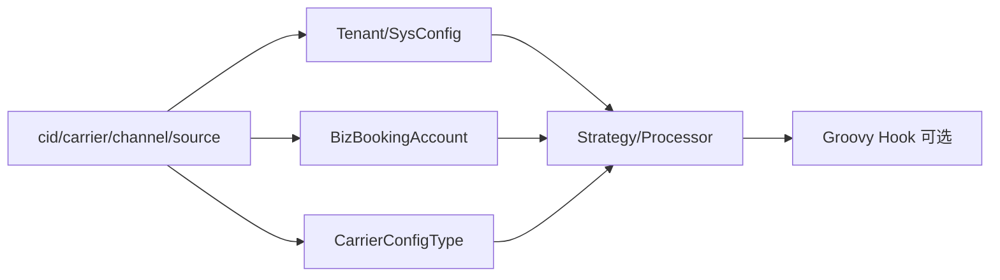

# 配置、账号与脚本解析

> 最后核验：2026-08-26。配置“存在”与生产“启用”必须分开描述。

## 解析层次

系统差异来自 Spring profile、`sys_config`、租户配置、`biz_booking_carrier_config`、`BizBookingAccount` 及 Groovy 脚本。典型顺序是先从请求得到 `cid + carrier + channel`，查询账号和能力配置，再由业务代码选择策略；特定租户的转换/回填可调用脚本 key。

Bill Input 通过 `getBillInputConfig` 读取 `BILL_INPUT`；Manifest 使用 `getManifestInputConfig`；Release 使用租户 releaseConfig 和 `CarrierConfigTypeEnum.RELEASE`；BL OpenAPI 使用 `THIRD_API:BILL_DESK:*`。脚本名称通常包含业务动作和租户/船司后缀，调用点和 fallback 决定实际行为。

## 设计原因与边界

配置适合表达开关、字段、渠道和策略参数；脚本适合租户转换；Java 代码负责安全、状态、事务和通用不变量。不要把所有差异硬编码到 Controller，也不要把关键一致性规则完全交给可变脚本。

## 故障与验证

配置缺失、JSON 反序列化、账号禁用、channel 枚举复用但策略不支持、脚本 key 找错或脚本运行异常是常见故障。验证要给出具体 cid/carrier/channel、命中的记录、解析后的对象和最终策略 key；脱敏后记录证据。

来源：`BizBookingCarrierConfigServiceImpl`、账号 Service、`SysConfigThirdApiConfigProvider`、TenantConfig、Script 执行组件和 resources/scripts。生产值当前代码无法确认。面试追问：配置中心缓存一致性、动态脚本安全沙箱、默认值兼容性。

