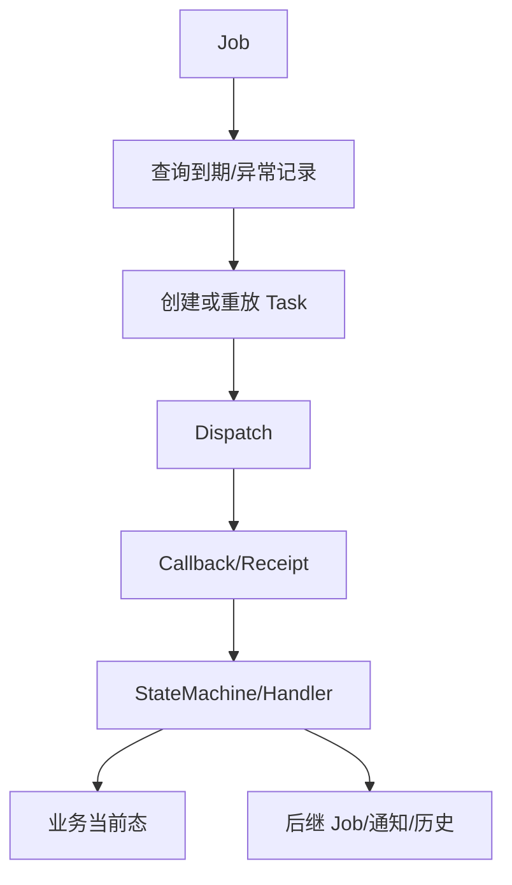

# Job、任务、状态机与回调

> 最后核验：2026-08-26。

Job 负责按时间扫描或补偿，任务表承载一次可执行命令，状态机/Handler 维护允许的业务迁移，回调把外部结果带回。四者不能互相替代。

`@XxlJob` 用于集中调度；Quartz/自建 scheduler 也可生成时间任务。`biz_task` / `biz_customer_task` 记录命令与执行状态，COLA stateMachine 为 Booking 等域组织事件和 Action；Bill/Manifest/VGM 更多使用 Processor/Handler + 条件更新。回调通常由 Provider/Manager 接收，先定位 task，再更新业务当前态。

验证时关注 Job 参数和扫描条件、重复扫描幂等、任务与业务状态是否一致、回调旧状态条件、超时判定使用的时钟，以及通知失败是否影响主事务。不要手工运行生产型 Job/脚本来“看看结果”。

来源：`component/middle/model/scheduler`、`component/cola/stateMachine`、`component/dispatch/rpa`、各业务 Job/Receipt/Handler。生产调度周期和 executor 在线状态当前代码无法确认。面试追问：至少一次执行、乱序回调、状态机守卫和补偿边界。

## 项目中的三种实现形态

Booking 使用 `StateMachineBuilderBookingConfig` 和 actions 把 collect、clean、confirm、run、fail 等事件组织为状态迁移；Bill Input 通过 `AbstractBillInputProcessor` 与 `BillRecordHandler` 统一推进主记录和文件子流程；Manifest 由 `ManifestSubmissionService`、`ManifestReceiptTransactionService` 和 monitor/notify 组件拆分提交事务与后继副作用。三种形态不能机械互换，但都要求“旧状态守卫 + 幂等标识 + 最终当前态”。

调度层同时存在 XXL-Job 与内部 scheduler 抽象。`XxlJobSchedulerServiceImpl` 面向集中调度，`QuartzSchedulerServiceImpl` 支持项目内注册；业务代码还会把未来执行点写入 `biz_customer_schedule_job`，由 Bill 文件等 Job 扫描。判断“任务没执行”前，先区分是哪一层没有创建、没有调度、没有下发或没有回执。

## 典型故障矩阵

| 现象 | 首查证据 | 常见断点 |
| --- | --- | --- |
| 业务记录存在、任务不存在 | 创建事务、命令枚举、Manager 日志 | 校验后抛错、事务回滚、分支未满足 |
| 任务 WAITING_RUN 不动 | executor/账号/dispatch Job | 调度未启用、账号不可用、集群无容量 |
| 外部已执行、本地仍处理中 | taskNo、callback 日志、旧状态条件 | 回调未到、关联失败、晚到被守卫拒绝 |
| Job 重复命中 | 扫描条件、关闭标记、更新时间 | 子任务未关闭、条件更新失败、时钟边界 |
| 主状态成功、后继任务缺失 | Handler 成功分支、配置快照 | 配置未命中、后继创建异常、通知与事务边界 |

安全验证使用隔离业务 id，先查询命中集合再触发单次 Job；重复触发时断言业务事实不重复。任何手工重放都要记录原 taskNo、当前状态和预期副作用。
