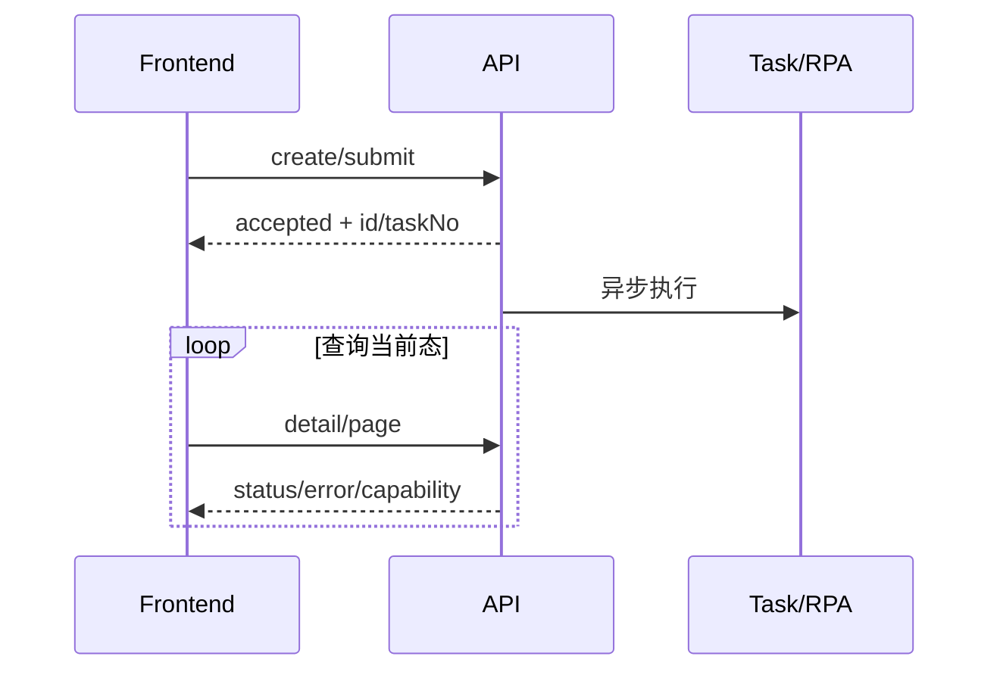

# 前端 API 联调指南

> 最后核验：2026-08-26；读者：前后端联调人员。本文不从前端路由推断后端权限。

## 联调前契约

先确认路由、HTTP 方法、鉴权头、tenant/cid 来源、请求 DTO、枚举值、分页/排序、时间格式、空值语义和错误结构。对异步接口还要确认“受理结果、taskNo、轮询/回调、最终状态”的区别。

前端常见链路不是一次请求完成：

## 字段与能力边界

- BL、VGM、Manifest 的列表/详情字段可能来自 MySQL 当前态、Mongo 详情和投影，前端不能把一次响应快照当作更新源。
- 能力开关如 `vgmCombinedEnabled`、`vgmStandaloneEnabled`、Bill Input `fieldConfig` 决定页面展示；提交接口仍会重新校验配置、账号和状态。
- `null`、空串和空数组在 MyBatis-Plus 更新与清除错误信息场景语义不同；接口文档必须明确。
- 枚举展示文案与后端 code 分离，避免按文案提交。

## 错误、并发和幂等

重复点击、页面重试和网络超时可能产生重复请求。前端可禁用按钮并带业务 id，但最终幂等由后端 taskNo/唯一键/状态条件保证。HTTP 200 仍需检查统一响应的业务 code；状态冲突应刷新详情而非盲目重试。

## 联调证据

记录脱敏请求/响应、业务 id、状态前后、后端日志相关键及数据库验证。不能只提供截图或“按钮没反应”。分享链接、免登录入口与普通用户接口要分别验证鉴权边界。

## 差异、未知项与来源

现有 `doc/design/*frontend_api.md` 是重要契约，但若与 Controller/DTO 不一致，以当前代码描述现状并登记差异。当前代码无法确认前端分支实际使用的字段版本。来源：app Controller、api DTO/VO、design frontend API、api-test。面试追问：异步 UI 状态机、兼容字段演进、前后端幂等分工。

