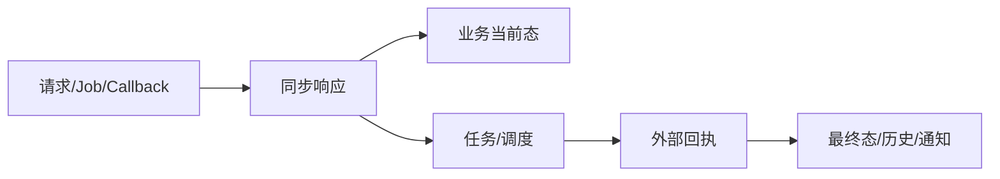

# 测试场景与验证指南

> 最后核验：2026-08-26；读者：测试、开发、自测负责人。

## 从业务不变量设计场景

每条链至少验证：合法入口能到最终态；非法状态/配置/字段被拒绝；重复请求不产生重复事实；失败保留可重试证据；回调重复/晚到/乱序不覆盖更晚状态；租户和业务类型不串数据。

断言不能只看同步响应，还要检查当前态表、Mongo 快照、任务、历史/日志和后继 Job。文件场景还检查 OSS/文件记录；通知场景检查发送记录而非只看主状态。

## 数据矩阵

覆盖 cid、carrier、channel、source、processType、旧状态、账号状态、配置存在/缺失、单条/批量、边界长度和特殊字符。Bill/VGM/Manifest 等 Input 能力应分别验证 TEMP/DRAFT/SUBMIT 或对应流程，不能用一个域的规则替代另一个域。

## api-test 与环境证据

复用 `../api-test/scenarios` 时记录环境、前置数据、执行命令和清理策略；场景缺失就补场景或明确静态/局部测试边界。外部系统不可控时使用契约桩验证本系统行为，并把模拟结果标明。

## 故障提交格式

提供时间、环境、接口/Job、cid、业务 id/taskNo、输入摘要、期望与实际状态、外部回执、可复现步骤和数据清理范围。敏感值脱敏。

## 差异、未知项与来源

部分模块缺稳定主链 api-test；测试资产存在不表示本轮通过。来源：各模块 tests、api-test README/场景、状态枚举、SQL 与验证文档。生产第三方稳定性和真实数据分布当前代码无法确认。面试追问：异步系统测试 oracle、最终一致性等待、幂等/乱序用例。

