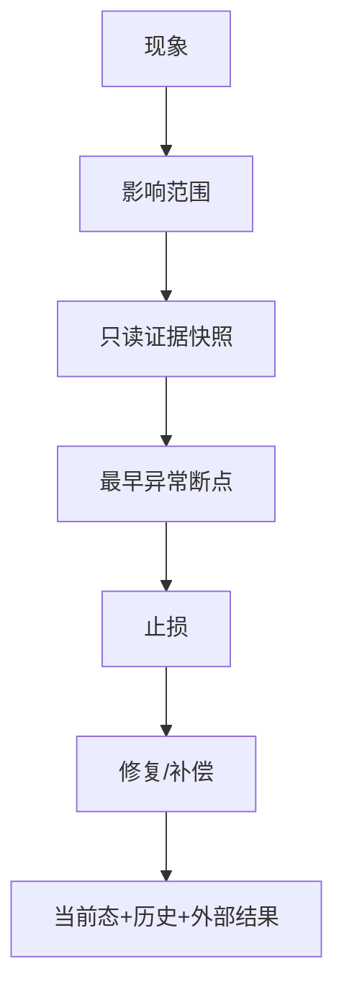

# 事故诊断与证据交接

> 最后核验：2026-08-26。目标是让另一角色无需猜测即可继续诊断。

## 诊断顺序

1. 明确影响范围：租户、船司/通道、时间、接口/Job、业务状态。
2. 保存入口请求、日志相关键和当前配置版本。
3. 沿“当前态 → 任务 → 外部调用 → 回调 → 历史/通知”定位断点。
4. 区分代码缺陷、配置缺失、外部失败、数据污染、调度停滞和观察误差。
5. 在任何补偿前记录待处理 id、当前状态和幂等条件。

## 交接包

必须包含：事件时间线、checkout/版本、环境、cid、业务 id/taskNo、入口与输入摘要、状态前后、相关表/文档/文件、外部 status/body、Job/重试记录、已尝试动作及结果、未覆盖风险。所有凭据和个人数据脱敏。

## 事实表达

“日志显示调用”“数据库当前为”“推断最可能原因”“当前无法确认外部是否处理”要分开写。HTTP 200、消息发送成功、Job 返回成功都不是业务最终成功的充分证据。

## 修复与复盘

修复优先可回滚、可审计、最小范围；重放验证幂等；跨存储检查所有关联状态。复盘把可复用根因写入 `docs/solutions` 或知识库差异/未知台账，并关联测试或告警改进。

来源：Web/Job AOP、BusinessLog/SysOperationLog、任务/重试/发送记录、incident 相关 solutions。生产监控平台和组织升级流程当前代码无法确认。面试追问：如何证明根因、如何安全补偿已产生外部副作用的事务。

