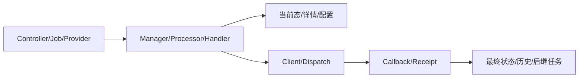

# 核心业务模块文章模板

> 模板使用规则：一个核心模块必须分别完成概览、端到端、数据状态、API 协作、开发、排障六篇；不要把六篇压缩成同一份摘要。

## 目的与读者写作要求

说明本文解决的阅读问题、主要读者及阅读前置。

## 范围与明确非目标写作要求

列出模块拥有的生命周期、数据和接口；明确相邻模块只被调用但不归本文所有的能力。

## 已验证入口到结果

逐步写明输入、条件、调用方法、写入、下游和最终可观察结果。

## 核心符号

按 Controller、Manager/Provider、Processor/Strategy、Service/Mapper、Entity/Document、Job/Callback 列出类和关键方法，并解释职责，不只贴名称。

## 数据、配置与状态

列当前态真源、历史/快照、任务、文件、缓存、配置 key/model、账号和状态迁移。说明谁可写、谁只读。

## 实现机制与设计原因

说明策略、状态机、幂等、条件更新、异步回调、缓存/锁、多存储等机制为何在当前模块出现。

## 事务、并发、一致性与异常

覆盖事务边界、重复/晚到/乱序、外部失败、配置缺失、部分成功、补偿与人工恢复。

## 风险、限制与优化

区分已证实缺陷、结构风险、推断和当前代码无法确认项；优化建议必须保持现有行为和兼容边界。

## 验证证据

列测试/api-test/静态检查和实际执行状态。未运行就明确写“未运行”。

## 文档/代码差异

写历史材料描述、当前代码事实和影响。

## 未知项

列需要产品、运维、外部系统或生产数据确认的内容。

## 面试深挖

用项目具体链路回答领域边界、技术原理、失败场景和取舍。

## 来源与最后核验

列具体相对路径、类/方法、SQL/配置/tests；最后核验日期必须真实。
