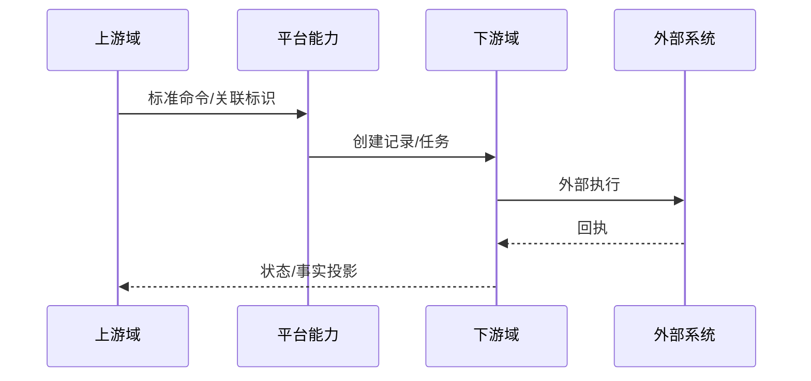

# 跨域流程标题

## 目的、参与者与非目标

指出为何需要独立于模块文章描述；列出参与域和每个域拥有的事实，不重新定义其内部实现。

## 触发与完成条件

说明起点、输入、受理成功、任务成功、回执成功和全链完成分别是什么。

## 端到端时序

逐跳解释数据转换、配置、主数据、任务、下游、回调和最终状态。

## 跨域一致性

列关联键、幂等键、重复/乱序、事务断点、补偿、投影和人工恢复；明确没有全局事务时怎样收敛。

## 失败矩阵与验证

覆盖每个断点的失败、可观察证据、是否可重试和验证场景。未执行的外部验证明确标注。

## 差异、未知、面试与来源

记录历史设计冲突、生产配置未知、架构取舍追问和具体源码/SQL/test。
